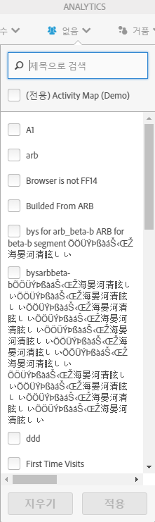
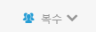

# 고객 세그멘테이션

Activity Map에서 여러 세그먼트 필터를 적용해봅니다.

>[!NOTE]
>
>세그먼트 컨트롤은 Adobe Analytics 플랫폼이 실시간 데이터를 세그먼트화하지 않으므로 표준 모드에서만 사용할 수 있습니다.

You can select one or several of the segments from the **[!UICONTROL Segments]**drop-down menu shown below. 나열된 세그먼트는 선택한 보고서 세트에 대해, Reports &amp; Analytics을 통해 사용자에게 공유되었거나 사용자가 소유하는 세그먼트와 동일합니다.

세그먼트 선택 내용이 변경되고, 세그먼트 선택기를 닫은 후에는 애플리케이션에 표시된 모든 지표에 대해 새 Analytics 데이터 검색 프로세스가 시작됩니다. 선택된 세그먼트는 페이지 간에 이동할 때 기억됩니다.

두 개 이상의 세그먼트를 선택하면, 세그먼트 선택 레이블(축소된 상태)에 "복수"가 표시됩니다. 선택한 세그먼트에 대한 전체 목록은 컨트롤을 클릭하면 표시됩니다.

선택한 세그먼트는 Activity Map에 있는 모든 Analytics 보고서, 즉, 오버레이 및 **[!UICONTROL 페이지에 있는 링크 수]** 및 **페이지 상세정보]보고서에 적용됩니다.[!UICONTROL **
