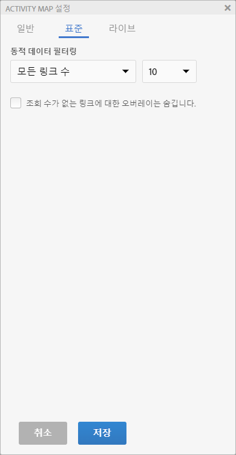
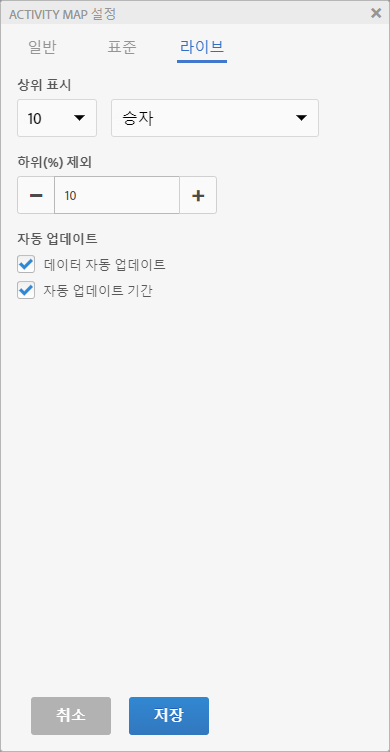
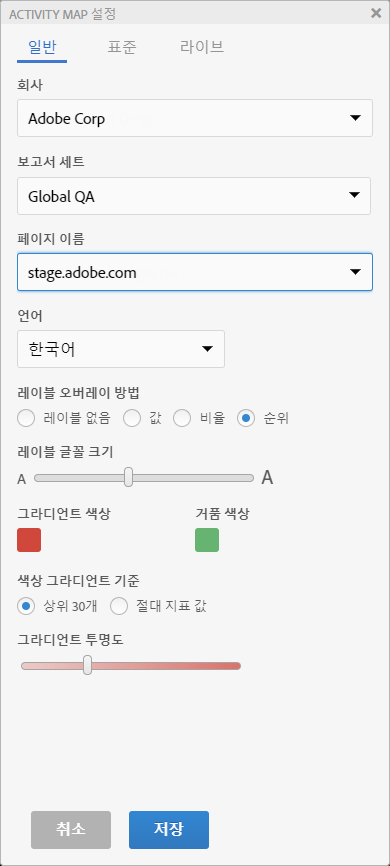

# Activity Map 설정 구성

Activity Map [설정] 패널에서는 모든 유형의 오버레이 시각화에 대한 설정 및 속성을 수정할 수 있습니다.

Activity Map 도구 모음에 있는 톱니바퀴 아이콘을 클릭하여 액세스하는 Activity Map [설정] 패널에 액세스하십시오.

[설정] 패널에는 선택한 애플리케이션 모드를 기반으로 다른 컨텐츠가 표시됩니다. [기타] 탭에는 일반적인 설정이 포함되어 있습니다.

| 표준 | **[!UICONTROL 그라데이션]** 또는 **[!UICONTROL 버블]오버레이** |
|---|---|
| 라이브 | **[!UICONTROL 승자 및 패자]**, **[!UICONTROL 그라디언트]**, **[!UICONTROL 버블]** 오버레이 |
| 기타 | 보고서 세트 선택 및 언어 선택 |

## Settings for standard mode overlay {#section_24DB95376E1A448494ECF3F57743FC19}

<table id="table_0244107DE6D142F2A1DA4882E0ED9826"> 
 <thead> 
  <tr> 
   <th colname="col2" class="entry"> 설정 </th> 
   <th colname="col3" class="entry"> 설명 </th> 
  </tr> 
 </thead>
 <tbody> 
  <tr> 
   <td colname="col2">  레이블 오버레이 방법 </td> 
   <td colname="col3"> 
    <ul id="ul_13AD02789F2D4904A35215A8FA230F3E"> 
     <li id="li_8DB71636D2074C69B0D94D3FB0CAFE28"> <b>레이블 없음</b>: 그라데이션 오버레이에 대해서만 적용 가능. 이 경우 오버레이 색상은 링크의 등급에 대한 감각을 전달합니다. </li> 
     <li id="li_39C98D7EA9514C1D8731B9D21C0E73A6"> <b>값</b>: 해당 링크에 대한 원시 지표 합계 </li> 
     <li id="li_A5F583E45BCD4F2399398F9DCC7FE382"> <b>퍼센트</b>: 페이지의 전체 지표에 대한 이 링크용 지표의 백분율. </li> 
     <li id="li_E4BF7D3B863E4B6C8E737CF29ADA9D67"> <b>등급</b>: 렌더링된 페이지에 있는 모든 링크에서 이 링크의 등급 </li> 
    </ul> </td> 
  </tr> 
  <tr> 
   <td colname="col2">  레이블 글꼴 크기 </td> 
   <td colname="col3"> 더 높은 가독성을 위해 슬라이더를 사용하여 오버레이 레이블 글꼴 크기를 늘리거나 줄이겠습니다. </td> 
  </tr> 
  <tr> 
   <td colname="col2">  표시 </td> 
   <td colname="col3">상위, 하위 또는 모든 링크 수를 선택하여 오버레이에 표시합니다. 상위 또는 하위를 선택하는 경우, 표시할 링크의 수도 선택해야 합니다. </td> 
  </tr> 
  <tr> 
   <td colname="col2">  조회 수가 없는 링크에 대한 오버레이는 숨깁니다. </td> 
   <td colname="col3"> 이 확인란을 선택하면 히트를 받지 않은 링크에 대한 오버레이를 숨겨 인터페이스에서 불필요한 것들을 줄일 수 있습니다. </td> 
  </tr> 
  <tr> 
   <td colname="col2">  그라데이션 색상 / 버블 색상 </td> 
   <td colname="col3">다양한 색상 중에서 선택하여 그라데이션 또는 버블 오버레이 시각화를 위한 오버레이 링크 등급을 표시합니다. </td> 
  </tr> 
  <tr> 
   <td colname="col2">  색상 그라데이션 기준 </td> 
   <td colname="col3"> 
    <ul id="ul_1B5C2A44A9EB465D8B8E9AD91AF79D69"> 
     <li id="li_C983CB68B90B492BB0774254292B5961">  상위 30개: 상위 30개 값에 대해 색상 강도가 표준화되었습니다. </li> 
     <li id="li_1E83431C8C734AB0BC82B5A66AED1189">  절대 지표 값: 색상 강도는 절대 지표 값의 함수입니다. </li> 
    </ul> </td> 
  </tr> 
  <tr> 
   <td colname="col2">  그라데이션 투명도 </td> 
   <td colname="col3">그라데이션 오버레이에 대한 투명도 수준을 선택합니다. 
이 설정은 버블 오버레이에 영향을 주지 않습니다. 
 </td> 
  </tr> 
 </tbody> 
</table>

## Settings for live mode overlays {#section_D30F6E62FB5D404090B588F396A460AF}

| 설정 | 설명 |
|---|---|
| **[!UICONTROL 상위 표시]** | Select number of links to display (or all) and the **[!UICONTROL Gainers]** or **[!UICONTROL Losers]** (or both) to display as overlays. |
| **[!UICONTROL 하위(%) 제외]** | 데이터가 희박한 승자-패자 링크를 제거하도록 선택합니다. 링크 변경 사항의 하위 백분율을 필터링하여 관련 있는 이득 또는 손실을 표시하기에 충분한 데이터가 있는 링크만 표시합니다. 백분율은 해당 페이지에 있는 링크의 수를 기반으로 계산됩니다. 예를 들어, 200개 링크가 있는 목록의 하위 10%를 필터링하면 마지막 20개의 링크가 필터링됩니다. |
| **[!UICONTROL 데이터 자동 업데이트]** | 새 기간이 계산될 때 인터페이스에 표시된 Analytics 데이터가 자동으로 업데이트되는지 여부를 결정하겠습니다. |
| **[!UICONTROL 자동 업데이트 기간]** | 선택하면, 페이지의 링크가 수집된 데이터와 더 밀접하게 동기화될 수 있도록 각각의 새로운 데이터 검색으로 웹 페이지가 새로 고쳐집니다. |

## Other settings {#section_697A12F099494D699A4BF498598178C5}

<table id="table_0F560236F8844FA0928CBB9C50D5ABEF"> 
 <tbody> 
  <tr> 
   <td colname="col1"> 보고서 세트 </td> 
   <td colname="col2"> 
사용자가 액세스 가능한 보고서 세트 목록은 더 이상 웹 페이지 태그에 정의된 보고서 세트로 제한되지 않습니다. 이제 다른 보고서 세트와 함께 선택된 보고서 세트(페이지의 태그 중 하나에 해당)를 대체할 수 있습니다. 이 새 보고서 세트는 페이지의 태그에 연결되어 있을 필요가 없습니다. Activity Map 설정에서 선택된 보고서 세트를 변경하면, 저장 프로세스로 인해 영향을 받는 모든 Analytics 보고서가 새로 고침됩니다. 
 
 
중요: 가상 보고서 세트는 라이브 모드와는 호환하지 않고, 표준 모드와만 호환합니다. 표준 보고서 세트에 대해 라이브 모드 상태에 있지만, 이 대화 상자에서 가상 보고서 세트를 선택할 경우, 여기에서 확인을 선택하면 표준 모드가 표시됩니다. 
 
 
또한, 달력 컨트롤은 보고서 세트의 달력 유형(양력, 소매, 사용자 지정...)과 일치하도록 다시 초기화됩니다. 
 </td> 
  </tr> 
  <tr> 
   <td colname="col1"> 언어 </td> 
   <td colname="col2"> 선택 항목은 Adobe Analytics에 대해 제공된 언어와 일치합니다. </td> 
  </tr> 
  <tr> 
   <td colname="col1"> 정보 </td> 
   <td colname="col2"> 애플리케이션 이름 및 버전 번호를 나타냅니다. </td> 
  </tr> 
 </tbody> 
</table>

