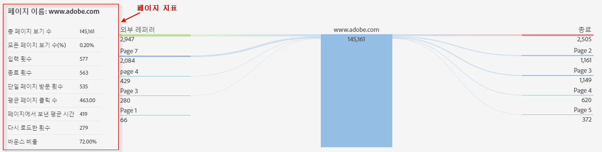

# 페이지 세부 사항

페이지 상세정보 탭에는 페이지 보고서가 표로 표시되며, 페이지 흐름 보고서가 나비넥타이 보고서로 표시됩니다.

## Page report {#section_2335A9EFE57B4A7687B397DF2098CC6B}

이 패널에는 방문한 웹 페이지와 관련된 트래픽 지표가 표시됩니다. Analytics 페이지 태그가 구현되지 않은 웹 페이지로 이동하는 경우, 패널이 표시되지 않습니다.

## Page Flow report {#section_D6EDE78CF7124758BF846E57ADABA234}

왼쪽에는 이전 페이지 및 레퍼러(외부)가 표시됩니다. 그렇지 않고 각 카테고리에 대해 상위 4개의 항목을 표시하도록 왼쪽을 확장할 수도 있습니다.

오른쪽에는 상위 4개의 다음 페이지와 종료 횟수가 표시됩니다.

이 섹션에 표시된 내부 페이지에 대한 URL이 추적된 경우, 해당 페이지가 링크로 표시됩니다. 따라서 해당 페이지를 클릭하고 가장 관련 있는 페이지들의 경로를 계속 갈 수 있습니다. 이렇게 이 보고서를 사용하면 웹 분석 관점에서 웹 속성을 대화식으로 탐색할 수 있습니다.

페이지 흐름 보고서는 표준 모드에서만 사용할 수 있습니다.

| **페이지 흐름** | **설명** |
|---|---|
| 외부 레퍼러 | 현재 페이지를 참조하는 다른 사이트의 URL. |
| 이전 페이지 | 현재 페이지 전에 보고서 세트에서 내부 페이지에 이름을 지정합니다. |
| 다음 페이지 | 현재 페이지를 떠난 후 방문한 페이지. |
| 사이트 종료 수 | 페이지를 본 후 사이트를 완전히 떠난 사람의 수. |

