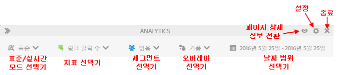
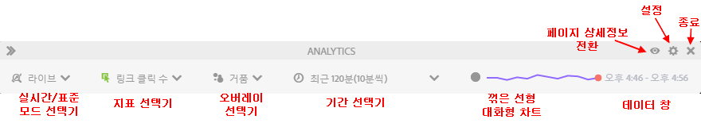

# 표준 모드와 라이브 모드

Activity Map에서는 페이지 활동의 보조 보고 기능을 제공하기 위해 두 가지 기본 모드를 제공합니다.

* 표준 모드에서 - [페이지에 있는 링크 수 보고서](/help/analyze/activity-map/activitymap-links-report.md)에 전체 날짜 범위에 대해 집계한, 하루 범위에서 여러 날 범위까지의 링크 데이터가 표시됩니다.
* 라이브 모드에는 활동 트렌드 보고서가 실시간으로 표시됩니다.

두 가지 모드는 도구 모음에 있는 모드 단추를 클릭하여 전환할 수 있습니다.

## 표준 모드 {#section_0C755F30B7EC4A13A62AB9A391AF51E6}

**표준 모드**&#x200B;에서는 아래 표시대로 도구 모음에서 날짜 범위를 선택할 수 있습니다.

이 모드에서는 "기여도"가 활성화되어 있지 않은 상거래 지표가 선형적으로 할당됩니다. 예를 들어, 사용자가 홈 페이지의 "IPod mini" 링크를 클릭하고 3페이지를 더 이동하고, 4번째 페이지에서 200달러에 iPod mini를 구입하는 경우, "iPod mini" 링크는 기여도 매출 200달러와 매출 50달러(200달러/4)(선형적으로 할당된 매출)를 받게 됩니다.

Q: 페이지의 별도 지역에 링크 이름이 동일한 링크가 있다면 어떻게 합니까? 페이지에서 링크 이름이 동일하지만 지역이 다르므로 두 링크는 따로따로 크레딧을 받습니까?

A: 링크 데이터를 집계하는 방식에 따라 다릅니다. Activity Map에서는 주어진 페이지에 대한 링크 ID|지역을 보게 되므로 할당된 데이터는 "링크 ID|지역" 조합용으로 사용됩니다. 이 경우, 지역이 다르므로, 링크|지역이 구별되며, 따라서 첫 번째 링크|지역에 대한 할당된 모든 매출은 두 번째 링크에 대해 할당된 모든 매출과 달라집니다. 하지만 Adobe Analytics UI에서는 주어진 페이지에 대한 링크 ID 보고서(링크|지역 보고서)만 볼 수 있습니다(링크로 나눠진 페이지). 이 경우, 매출은 두 지역 모두에서 집계됩니다.

## 라이브 모드 {#section_D619B77D89A840F0B1C2DEA2715A516A}

**라이브 모드**&#x200B;에서 Analytics 데이터는 1분에서 15분까지의 간격으로 트렌드 방식으로 표시됩니다. 이 모드는 웹 페이지에 대한 단기 트렌드 분석 및 모니터링이 전부입니다.

라이브 모드는 게시 조직의 요구에 대응합니다. 이러한 조직은 몇 개의 주요 페이지 내에서 링크 인기도에 대한 마이크로 트렌드를 모니터링해야 합니다. 실적이 낮거나 인기가 높아지고 있는 링크들을 신속히 파악하는 기능은 게시 비즈니스에 있어 매우 중요합니다.

>[!IMPORTANT]
>
>가상 보고서 세트는 라이브 모드와 호환하지 않으며 표준 모드와만 호환합니다.

