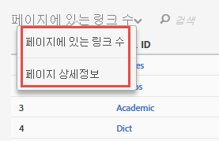

# Activity Map 사용자 인터페이스

Activity Map UI는 두 부분으로 구성되어 있습니다.

* 웹 페이지, 주입된 오버레이 및 도구 모음이 있는 위쪽 창.
* 보고서용 아래쪽 패널.

## Top panel {#section_2DA8ACD35D4C4ACBA32C13EFB5317E7C}

위쪽에는 [주입된 도구 모음](/help/analyze/activity-map/activitymap-standard-live.md)과 [링크 오버레이](/help/analyze/activity-map/activitymap-gainerslosers.md)가 있는 웹 페이지가 표시됩니다. 버블 등급은 총 클릭 수를 식별할 수 있도록 링크 위에 표시됩니다.

추가적인 링크 세부 사항은 각 링크 오버레이를 마우스로 가리켜서 액세스할 수 있습니다.

## Bottom reports panel {#section_21B129D69B7A4F918E975E8E66DB02EE}

페이지 하단에는 페이지 흐름 정보는 물론 현재 웹 페이지 통계 요약을 볼 수 있는 [페이지에 있는 링크 수](/help/analyze/activity-map/activitymap-links-report.md) 보고서와 [페이지 상세정보](/help/analyze/activity-map/activitymap-page-flow.md) 보고서가 표시됩니다.

페이지에 있는 링크 수 보고서에서는 추가적인 클릭 정보를 포함하여 현재 페이지에 있는 링크에 대한 스프레드시트 보기가 제공됩니다. 페이지 세부 사항 보고서에서는 현재 표시된 페이지로 이동하는 전후에 방문한 페이지와 관련된 분석 데이터를 제공합니다.

