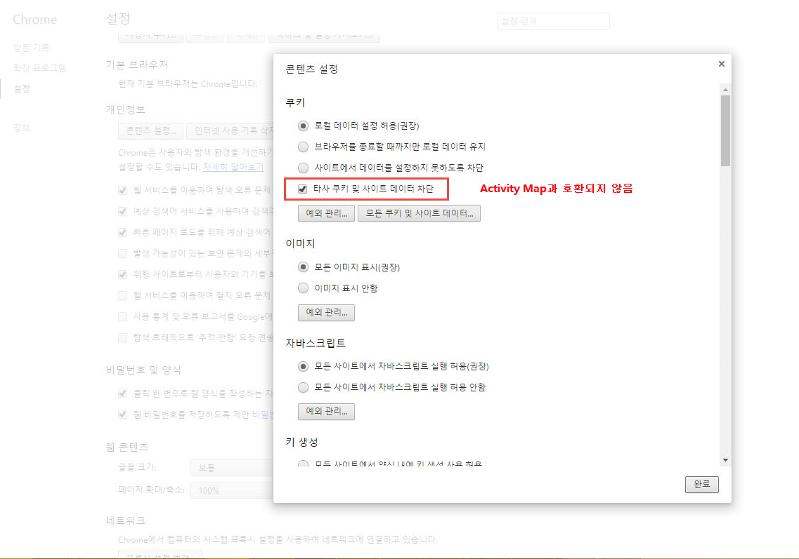
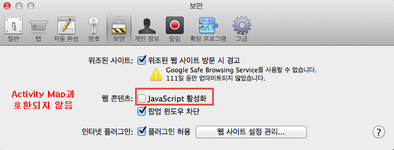
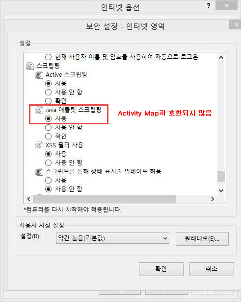

# Activity Map 데이터 수집 문제 해결

Activity Map 차원에 대한 데이터가 표시되지 않는 경우 이 페이지를 사용하여 이유를 확인하십시오.

## 디버거를 사용하여 데이터 수집 확인

먼저, AppMeasurement에서 Activity Map 데이터를 올바르게 수집하는지 확인하십시오.

1. [Adobe Experience Cloud Debugger Chrome 확장 프로그램](https://experienceleague.adobe.com/en/docs/experience-platform/debugger/home)을 다운로드하여 설치하십시오.
2. 웹 페이지로 이동한 다음 링크를 클릭합니다.
3. 후속 페이지가 로드되면 디버거를 엽니다. `activitymap.`과(와) `.activitymap` 사이에 있는 Activity Map 컨텍스트 데이터 변수가 표시되는지 확인합니다.

## Activity Map 데이터가 없는 가능한 이유

다음 각 항목을 확인하여 Activity Map 구성 요소가 있는지 확인하십시오.

* **AppMeasurement 버전**: Activity Map은 v1.6 이상에서 지원됩니다. 안정적인 최신 버전의 AppMeasurement으로 업그레이드할 때 많은 에지 사례 문제가 해결됩니다.
* **Activity Map 모듈**: `AppMeasurement_Module_Activity_Map` 모듈이 `AppMeasurement.js` 파일에 있는지 확인하십시오. 구현에서 Adobe Experience Platform을 사용하여 데이터를 수집하는 경우 **[!UICONTROL 링크 추적]**&#x200B;에서 Analytics 확장을 구성할 때 **[!UICONTROL ClickMap 사용]**&#x200B;을(를) 선택해야 합니다.
* **`s_sq` 쿠키**: Activity Map은 데이터 수집을 위한 `s_sq` 쿠키에 따라 다릅니다.
   * 특히 `cookieDomainPeriods` 또는 `*.co.uk`과(와) 같은 지역 도메인의 경우 `*.co.jp` 변수가 올바르게 설정되었는지 확인하십시오.
   * `linkInternalFilters` 변수가 원하는 값으로 설정되어 있는지 확인하십시오. 클릭한 링크가 내부 필터와 일치하지 않으면 Activity Map은 종료 링크로 간주하여 데이터를 수집하지 않습니다.
* **Activity Map 오버레이 실행 중**: Activity Map 오버레이가 활성화되면 AppMeasurement에서 웹 페이지에 대한 클릭 데이터를 추적하지 않습니다.

Activity Map 사용과 호환하지 않는 브라우저 매개 변수를 표시합니다. Adobe에서는 이러한 설정을 비활성화하는 것이 좋습니다.

## Chrome

## Firefox

## Safari

## Internet Explorer

**유효성 검사**

Developer Console 네트워크 탭을 사용하여 호출 상호 작용:

1. 사이트의 Development Launch 스크립트를 로드합니다.
1. 요소 클릭의 네트워크 탭에서 “/ee” 검색

Adobe Experience Platform Debugger:

1. [Adobe Experience Platform Debugger](https://chromewebstore.google.com/detail/adobe-experience-platform/bfnnokhpnncpkdmbokanobigaccjkpob)를 다운로드하여 설치합니다.
1. [!UICONTROL 로그] > [!UICONTROL Edge] > [!UICONTROL Edge에 연결]로 이동합니다.

* **네트워크 탭에서 상호 작용 호출이 실행되지 않습니다**: 컬렉션 호출의 클릭 데이터 컬렉션은 `"/ee"` 또는 `"collect?"` 중 하나로 필터링됩니다.
* **수집 호출에 대한 페이로드가 표시되지 않습니다**: 수집 호출은 추적이 다른 사이트로의 탐색에 영향을 주지 않도록 디자인되었으므로 수집 호출에 문서 언로드 기능을 사용할 수 있습니다. 이 기능은 데이터 수집에는 영향을 주지 않지만 페이지에서 유효성을 검사해야 하는 경우에는 각 요소에 `target="_blank"`을(를) 추가하십시오. 링크가 새 탭에서 열립니다.
