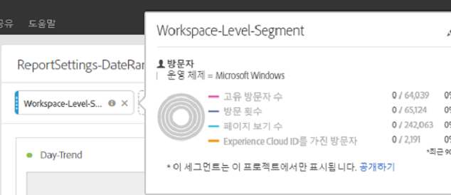
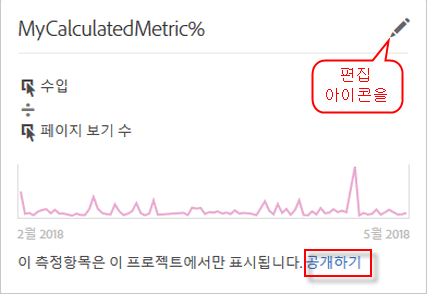

# 프로젝트 변환기 FAQ

## 프로젝트 변환기 FAQ {#topic_8231595303AD403E9322645A63632D57}

* [알려진 전환 문제](../../../analyze/ad-hoc-analysis/c-aha-project-converter/aha2aw-converter-faq.md#section_39C922A58B2E49C9877B363042801361)
* [전환 FAQ](../../../analyze/ad-hoc-analysis/c-aha-project-converter/aha2aw-converter-faq.md#section_1E53FE373AF045978F939916124E194E)

## Known Conversion Issues {#section_39C922A58B2E49C9877B363042801361}

| 문제 | 설명 |
|--- |--- |
| 분류가 있는 분 세부기간 또는 열 | 분 세부기간에 분류가 적용되어 있거나 분 세부기간을 열에 있는 경우, 프로젝트를 분석 작업 공간으로 변환할 수 없습니다. 해결 방법은 분 단위로 분류 세부기간을 제거하고 열에서 제거한 다음 프로젝트를 전환하는 것입니다. 그런 다음 분석 작업 공간의 분 세부기간에 분류를 적용할 수 있습니다. |
| 열 세그먼트와 함께 사용되는 내부 계산된 지표 | 내부 계산된 지표를 열 세그먼트와 함께 사용하는 경우, 프로젝트를 분석 작업 공간으로 변환할 수 없습니다. 이 문제를 해결하려면 변환하기 전에 프로젝트에서 내부 계산된 지표를 제거한 다음 분석 작업 공간에 다시 추가하십시오. |

## Conversion FAQ {#section_1E53FE373AF045978F939916124E194E}

<table id="table_48CC119236C94835A6A512E989BE4200"> 
 <thead> 
  <tr> 
   <th colname="col1" class="entry"> 질문 </th> 
   <th colname="col2" class="entry"> 답변 </th> 
  </tr>
 </thead>
 <tbody> 
  <tr> 
   <td colname="col1"> 
<b>Q: Analysis Workspace에서 Ad Hoc Analysis 기능이 지원되지 않습니까?</b> 
 </td> 
   <td colname="col2"> 
A: 사이트 분석 보고서는 Analysis Workspace에서 지원되지 않습니다. 또한 애드혹 분석과 작업 영역의 다른 시각화 간에는 약간의 차이가 있습니다. 자세한 내용은 아래 질문을 참조하십시오. 
 </td> 
  </tr> 
  <tr> 
   <td colname="col1"> 
<b>Q: 표 설정이 어떻게 변환됩니까?</b> 
 </td> 
   <td colname="col2"> 
    <ul id="ul_A645A004FB094A1593439A6607FE9A6B"> 
     <li id="li_033CA771F08A4BC3B0BC52CDCCA03FF4"><b>표시된 행 수</b>: Workspace는 10개의 행만 표시하도록 페이지가 지정되지만(한 번에 최대 400개 행을 표시하도록 사용자 지정 가능), Ad Hoc은 한 페이지에 최대 50,000개 행을 표시합니다. 데이터가 여전히 Workspace에 있으므로 기본적으로 10개 행을 표시하도록 페이지가 매겨집니다. </li> 
     <li id="li_A8B8890149334032A56D8D1C0F8691EA"><b>고급 검색:</b> 여러 개의 동시 검색 옵션이 지원되지 않지만, 단일 검색 옵션(예: 이 단어 모두, 정확한 구문 사용, 이 단어 중 하나 또는 이 단어 모두 제외)이 Analysis Workspace로 변환됩니다. </li> 
    </ul> </td> 
  </tr> 
  <tr> 
   <td colname="col1"> 
<b>Q: 차트/그래프가 어떻게 변환됩니까?</b> 
 </td> 
   <td colname="col2"> 
A: 차트 및 그래프는 Workspace에서 "시각화"라고 합니다. 
 
    <ul id="ul_597F5AB826EF434295D0CABD0313CAD5"> 
     <li id="li_AFB2805418034721A9519D999128C0A8"><b>설정</b>: "항목 수" 또는 "막대 수"와 같은 시각화 설정은 Workspace에서 지원되지 않습니다. </li> 
     <li id="li_D5C7EA8815344EDB8585CBB8E1AF583E"><b>파이 차트</b>: <a href="https://marketing.adobe.com/resources/help/en_US/analytics/analysis-workspace/donut.html" format="html" scope="external">도넛</a> 시각화로 내보냅니다. Workspace에서 이 시각화는 19개 섹션으로 제한됩니다. </li> 
     <li id="li_91659FBFD77C4B3393D78447D658B7B4"><b>거품 차트</b>: <a href="https://marketing.adobe.com/resources/help/en_US/analytics/analysis-workspace/scatterplot.html" format="html" scope="external">산포도</a> 시각화로 내보냅니다. 기본적으로 산포도는 x축의 첫 번째 지표와 y축의 두 번째 지표를 그립니다. 지표가 하나만 있는 경우 거품 차트가 선 시각화로 변환됩니다. </li> 
     <li id="li_FA05085FFB1747EBAF63616AC2B8D59C"><b>막대 그래프</b>: Workspace와 Ad Hoc Analysis에서 다른 그룹 로직을 지원합니다. 따라서 <a href="https://marketing.adobe.com/resources/help/en_US/analytics/analysis-workspace/bar.html" format="html" scope="external">막대</a> 시각화로 변환됩니다. </li> 
     <li id="li_959499D20796459CA0F6BBC8F0A8D808"><b>산포도</b>: Analysis Workspace의 내보낸 프로젝트에서 Y축은 첫 번째 열로, X축은 두 번째 열로, 지름은 세 번째 열로 설정됩니다. </li> 
     <li id="li_14E06D7A5106405A89A07B44FFD9A92D"><b>폴아웃 표</b>: 폴스루 또는 폴아웃 표를 표시하려면 체크포인트를 마우스 오른쪽 단추로 클릭하고 분류 옵션을 선택합니다. </li> 
     <li id="li_240F43C386F04111A7632A8FCA37832C"><b>폴아웃 보고서 수준 날짜 범위</b>: 사용자 정의된 보고서 날짜 범위가 폴아웃 시각화에 적용되지 않았습니다. </li> 
     <li id="li_1FF5B3FD9E424E7190AF03FD4DD9D654"><b>흐름 보고서</b>: 흐름이 별도의 패널로 이동하여 날짜 범위 및 세그멘테이션을 유지합니다. </li> 
     <li id="li_BE8F8F6EC2EA49E18EF52539BC1700E0"><b>제품 전환 유도</b>: Analysis Workspace에서 지원되지 않으므로 자유 형식 테이블로 변환됩니다. 폴아웃 시각화는 제품 전환 유도에 대한 권장 교체 대상이지만, 약간 다른 방식으로 작동합니다. </li> 
    </ul> </td> 
  </tr> 
  <tr> 
   <td colname="col1"> 
<b>Q: 세그먼트는 어떻게 변환됩니까?</b> 
 </td> 
   <td colname="col2"> 
    <ul id="ul_15D5B17461E2402DB07DF8B0A10AAC37"> 
     <li id="li_CF9C3D235A664B15B21D9F89DC5EF7D3">세그먼트는 변환된 프로젝트 내부에 있습니다(공용 아님). 다음과 같이 공용으로 설정하도록 선택할 수 있습니다. 
 
 </li> 
     <li id="li_AE61DAEC5C0047349DD192EFEEDB0BF9">Ad Hoc Analysis 작업 공간 수준 세그먼트는 Workspace의 프로젝트/작업 공간 수준에서 적용됩니다. </li> 
     <li id="li_B1559E2C18724FE189AF87D0BEF16811">Ad Hoc Analysis 보고서 수준 세그먼트는 Workspace의 표 열 수준에서 적용됩니다. </li> 
     <li id="li_0E6DF6D44EA448A4A212BA2BB8E342CF">Ad Hoc Analysis 표 세그먼트는 Workspace의 표 열 수준에서 적용됩니다. </li> 
    </ul> 
<a href="https://marketing.adobe.com/resources/help/en_US/analytics/segment/" format="https" scope="external">세그먼트 빌더</a>에서 세그먼트를 편집할 수 있습니다. 
 </td> 
  </tr> 
  <tr> 
   <td colname="col1"> 
<b>Q: 날짜 범위는 어떻게 변환됩니까?</b> 
 </td> 
   <td colname="col2"> 
    <ul id="ul_A24AB597F3CE4847AF00D49A9A72A395"> 
     <li id="li_24FD18AF64114445939C4FBC03F2D406">Ad Hoc Analysis의 '최근 X일' 날짜 범위는 오늘을 <i>제외</i>하지만, Analysis Workspace는 오늘을 <i>포함</i>합니다. 따라서 '최근 90일'과 같은 날짜 범위가 도구마다 일치하지 않을 수 있습니다. 사용자 지정 날짜 범위를 사용하여 Analysis Workspace에서 동일한 기간을 검색합니다. </li> 
     <li id="li_AA4390470C494748B4B12030B1226720">Ad Hoc Analysis 작업 공간 수준 날짜 범위는 Workspace의 프로젝트/작업 공간 수준에서 적용됩니다. </li> 
     <li id="li_B8F0CDD413154856A315D087FEC4D418">Ad Hoc Analysis 보고서 수준 날짜 범위는 Workspace의 표 열 수준에서 적용됩니다. </li> 
    </ul> 
분석 &gt; 구성 요소 &gt; 날짜 범위에서 사용자 지정 날짜 범위를 편집할 수 있습니다. 
 </td> 
  </tr> 
  <tr> 
   <td colname="col1"> 
<b>Q: 계산된 지표는 어떻게 변환됩니까?</b> 
 </td> 
   <td colname="col2"> 
    <ul id="ul_ADA380D5D09B4223AAE4853D4C64F679"> 
     <li id="li_010572F793F54680ABE64117DAB7E800">계산된 지표는 내보낸 프로젝트(공개 아님) 내부에 있습니다. 이 지표를 마우스 오른쪽 단추로 클릭하고 공개하기를 클릭하여 공개하도록 선택할 수 있습니다. 
 
 </li> 
     <li id="li_930546EC8FEB432C8810FAF93556FC9A">모든 유형의 계산된 지표가 내보내기에 대해 지원됩니다. </li> 
     <li id="li_DFF7C6F8BB2344928D49194DA0F6EC38"><b>할당 유형</b>: Analysis Workspace에서 계산된 지표의 할당 유형을 명시적으로 표시하지 않더라도 내보내기는 할당 유형을 만들고 Ad Hoc Analysis에 있던 할당 유형과 일치시킵니다. </li> 
    </ul> 
편집(연필) 아이콘을 클릭하여 <a href="https://marketing.adobe.com/resources/help/en_US/analytics/calcmetrics/" format="https" scope="external">계산된 지표 빌더</a>에서 할당 유형을 편집할 수 있습니다. 
 </td> 
  </tr> 
  <tr> 
   <td colname="col1"> 
<b>Q: Ad Hoc의 글로벌 데이터 설정은 변환된 프로젝트에 어떻게 적용됩니까?</b> 
 </td> 
   <td colname="col2"> 
글로벌 데이터 설정으로 인해 동일한 프로젝트를 두 번 내보내어 다르게 동작할 수 있습니다. 
 
    <ul id="ul_E3827883DD8045FAAB359D7E85E3EEFA"> 
     <li id="li_1056CA4813C44638BEB070228AE6914C"><b>반복 인스턴스 카운트.</b> 내보낼 때 적용된 설정이 어떤 설정이든 간에 Analysis Workspace의 내보낸 프로젝트에 적용됩니다. </li> 
     <li id="li_D5405E2862CF434CA82AA9DE000F4BBC"><b>데이터 소스.</b> Analysis Workspace에서 데이터 소스를 포함하여 분석 데이터가 모두 표시됩니다. </li> 
    </ul> </td> 
  </tr> 
  <tr> 
   <td colname="col1"> 
<b>Q: Ad Hoc Analysis 프로젝트가 예약된 경우 일정이 Analysis Workspace로 변환됩니까?</b> 
 </td> 
   <td colname="col2"> 
아니오, 일정이 변환되지 않습니다. Analysis Workspace에서 예약하려는 프로젝트를 열고 공유 &gt; 일정에 따라 파일 보내기로 이동하여 새 일정을 설정합니다. Ad Hoc Analysis에서 예약된 프로젝트를 취소해야 합니다. 
 </td> 
  </tr> 
  <tr> 
   <td colname="col1"> 
<b>Q: 두 도구 간의 이름 지정 차이가 있습니까?</b> 
 </td> 
   <td colname="col2"> 
A: 예. Analysis Workspace 문서에서 </a>키 용어 비교<a href="https://marketing.adobe.com/resources/help/en_US/analytics/analysis-workspace/adhocanalysis_vs_analysisworkspace.html" format="html" scope="external"> 를 참조하십시오. </a>
 </td> 
  </tr> 
 </tbody> 
</table>

