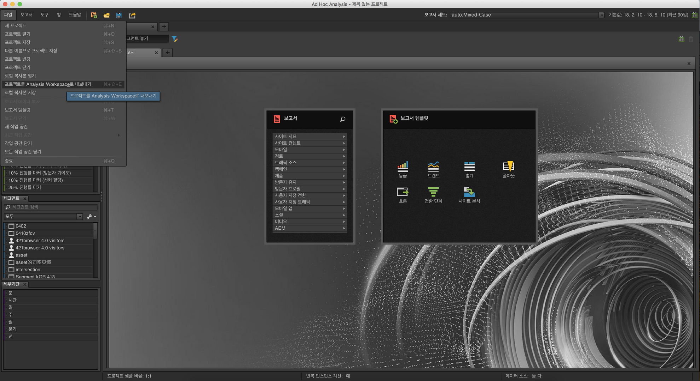
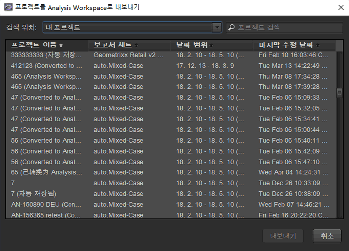
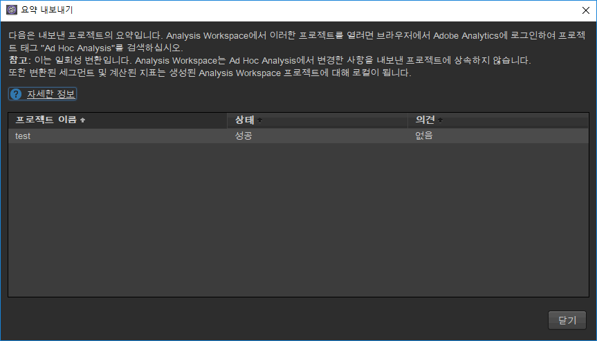
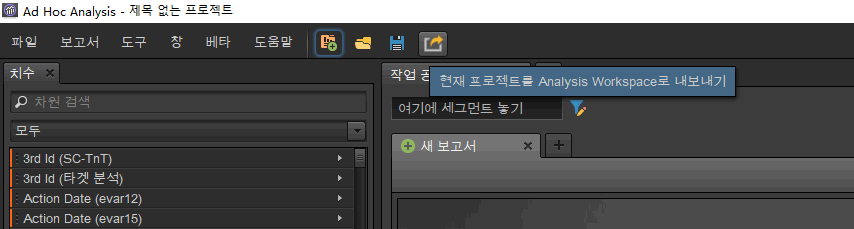

# 애드혹 분석에서 프로젝트 변환

## Convert your projects in Ad Hoc Analysis {#topic_5A55F73488704C5D8E42CDD04B5984DE}

프로젝트를 변환하기 전에 다음 사항을 확인하십시오.

* 프로젝트를 변환하려면 Ad Hoc Analysis에 관리자로 로그인하거나, Analysis Workspace를 사용할 권한이 있는 비관리자로 로그인해야 합니다.
* 이 변환은 일회성이므로, 변환된 Ad Hoc 프로젝트에 대한 추가 변경 사항은 Analysis Workspace에 반영되지 않습니다. 그러나 프로젝트를 다시 변환하는 옵션이 있습니다.
* 변환된 Ad Hoc Analysis 프로젝트는 Ad Hoc에 계속 남아 있지만, 변환되었음을 나타내는 괄호와 횟수가 제목에 추가됩니다. 예:

   

Ad Hoc Analysis 프로젝트 변환과 관련된 옵션이 두 개 있습니다.

* 목록에서 변환할 프로젝트를 선택합니다.
* 현재 열려 있는 프로젝트만 변환합니다.

**목록에서 프로젝트 선택**

1. In Ad Hoc Analysis, click **[!UICONTROL File]** &gt; **[!UICONTROL Convert Projects to Analysis Workspace]**.

   

1. In the **[!UICONTROL Convert Projects to Analysis Workspace]** dialog, select the project to convert or press  +  to select the entire list.

   

1. **[!UICONTROL 변환을 클릭합니다]**.
1. 이제 [!UICONTROL 변환 요약]에 변환 성공 또는 실패를 나타내는 상태 열 및 오류 코드와 함께 변환된 모든 프로젝트가 나열됩니다. Contact Adobe Client Care for further diagnosis with the "`Error-Id: <Error-Code>`".

   

**현재 프로젝트 변환**

1. Ad Hoc Analysis에서 변환할 프로젝트를 엽니다.
1. **[!UICONTROL 현재 프로젝트를 Analysis Workspace로 변환을 클릭합니다.]** 

1. 이제 [!UICONTROL 변환 요약]에 변환 성공 또는 실패를 나타내는 상태 열 및 오류 코드와 함께 변환된 모든 프로젝트가 나열됩니다. Contact Adobe Client Care for further diagnosis with the "`Error-Id: <Error-Code>`".
