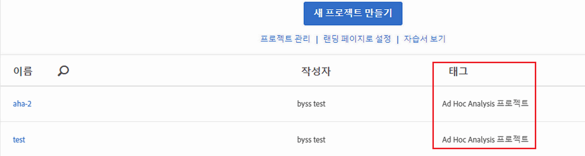

# 분석 작업 공간에서 전환된 프로젝트 보기

Workspace에서 프로젝트를 보기 전에 [FAQ](../../../analyze/ad-hoc-analysis/c-aha-project-converter/aha2aw-converter-faq.md#topic_8231595303AD403E9322645A63632D57)를 참조하고 Ad Hoc Analysis와 Workspace의 [용어 차이점](../../../analyze/ad-hoc-analysis/c-aha-project-converter/aha2aw-converter-faq.md#topic_8231595303AD403E9322645A63632D57)을 검토하십시오.

1. **[!UICONTROL Analytics]** &gt; **[!UICONTROL 작업 영역으로 이동합니다]**. Ad Hoc Analysis에서 변환된 프로젝트는 "Ad Hoc Analysis Project" 태그가 지정됩니다.

   

1. 프로젝트 이름을 클릭하여 프로젝트를 보십시오.
1. 필요한 경우 프로젝트를 변경합니다. 이러한 변경 사항은 Ad Hoc Analysis에 반영되지 않습니다.

