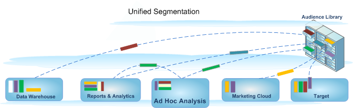

# 세그먼트 작성

애드혹 분석은 Analytics 세그멘테이션 환경과 통합되므로 Adobe 제품에서 방문자 세그먼트를 작성, 공유, 관리 및 적용할 수 있습니다. 애드혹 분석은 다른 Analytics 도구에서 사용하는 웹 기반 도구와 동일한 세그먼트 빌더 및 세그먼트 관리자를 위한 Java 기반 유저 인터페이스를 제공하여, 서버 호출을 일치시키고 Java 기반 콘솔에서 동일한 기능을 제공합니다.

Ad Hoc Analysis에는 익숙한 세그먼트 작성용 기능과 세그먼트 관리 [워크플로우](https://marketing.adobe.com/resources/help/en_US/analytics/segment/?f=seg_workflow)를 설정하는 데 사용되는 [세그먼트 관리자](https://marketing.adobe.com/resources/help/en_US/analytics/segment/?f=seg_manage)와 같은 새로운 기능 업그레이드가 포함됩니다. 또한 [세그먼트 빌더](https://marketing.adobe.com/resources/help/en_US/analytics/segment/?f=seg_build)에서 세그먼트를 작성하고 저장하거나 Ad Hoc Analysis 콘솔에서 [폴아웃 보고서로부터 세그먼트를 생성](https://marketing.adobe.com/resources/help/en_US/analytics/segment/?f=t_seg_fallout)한 다음, 새 세그먼트나 확장된 세그먼트를 일반적인 액세스 및 애플리케이션용의 대상 라이브러리에 저장할 수 있습니다. 

## Ad Hoc Analysis에서의 통합 세그멘테이션 {#section_5FA03A06DE054448AD519CE30C39E294}

애드혹 분석 기능을 포함하는 통합 세그멘테이션 환경에서 세그먼트를 작성하고 관리하는 방법에 대한 정보 및 지침은 [통합 세그멘테이션](https://marketing.adobe.com/resources/help/en_US/analytics/segment/?f=index) 설명서를 참조하십시오.

* [새로운 기능](../../analyze/ad-hoc-analysis/c-content-ref.md#section_BD58629D1A9346BF879E229FA6BEC7A2)
* [세그먼트 정의 변경](https://marketing.adobe.com/resources/help/en_US/analytics/segment/?f=seg_definition)
* [기존 세그먼트에 발생한 결과](../../analyze/ad-hoc-analysis/c-content-ref.md#section_76CF47142D1A4FB6A0718AD9073049FE)
* [기존 세그먼트 폴더에 발생한 결과](../../analyze/ad-hoc-analysis/c-content-ref.md#section_FB04DCF775694E69B761DCA53F301C30)
* [세그먼트 관리자에서 모든 Analytics 세그먼트를 관리할 수 있습니까?](../../analyze/ad-hoc-analysis/c-content-ref.md#section_AF5EDD72C74A4739BD40C4AF125CE489)
* [히트 컨테이너란? 페이지 보기 컨테이너와 다른 점](../../analyze/ad-hoc-analysis/c-content-ref.md#section_65BBE60A836C4001938830DDA15DC256)
* [세그먼트를 사용하고 만들고 관리하는 데 필요한 권한](../../analyze/ad-hoc-analysis/c-content-ref.md#section_648DFA3A882146C485A84ED014EEC707)
* [... 이 있는 중복 세그먼트는 어떻게 해야 합니까?](../../analyze/ad-hoc-analysis/c-content-ref.md#section_E2C3A1B4B4274D1B86CAA9C0359D049C)
* [권장되는 세그먼트 정리 방법](../../analyze/ad-hoc-analysis/c-content-ref.md#section_3AC2D265F9084557A24C6FB39DC6EE49)
* [이 세그먼트를 삭제할 수 없는 이유](../../analyze/ad-hoc-analysis/c-content-ref.md#section_0FEB6711031A4ABCA915CDA745ECF38D)
* [기존 세그먼트에 발생하는 결과에 대한 자세한 내용](../../analyze/ad-hoc-analysis/c-content-ref.md#section_83ACAB256F394DCD8B424D8920BDD853)

## 기능 {#section_BD58629D1A9346BF879E229FA6BEC7A2}

* [세그먼트는 모든 보고서 세트에 범용입니다. ](https://marketing.adobe.com/resources/help/en_US/analytics/segment/?f=seg_overview) 이전에는 세그먼트가 보고서 세트별로 달랐습니다. 
* [세그먼트 관리자](https://marketing.adobe.com/resources/help/en_US/analytics/segment/?f=seg_manage)를 사용하면 세그먼트 공유, 태그 지정, 확인 및 승인 기능을 포함하는 [워크플로우](https://marketing.adobe.com/resources/help/en_US/analytics/segment/?f=seg_workflow)를 설정할 수 있습니다.

* [세그먼트 빌더](https://marketing.adobe.com/resources/help/en_US/analytics/segment/?f=seg_build_ui)가 세그먼트 생성을 간소화하도록 업데이트되었습니다.
* [세그먼트를 태그 지정](https://marketing.adobe.com/resources/help/en_US/analytics/segment/?f=seg_tag)하여 나중에 폴더를 사용하지 않고도 구성 및 검색이 가능합니다. Previously, you used folders (in [!DNL ad hoc analysis]) to organize your segments.

* Ad Hoc Analysis 외부에서 [순차적 세그먼트](https://marketing.adobe.com/resources/help/en_US/analytics/segment/?f=seg_sequential)를 만들 수 있습니다.
* 

>[!NOTE]
>
>애드혹 분석에서는 세그먼트에 날짜 범위를 추가할 수 없습니다. 이 기능은 Analysis Workspace에서 사용할 수 있습니다. Ad Hoc Analysis에서 [시퀀스 이전에만]/[시퀀스 이후에만]을 사용할 수도 있습니다.

## 기존 세그먼트에 발생한 결과 {#section_76CF47142D1A4FB6A0718AD9073049FE}

기존 세그먼트는 Analytics 세그먼테이션 도입 이전과 마찬가지로 계속 사용할 수 있습니다. 이러한 세그먼트가 적용된 모든 보고서는 계속 제대로 작동합니다. 

이전에 미리 정의된 대부분의 세트 세그먼트는 [세그먼트 템플릿](https://marketing.adobe.com/resources/help/en_US/analytics/segment/?f=seg_templates)으로 사용되어 세그먼트 빌더로 마이그레이션됩니다. 세그먼트 템플릿은 공통 대상을 갖는 사용자 지정 세그먼트를 빠르게 작성하는 데 사용됩니다. 세그먼트 템플릿을 보고서에 직접 적용할 수는 없지만 사용자 지정 세그먼트로 쉽게 저장할 수 있습니다.

## 기존 세그먼트 폴더에 발생한 결과 {#section_FB04DCF775694E69B761DCA53F301C30}

세그먼트 관리자는 Ad Hoc Analysis의 폴더 대신 [태그](https://marketing.adobe.com/resources/help/en_US/analytics/segment/?f=seg_tag)를 사용합니다. 폴더 이름은 자동으로 태그로 변환되고 해당 태그는 해당 세그먼트에 적용됩니다.

## 세그먼트 관리자에서 모든 Analytics 세그먼트를 관리할 수 있습니까? {#section_AF5EDD72C74A4739BD40C4AF125CE489}

Ad Hoc Analysis 세그먼트 관리자 내에서 사용자는 사용자에게 속한 세그먼트(사용자가 생성한 세그먼트)와 명확하게 사용자에게 공유되는 세그먼트만 볼 수 있습니다.

## 히트 컨테이너란? 페이지 보기 컨테이너와 다른 점 {#section_65BBE60A836C4001938830DDA15DC256}

페이지 보기 컨테이너는 단지 페이지 보기가 아닌 모든 유형의 데이터를 포함한다는 사실을 나타내기 위해 히트 컨테이너로 이름이 변경되었습니다. 예를 들어, 모바일 SDK에서 발생한 링크 추적 호출 및 [!DNL trackAction] 호출은 히트 컨테이너에 의해 모두 포함되거나 모두 제외됩니다.

이 컨테이너가 작동하는 방식은 변경되지 않았으며 이름만 바뀌었습니다.

## 세그먼트를 사용하고 만들고 관리하는 데 필요한 권한 {#section_648DFA3A882146C485A84ED014EEC707}

모든 사용자는 개인용 세그먼트를 만들고 편집할 수 있습니다. 이러한 세그먼트는 다른 Analytics 사용자와 직접 공유할 수 있습니다.

관리자는 세그먼트를 편집하고, 그룹과 [세그먼트를 공유](https://marketing.adobe.com/resources/help/en_US/analytics/segment/?f=t_seg_share)하고, 조직의 세그먼트에 액세스할 [권한을 설정](https://marketing.adobe.com/resources/help/en_US/analytics/segment/?f=seg_rights)할 수 있습니다.

## 이름은 같지만 정의는 다른 중복 세그먼트가 있는 경우 어떻게 해야 합니까? {#section_E2C3A1B4B4274D1B86CAA9C0359D049C}

세그먼트가 여러 보고서 세트에서 작동되므로 이름이 같은 여러 세그먼트를 찾을 수 있습니다. 다음이 권장됩니다.

* 이름이 같지만 정의가 다른 세그먼트의 이름을 변경합니다. 또는
* 더 이상 필요하지 않은 세그먼트를 삭제합니다.

## 권장되는 세그먼트 정리 방법 {#section_3AC2D265F9084557A24C6FB39DC6EE49}

* 모든 세그먼트에 레거시 태그를 태깅합니다.
* 보유한 세그먼트를 검토합니다.
* 적용 가능한 경우 세그먼트 라이브러리에 추가합니다.
* 표준 세그먼트를 승인합니다.
* 세그먼트에 모범 사례에 따라 태깅합니다.

## 이 세그먼트를 삭제할 수 없는 이유 {#section_0FEB6711031A4ABCA915CDA745ECF38D}

세그먼트가 [Experience Cloud로 게시된 경우](https://marketing.adobe.com/resources/help/en_US/mcloud/?f=t_publish_audience_segment) 삭제하거나 편집할 수 없습니다. 그렇지만 복사한 후 복사한 버전을 편집할 수 있습니다.

## 기존 세그먼트에 발생하는 결과에 대한 자세한 내용 {#section_83ACAB256F394DCD8B424D8920BDD853}

<table id="table_0AE814A64D2A48ABB28402C4303F420E"> 
 <thead> 
  <tr> 
   <th colname="col1" class="entry"> 세그먼트 카테고리 </th> 
   <th colname="col2" class="entry"> 이러한 세그먼트에 나타나는 결과 </th> 
  </tr> 
 </thead>
 <tbody> 
  <tr> 
   <td colname="col1"> 즐겨 찾는 세그먼트(Ad Hoc Analysis) </td> 
   <td colname="col2">이러한 Ad Hoc Analysis 세그먼트는 Adobe Analytics에 일반 세그먼트로 표시됩니다. 
세그먼트를 즐겨찾기로 표시할 수 있는 세그먼트 관리자의 즐겨찾기 기능과 혼동하지 않도록 합니다. 
 </td> 
  </tr> 
  <tr> 
   <td colname="col1">사전 구성된 세그먼트: 
    <ul id="ul_BBF3C3F4D41A40AF98DA9DA6D299AD03"> 
     <li id="li_B65A004BDF8743FDABCD3332AEB8A010">단일 페이지 방문 횟수 </li> 
     <li id="li_908CF5F964154C9D9EBBAC2A900DCB49">모바일 기기로부터 찾아온 방문 </li> 
     <li id="li_4A715F49AA374463B501D731261A3A4C">자연어 검색으로 찾아온 방문 </li> 
     <li id="li_67CE51237EC34FD4B33942BA14584EBF">유료 검색을 통한 방문 수 </li> 
     <li id="li_C3820743178A4E9F9E5E5B5C47401DF2">방문자 ID를 갖는 방문 </li> 
    </ul> </td> 
   <td colname="col2"> 
이러한 세그먼트는 <a href="https://marketing.adobe.com/resources/help/en_US/analytics/segment/?f=seg_templates" format="http" scope="external"> 세그먼트 템플릿으로 사용되어 세그먼트 빌더로 마이그레이션됩니다.</a> 
 
이러한 세그먼트가 적용된 기존의 보고서는 계속 제대로 작동합니다. 
 </td> 
  </tr> 
  <tr> 
   <td colname="col1">Experience Cloud(Suite) 세그먼트: 
    <ul id="ul_6968AFF6DEDA4BC8A7885B07CC1F57DF"> 
     <li id="li_073D9496F0C64AEB855855D01E65C1BA">비구매자 </li> 
     <li id="li_8958FD4272A14E16A9AA08216E8BC573">구매자 </li> 
     <li id="li_1436D7C9651D4AC38E10662DEDDD2B95">최초 방문 </li> 
     <li id="li_69F42B4F6107407792B0014804A8AF7B">소셜 사이트에서 찾아온 방문 </li> 
     <li id="li_29CA111186BE475C943E9F8450BDE8C8">10분 이상 방문한 횟수* </li> 
     <li id="li_1FEF207959DC4D2E9FC925DD43177AA0">이전 방문 횟수가 5회 이상인 방문* </li> 
     <li id="li_219AB1D4FD7E469C9076A23D2CCC7C2C">Facebook에서 찾아온 방문* </li> 
    </ul> </td> 
   <td colname="col2"> 
 이러한 세그먼트 대부분(별표*가 표시된 세그먼트 제외)은 <a href="https://marketing.adobe.com/resources/help/en_US/analytics/segment/?f=seg_templates" format="http" scope="external"> 세그먼트 템플릿으로 사용되어 세그먼트 빌더로 마이그레이션됩니다. </a> 또한 몇 개의 새 세그먼트 템플릿이 추가되었습니다. 
 
이러한 세그먼트가 적용된 기존의 보고서는 계속 제대로 작동합니다. 
 </td> 
  </tr> 
  <tr> 
   <td colname="col1">관리 세그먼트 
("전역" 세그먼트라고도 함) 
 </td> 
   <td colname="col2"> 
 <b>관리</b> 세그먼트는 새 세그먼트 인터페이스로 마이그레이션되고 모든 사람과 공유되는 세그먼트로 표시됩니다. 
 
이러한 세그먼트의 소유자는 로그인 회사의 관리자 사용자 목록에서 계정이 가장 오래된 관리자로 설정되지만 모든 관리자가 이러한 세그먼트를 삭제, 편집 및 공유할 수 있습니다. 
 
관리자가 이러한 전역 세그먼트를 만들고 관리하는 관리 콘솔의 세그먼트 관리 인터페이스는 더 이상 사용 가능하지 않습니다. 관리자는 이제 새 세그먼트 빌더를 사용하여 세그먼트를 만들고 해당 그룹이나 개인 또는 모든 사람과 공유하는 것이 좋습니다. 
 </td> 
  </tr> 
 </tbody> 
</table>

