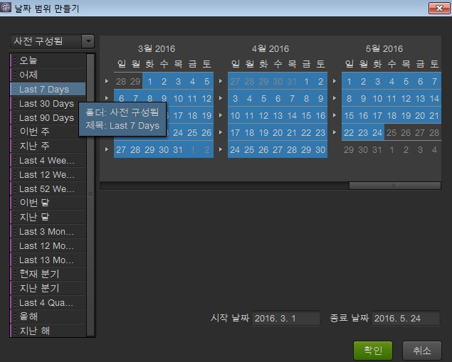

# 날짜 및 날짜 범위

달력에서 날짜와 날짜 범위를 지정하거나 사전 설정을 선택할 수 있습니다. 프로젝트, 작업 공간 및 보고서 수준에서 일정을 선택할 수 있습니다. 프로젝트의 날짜 범위는 기본 날짜입니다. 하지만 작업 공간 날짜 범위는 프로젝트의 날짜 범위를 덮어씁니다. 유사하게 보고서의 날짜 범위는 작업 공간과 프로젝트의 날짜 설정을 덮어씁니다. 데이터 가용성 범위 밖의 날짜 범위는 선택할 수 없습니다.

## Dates and date ranges {#concept_AB32765013F449908B5964AB622C75FF}

달력에서 날짜와 날짜 범위를 지정하거나 사전 설정을 선택할 수 있습니다. 프로젝트, 작업 공간 및 보고서 수준에서 일정을 선택할 수 있습니다. 프로젝트의 날짜 범위는 기본 날짜입니다. 하지만 작업 공간 날짜 범위는 프로젝트의 날짜 범위를 덮어씁니다. 유사하게 보고서의 날짜 범위는 작업 공간과 프로젝트의 날짜 설정을 덮어씁니다. 데이터 가용성 범위 밖의 날짜 범위는 선택할 수 없습니다.

 **[!UICONTROL 날짜 지우기]옵션이 활성화된 것은 데이터 날짜가 보고서 수준에서 지정되었음을 나타냅니다.**

날짜(및 시간 차원)를 보고서나 [!UICONTROL 테이블 빌더]로 드래그할 수도 있습니다. 특정, 날, 주, 달, 연도 또는 연속 날짜를 지정할 수 있습니다. Marketing Reports &amp; Analytics에서 사용자 정의 달력을 사용하는 경우 보고서 세트는 해당 설정을 상속하고 그에 따라 보고서를 업데이트합니다. 

프로젝트를 만드는 동안 날짜 범위를 선택할 때, 왼쪽의 [사전 구성됨]을 사용하면 롤링 날짜가 설정되고 오른쪽의 달력을 사용하면 롤링 날짜가 설정되지 않습니다. **[!UICONTROL 확인]단추 옆에 있는 "이 날짜 범위는 롤링됩니다"라는 구문을 통해 날짜 범위가 롤링되는지 여부를 쉽게 알려줄 수 있습니다.**

>[!NOTE]
>
>기존 보고서를 실행하는 데 도움이 필요한 경우 계정 관리자에게 문의하십시오.

## 기존 날짜 구획 {#concept_53AA34DB3CE647608CAF4B41D6EAF45E}

2010년 후반기에 Adobe는 향상된 처리 및 저장을 위해 통합된 데이터 플랫폼으로 보고서 세트 마이그레이션을 시작했습니다. 마이그레이션 이전에 존재했던 데이터는 캘린더 분기 또는 연도 경계로 제한되는 레거시 또는 과거 데이터로 간주됩니다.

<!-- 

c_legacy_data.xml

 -->

** 이전 날짜 구획에 액세스하려면**

1. [프로젝트를 만들거나 엽니다.](../../analyze/ad-hoc-analysis/c-getting-started.md#task_918A4539134E4E62B00486DCB8D3D403)
1. [달력을](../../analyze/ad-hoc-analysis/c-dates.md#concept_E8A2E36E595C45C785ECB724CA37FA47)연 다음 **[!UICONTROL 분기]** 또는 **[!UICONTROL 연도를 선택합니다]**.

>[!NOTE]
>
>내역 날짜 구획은 분기 및 연도 제한 내에 있습니다. 기존 구획과 새로운 처리 플랫폼 사이의 경계를 넘어 데이터를 볼 수 없습니다. 오류의 두 결과에 걸쳐 있는 날짜 범위입니다. 또한 날짜 범위는 사용자 지정 달력이 아닌 태양력에만 적용됩니다.

