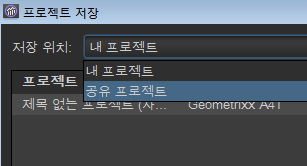

# Get Started with Ad Hoc Analysis{#concept_48936BA28FAE42DB81F1B2CD4726EB17}

>[!Important]
>2018년 8월 6일, Adobe는 Ad Hoc Analysis를 종료할 예정이라는 발표를 했습니다. 수명 종료 날짜는 확정된 후 공유될 예정입니다. 이 기간 동안의 Java 호환 버전 등 자세한 정보는 [https://adobe.ly/discoverworkspace](https://adobe.ly/discoverworkspace)를 참조하십시오.

웹 사이트 활동에 대한 즉각적인 고급 분석을 수행할 수 있습니다. 여러 보고서를 동시에 보고 여러 차원에 대한 세그먼트를 적용할 수 있습니다. 미시적 관점과 거시적 관점 모두에서 데이터를 분석하여 중요한 비즈니스 지표에 대한 영향을 볼 수 있습니다.

이러한 기능을 사용하면 사이트 트래픽, 방문자의 인구 통계학적 특성, 매출액 및 제품 이동에 대한 질문에 응답할 수 있습니다. 또한 데이터를 필터링, 정렬 및 세분화하여 까다로운 질문에 대한 해답도 찾을 수 있습니다. 결과는 거의 즉시 반환되어 요인의 조합이 미치는 효과를 신속하게 분석할 수 있습니다.

<table id="table_C9C0444687FC418580F996E1D2ADB61A"> 
 <thead> 
  <tr> 
   <th colname="col1" class="entry"> 작업 시작 </th> 
   <th colname="col2" class="entry"> 설명 </th> 
  </tr> 
 </thead>
 <tbody> 
  <tr> 
   <td colname="col1"> 
1. Adobe Analytics에 로그인합니다. 
 </td> 
   <td colname="col2"> 
<a href="https://marketing.adobe.com" scope="external" format="https"> marketing.adobe.com </a>로 이동하여 Adobe Analytics 자격 증명을 사용하여 로그인합니다. 
 </td> 
  </tr> 
  <tr> 
   <td colname="col1"> 
2. Ad Hoc Analysis을 시작합니다. 
 </td> 
   <td colname="col2">Adobe Analytics &gt; 도구 &gt; Ad Hoc Analysis을 클릭한 다음 Ad Hoc Analysis 시작 단추를 클릭합니다. 
 
참고: 이 페이지에서 <b>Ad Hoc Analysis 시작</b> 단추가 보이지 않는 경우에는 관리 도구에서 관리자가 사용자를 <i>Ad Hoc Analysis 라이선스 사용자</i> 그룹에 추가했는지 확인하십시오. 
 
 </td> 
  </tr> 
  <tr> 
   <td colname="col1"> 
3. 프로젝트를 만듭니다. 
 </td> 
   <td colname="col2"> 
 시작 페이지에서 보고서 세트를 선택한 다음 프로젝트 만들기를 클릭합니다. 
 
<a href="../../analyze/ad-hoc-analysis/c-getting-started.md#concept_FAE346335B0347A192C6C806C775D72B" type="concept" format="dita" scope="local"> 프로젝트 및 작업 영역을 참조하십시오</a>. 
 </td> 
  </tr> 
  <tr> 
   <td colname="col1"> 
4. 보고서를 엽니다. 
 </td> 
   <td colname="col2"> 
표준 Cloud 보고서 메뉴를 사용하여 보고서를 검색합니다. 템플릿을 선택할 수도 있습니다. 
 
자세한 내용은 <a href="../../analyze/ad-hoc-analysis/c-getting-started.md#concept_370F674C5B4C45368731AA801C5A45F8" type="concept" format="dita" scope="local"> 보고서 템플릿</a>. 
 </td> 
  </tr> 
  <tr> 
   <td colname="col1"> 
5. 보고서를 구성합니다. 
 </td> 
   <td colname="col2"> 
다음과 같은 작업 수행으로 보고서를 구성합니다. 
 
    <ul id="ul_0D2E8C614F2A4899A376BCEECEA374C6"> 
     <li id="li_FA925D52A8FD4DFAB0C88B797B24E72B"> 세그먼트를 만들어 데이터를 더 깊이 분석 </li> 
     <li id="li_5E91632551D2473BA8BD0637CDC1A9F6"> 지표, 차원 및 세그먼트를 <a href="../../analyze/ad-hoc-analysis/c-tablebuilder.md#concept_664FC77306E148DBA4EA081814943C5E" type="concept" format="dita" scope="local"> 테이블 빌더</a> </li> 
     <li id="li_019316C9A94B4A8C8A77D07C04E50278"><a href="../../analyze/ad-hoc-analysis/c-dates.md#concept_E8A2E36E595C45C785ECB724CA37FA47" type="concept" format="dita" scope="local"> 날짜 범위 구성</a> </li> 
     <li id="li_2B33B325D5EE420AB412B73AD1D231C5"> <a href="../../analyze/ad-hoc-analysis/c-schedule.md#concept_12D2DDD66086453BAB6D48D9D22932F2" type="concept" format="dita" scope="local"> 보고서 배달 예약</a> </li> 
    </ul> 
필요한 도움말을 찾으려면 도움말 시스템을 검색하십시오. 
 </td> 
  </tr> 
 </tbody> 
</table>

## 시스템 권장 사항 {#concept_6691331B45174290BD9B839806A9B52D}

 보고서는 가장 많이 사용되는 웹 브라우저에서 올바르게 작동해야 하지만 다음의 특정 권장 사항을 충족시키는 시스템에서 최적화된 보고서 모양과 기능을 얻을 수 있습니다.

<!-- 

c_sys_reqs.xml

 -->

>[!NOTE]
>
>Ad Hoc Analysis는 2018년 7월부터 Java 8 이후 버전만 지원합니다. 2018 년 7 월 유지관리 릴리스 이후 Java 7에서 애드혹 분석을 실행하도록 선택하는 경우 Adobe는 더 이상 애드혹 분석 구현을 지원하지 않습니다.

* OpenGL 2.0을 지원하는 비디오 카드
*  쿠키: 필수
* 운영 체제: Windows 및 Mac OS
* Macromedia Flash Player: 버전 6 이상
* 모니터 해상도: 800x600(1024x768 권장)
* 색상 깊이: 16비트 이상
* JavaScript: 활성화
* Java 버전: Java 1.7 이상 (위 참고 참조)

   올바른 Java 버전이 설치되지 않은 경우 자동으로 설치됩니다. 호환되지 않는 Java 버전이 설치된 경우 Ad Hoc Analysis은 업데이트를 다운로드하고 설치 여부를 묻습니다.

## Java 업그레이드 지침 {#section_E4C0C6492FF24636A0FF71A59331111D}

Ad Hoc Analysis는 2018년 7월부터 Java 8 이후 버전만 지원합니다. 2018 년 7 월 유지관리 릴리스 이후 Java 7에서 애드혹 분석을 실행하도록 선택하는 경우 Adobe는 더 이상 애드혹 분석 구현을 지원하지 않습니다.

Adobe의 .jar 파일은 1.7.0_76 이하의 Java 버전에서 지원되지 않는 보안 256비트 암호화로 서명됩니다. 이 256비트 인증서를 사용하면 향상된 보안을 활용할 수 있습니다.

아직 Java 7가 설치되어 있다면, 2018년 7월 유지관리 버전이 릴리스되기 전에 업그레이드해야 합니다. 방법은 다음과 같습니다.

* 컴퓨터에 프로그램 설치가 허용되는 경우

   1. https://www.java.com로 이동합니다.
   1. **[!UICONTROL 무료 Java 다운로드를 클릭합니다]**.
   1. **[!UICONTROL 동의 및 무료 다운로드 시작을 클릭합니다]**.
   1. 사용 중인 운영 체제용의 최신 Java 버전을 설치합니다.

* 컴퓨터에 프로그램 설치가 허용되지 **않는** 경우

   1. IT 부서의 도움을 받아 최신 버전의 Java를 설치합니다.

## Ad Hoc Analysis 시작 {#concept_B1CE3C1E6D1A4311B9835BEB69812E55}

<!-- 

c_login.xml

 -->

[!DNL Experience Cloud] 또는 URL에서 로그인할 수 있습니다. Reports &amp; Analytics에서 로그인하면 자동으로 로그인됩니다. URL을 사용한 로그인은 링크나 즐겨찾기 메뉴 등 다른 위치에서 Ad Hoc Analysis URL에 액세스하는 경우에만 필요합니다.

## Experience Cloud에서 로그인 {#task_128ED319F3AE49ED886EA3DFA8D0987F}

[!DNL Experience Cloud]에서 로그인하는 방법을 설명하는 단계입니다.

<!-- 

t_login_suite.xml

 -->

1. In a browser, navigate to [!DNL marketing.adobe.com].
1. Type your company name, your username, and your password. Then click **[!UICONTROL Sign In]**.
1. **[!UICONTROL Adobe Analytics]** &gt; **[!UICONTROL 도구]** &gt; **[!UICONTROL 애드혹 분석을 클릭합니다]**.

   이 페이지에서 **Ad Hoc Analysis 시작** 단추가 보이지 않는 경우에는 관리 도구에서 관리자가 사용자를 *Ad Hoc Analysis 라이선스 사용자* 그룹에 추가했는지 확인하십시오.
1. Click **[!UICONTROL Launch Ad Hoc Analysis]**.
1. [!DNL discover.jnlp] 파일을 로컬에 저장합니다.

   Ad Hoc Analysis를 실행하려 할 때마다 이렇게 저장된 파일을 실행할 수 있습니다.

## 프로젝트 및 작업 공간 {#concept_FAE346335B0347A192C6C806C775D72B}

프로젝트는 보고서 세트 및 날짜 범위 등 가져오는 데이터 세트를 정의합니다. 프로젝트는 모든 지표, 설정, 차원 및 세그먼트가 있는 임의 개수의 보고서들로 구성됩니다. 새로운 프로젝트를 시작하거나 저장된 프로젝트를 로드하거나 자동으로 저장된 프로젝트를 로드할 수 있습니다.

<!-- 

c_projects.xml

 -->

보고서를 *작업 공간*&#x200B;으로 그룹화합니다. 프로젝트에는 여러 작업이 들어 있을 수 있으며 작업 공간에는 여러 개의 보고서가 들어 있을 수 있습니다. 이 항목 간의 관계는 중첩 관계로 이해하면 가장 좋습니다.

한 번에 한 프로젝트만 열 수 있습니다. 하지만 프로젝트에서는 여러 작업 공간을 열 수 있습니다. 각 작업 공간에서는 몇 개의 보고서를 열어둘 수 있습니다.

새 프로젝트에 대한 기본적인 날짜 범위는 [!UICONTROL 최근 90일]입니다.

## 프로젝트 시작 {#task_918A4539134E4E62B00486DCB8D3D403}

프로젝트를 시작하는 방법에 대해 설명하는 단계입니다.

<!-- 

t_project_start.xml

 -->

1. 로그인합니다.
1. Open a saved project or click **[!UICONTROL Create Project]**.
1. 보고서를 검색하거나 템플릿을 선택합니다.

## 최근 저장한 작업 공간 열기 {#task_DE4A54180BC24E9DAEC98E2171DC6B40}

최근 저장한 작업 공간을 여는 방법에 대해 설명하는 절차입니다.

<!-- 

t_recent_workspace.xml

 -->

1. **[!UICONTROL 파일]** &gt; **[!UICONTROL 최근 작업 공간을 클릭합니다]**.

   최대 다섯 개의 최근 작업 공간을 열 수 있습니다. 최근 작업 공간은 세션을 종료한 후에는 사용할 수 없습니다.

## 프로젝트 공유 {#task_5911780D90164F3A8A677C8BC719750D}

공유 프로젝트는 회사에 있는 모든 Ad Hoc Analysis 사용자가 사용할 수 있습니다.

<!-- 

t_share_projects.xml

 -->

1. **[!UICONTROL 파일]** &gt; 다른 이름으로 **[!UICONTROL 저장을]**&#x200B;선택합니다.
1. Select **[!UICONTROL Shared Projects]** from the **[!UICONTROL Save in:]**drop-down.

   

1. **[!UICONTROL 저장을]** 클릭하여 프로젝트를 저장합니다.

   Shared projects can be opened via **[!UICONTROL File]** &gt; **[!UICONTROL Open]** &gt; **[!UICONTROL Shared Projects]**.

   >[!NOTE]
   >
   >하나 이상의 프로젝트를 선택하여 프로젝트 공유를 위한 동일한 대화 상자에서 공유 프로젝트를 삭제할 수 있습니다.

## Rename a Workspace {#task_0DB177DD6DB54B7F9FE60A0B3FC7CFC3}

작업 공간 이름을 변경하는 방법을 설명하는 단계입니다.

<!-- 

t_rename_workspace.xml

 -->

1. 작업 공간 이름을 마우스 오른쪽 단추로 클릭합니다.
1. Choose **[!UICONTROL Rename Workspace]**.
1. Type a name, then click **[!UICONTROL OK]**.

## 로컬 프로젝트 열기 {#task_1B3EF63A80C74776B24B99D80EAC74AC}

프로젝트에 대한 로컬 복사본을 여는 방법을 설명하는 단계입니다.

<!-- 

t_open_local_project.xml

 -->

1. **[!UICONTROL 파일]** &gt; 로컬 복사본 **[!UICONTROL 열기를]**&#x200B;클릭합니다.
1. Navigate to the local [!DNL .dproj] file, then click **[!UICONTROL Open]**.

## 보고서 템플릿{#concept_370F674C5B4C45368731AA801C5A45F8}을 참조하십시오 

템플릿은 수행할 분석 유형의 시작 지점입니다. 템플릿은 등급 보고서 또는 폴아웃 보고서와 같은 빈 캔버스일 수 있습니다. 또는 기본 지표 및 차원으로 시작되는 보고서입니다.

<!-- 

c_templates.xml

 -->

You can access templates when creating a project ( **[!UICONTROL File]** &gt; **[!UICONTROL New Project]**), or by adding a workspace or report.

| 템플릿 | 설명 |
|--- |--- |
| 등급 | 테이블을 구성할 수 있는 빈 캔버스를 제공합니다. 예를 들어, 페이지 보고서는 트래픽을 기반으로 사이트에 있는 페이지에 대해 등급을 매기고, 세부 사항 테이블은 페이지 보기 횟수 및 매출처럼 지표에 대한 비율(%) 및 수치를 보여줍니다. |
| 트렌드 | 전환과 이벤트가 보고 기간 동안 선택한 시간 세부기간(시간, 일, 주, 월, 분기, 또는 년)에 대해 보여지는 트렌드 방식을 조사하도록 해줍니다. |
| 총계 | 최종적인 수치를 보여주는 경영진 수준 보고서입니다. 여기에는 총 매출액, 페이지 보기 및 주문에 대한 데이터가 포함되어 있습니다. |
| 폴아웃 | 체크포인트 간 전환율 및 폴아웃 비율을 표시하는 단계를 만들도록 해줍니다. 예를 들어, 구매 프로세스 동안 방문자의 폴아웃 지점을 추적할 수 있습니다. |
| 흐름 | 사용자가 페이지, 사이트 섹션 및 서버에 걸쳐 선택하는 가장 일반적인 경로를 보여줍니다. |
| 전환 단계 | 특정 지표 이벤트 간 전환율을 보여줍니다. 이 보고서를 사용하여 영업을 생성하는 클릭스루의 수와 판매된 수량을 이해할 수 있습니다. |
| 사이트 분석 | 방문자가 지정된 페이지 및 이벤트를 통해 이동하는 방식을 표시하는 3차원 사이트 경로 지정 도구입니다. |
| 가상 포커스 그룹 | 사이트를 임의로 방문하고 방문에 대한 많은 양의 데이터를 보여줍니다. 이 보고서를 사용하여 방문자 인구의 포커스 그룹을 만들 수 있습니다. |

## 보고서 열기 {#task_0AC455CDA198497AA546622FB05F300D}

프로젝트를 만들 때, 또는 기존 프로젝트 내에서 보고서 또는 템플릿을 열 수 있습니다. 템플릿을 사용하여 보고서를 처음부터 구성하십시오.

<!-- 

t_reports_opening.xml

 -->

보고서를 여는 방법에는 다음과 같이 몇 가지가 있습니다.

* [!UICONTROL 새 보고서] 페이지에서 보고서를 검색하거나 템플릿을 선택합니다.
* 메뉴에서 **[!UICONTROL 보고서]를 클릭한 다음 보고서나 보고서 템플릿을 선택합니다.**
* 차원에서 보고서 실행: 차원 이름을 마우스 오른쪽 단추로 클릭한 다음 **[!UICONTROL 보고서 실행]** &gt; **`report name`**.
