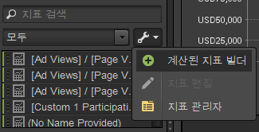
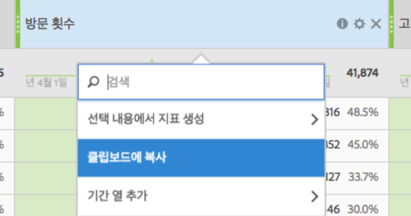

# 지표

지표는 보기 수, 클릭스루 횟수, 재로드 횟수, 평균 체류 시간, 날짜, 판매량, 주문 수, 매출액 등과 같은 방문자 활동에 대한 수량적 정보입니다. 지표와 관련 데이터는 보고서 열에 표시됩니다. 

## 지표 {#concept_46A67930CFDB4A078225C5B189688AF3}

지표는 보기 수, 클릭스루 횟수, 재로드 횟수, 평균 체류 시간, 날짜, 판매량, 주문 수, 매출액 등과 같은 방문자 활동에 대한 수량적 정보입니다. 지표와 관련 데이터는 보고서 열에 표시됩니다. 

표준 지표에는 다음이 포함됩니다.

* **트래픽**: 방문자의 볼륨에 대한 데이터를 보여줍니다.
* **전환**: 웹 사이트의 성공 이벤트에 대한 데이터를 보여줍니다. 성공 이벤트에는 구매, 다운로드 또는 웹 사이트에서 사용자가 수행하기를 원하는 기타 작업이 포함될 수 있습니다.
* **계산됨**: 다른 지표를 결합하여 만들어진 사용자 지정 가능한 지표. 예를 들어 매출액에서 키워드 비용과 상품 비용을 빼는 지표를 만들어 순 매출액을 얻을 수 있습니다. 그런 다음 이 금액을 총 주문 수로 나누어 주문당 평균 순 매출액을 얻을 수 있습니다.

에서 지표 사용 방법에 대한 자세한 내용은 *분석 참조 자료*&#x200B;의 [!DNL Experience Cloud]지표 정의를 참조하십시오.

[!UICONTROL 지표 구성] 도구를 사용하여 지표에 대한 새 폴더를 만들 수 있습니다. 그런 다음 원하는 대로 지표를 그룹화할 수 있습니다. 구성기를 사용하면 드래그 앤 드롭을 사용하여 사용자 지정 폴더에 기존의 지표를 복사할 수 있습니다.

폴더를 만들고 이름을 지정하고 원하는 대로 지표를 구성할 수 있지만 즐겨찾기와 계산된 지표 폴더를 제외하고는 기본 폴더로 변경할 수 없습니다.

## 지표 구성 {#task_17C844A9387042EAA9983E1E554846B1}

지표를 구성하고 지표 폴더를 만드는 방법을 설명하는 단계입니다.

<!-- 

t_organize_metrics.xml

 -->

1. [!UICONTROL 지표] 도구 창에서 **[!UICONTROL 추가 작업을 클릭합니다]**. (  

   )
1. Click **[!UICONTROL Organize Metrics]**.
1. **[!UICONTROL [새로 만들기]** ] 를 클릭하여 폴더를 만듭니다.
1. 다른 폴더에서 지표를 선택한 다음 선택 사항을 새 폴더로 드래그합니다.
1. **[!UICONTROL 확인을 클릭합니다]**.

   >[!NOTE]
   >
   >폴더를 삭제하면 폴더의 모든 지표가 현재 선택한 프로젝트에서 삭제됩니다.

## 보고서에 지표 추가 {#task_747DD1718B3F4776B83A115D0BE8754C}

 보고서에 지표를 추가하는 방법을 설명하는 단계입니다.

<!-- 

t_add_metrics_dsc.xml

 -->

1. [!UICONTROL 지표] 도구 창에서 지표를 찾습니다.

   검색 필드 또는 지표 폴더로 드릴다운하여 지표를 찾을 수 있습니다.

1. Drag the metric to the report table or [!UICONTROL Table Builder].

   보고서에 지표를 반복적으로 추가해야 하는 필요성을 줄이고자 하는 경우 [!UICONTROL 설정]에서 미리 기본 지표를 지정할 수도 있습니다.

   자세한 내용은 [등급 탭 - 정의](../../analyze/ad-hoc-analysis/c-global-settings.md#reference_FB9BADD7E3DA42C1BB2A02A6E9D5C1CF).

## 계산된 지표 빌더{#concept_F8E213CE786A43FB93847C5BA883A29C}에서 계산된 지표를 작성합니다.

이제 Ad Hoc Analysis의 계산된 지표 빌더는 Analytics 통합 계산된 지표에 연결되어 있습니다. 사용자 인터페이스는 Analytics의 계산된 지표 빌더와 유사합니다.

<!-- 

c_calc_metric_builder.xml

 -->

계산된 지표가 만들어지고 관리되는 방법에 대한 자세한 내용은 [계산된 지표 안내서](https://marketing.adobe.com/resources/help/en_US/analytics/calcmetrics/)를 참조하십시오.

다음은 Ad Hoc Analysis의 계산된 지표 빌더에 액세스하는 방법입니다.

1. [!UICONTROL 지표]**창에서[!UICONTROL 추가 옵션]**&#x200B;을 클릭한 다음 **[!UICONTROL 계산된 지표 빌더를 클릭합니다]**.

   

1. 계산된 지표 빌더 인터페이스를 사용하면 지표, 세그먼트 및 함수를 드래그하여 놓는 방식으로 사용자 지정 지표를 만들 수 있습니다.

   

