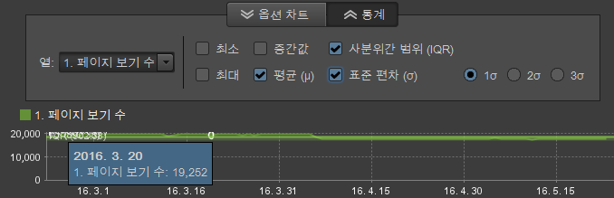

# 보고서 개요

표준 보고서에는 웹 사이트 및 방문자 활동 데이터, 트래픽 패턴, 참조 데이터, 광고 캠페인, 방문자 유지, 제품 데이터 등이 표시됩니다. 보고서를 실행한 다음 도구에 액세스하여 세그먼트, 지표 및 보고서 비교를 구성할 수 있습니다.

## 보고서 개요 {#concept_41459A705F2048EEA4EFA80F6BD9FFAB}

표준 보고서에는 웹 사이트 및 방문자 활동 데이터, 트래픽 패턴, 참조 데이터, 광고 캠페인, 방문자 유지, 제품 데이터 등이 표시됩니다. 보고서를 실행한 다음 도구에 액세스하여 세그먼트, 지표 및 보고서 비교를 구성할 수 있습니다.

사용자 지정 데이터를 수집하여 웹 사이트 특정 보고서를 만들 수 있습니다. 예를 들어 웹 사이트에 검색 기능이 있는 경우 제출된 검색어를 추적할 수 있으며 해당 검색어와 검색 결과를 보여주는 보고서를 만들 수 있습니다.

표준 보고서 세트는 모든 웹 사이트에서 공통적인 주제를 다룹니다. 보고서에 포함되는 사항은 다음과 같습니다.

* 웹 사이트 데이터
* 방문자 데이터
* 트래픽 패턴
* 참조 데이터
* 광고 캠페인
* 방문자 유지
* 제품 정보

Marketing Reports &amp; Analytics을 사용하는 경우에는 익숙한 보고서 유형 및 메뉴가 보입니다. Ad Hoc Analysis은 다음과 같은 유형을 기반으로 보고서를 분류합니다.

**요약 보고서**

[!UICONTROL 합계 보고서]와 같이 빠른 개요를 위해 설계된 데이터를 보여주는 보고서를 포함합니다. 데이터에 대한 일반적인 개요가 필요한 경영진에게 유용한 보고서입니다.

**전환 보고서**

전환 보고서로 고객 활동을 간편하고 정확하게 세부적으로 분석할 수 있습니다. 캠페인 관리, 영업 주기, 고객 폴아웃 및 고객 전환과 같은 지표로 전자 상거래, 영업 소스, 광고 효과, 고객 충성도 등을 측정할 수 있습니다.

**트래픽 보고서**

트래픽 보고서로 방문자와 웹 사이트의 상호 작용을 세부적으로 파악할 수 있습니다.

*  방문자 행동의 주요 측면 분석
*  트래픽 패턴 모니터링 및 이해
*  인기 있는 사이트 컨텐츠 판별
*  측정 가능한 기준으로 방문자 분류

## 캠페인 {#concept_A407CDF1D4AA49BAB396A1666E67FC87}

광고 노력의 효과에 대한 정보를 표시합니다. 어떤 종류의 광고가 가장 많은 트래픽을 유발하며 어떤 직원이 이러한 노력을 담당했는지 확인할 수 있습니다.

<!-- 

c_reports_campaigns.xml

 -->

이 보고서는 보통 사용자 지정되며 따라서 분석가마다 다릅니다. See [Campaign Manager](https://marketing.adobe.com/resources/help/en_US/reference/campaign_manager_admin.html) in the [!DNL Admin Console] help for more information.

## 통계적 계산 {#concept_83FF70DB7895435E985699FE9012D585}

등급 보고서에 표시할 기본 통계를 사용자 지정할 수 있습니다.

<!-- 

c_Statistical_Calculation_ad_hoc.xml

 -->

특정 보고에 필요한 사항을 기반으로 하여 데이터에 대해 측정되는 평균, 중간값, 표준 편차, 기타 수학적 계산 등을 포함한 추가적인 기본 통계 계산은 보고서 실행 시 등급 보고서에 추가하여 표시할 수 있습니다.

**등급 보고서용의 통계적 계산을 열려면**

1. Select **[!UICONTROL Tools]** &gt; **[!UICONTROL Ranked]** from the menu.

1. **[!UICONTROL 설정을 선택합니다]**.
1. **[!UICONTROL 기본 통계를 선택합니다]**.

**[!UICONTROL 통계 계산에서]** 0을 무시합니다. 0을 무시하고 다른 지표를 추가해도 이미 계산된 평균이 변경되지 않게 하려면 이 옵션을 선택하십시오. 모든 통계가 이 설정의 영향을 받습니다(합계에는 영향이 없는 경우에도).

| 계산 | 설명 |
|--- |--- |
| 최대 | 지정된 데이터 세트에 대한 모든 행에서 최대값을 식별합니다. |
| 최소 | 지정된 데이터 세트에 대한 모든 행에서 최소값을 식별합니다. |
| 합 | 데이터 세트에 있는 각 행의 모든 값에 대한 계산.  예를 들어, 합계에서는 방문자를 한 번만 계산(방문 횟수에 상관없이)하지 않고 방문자의 모든 방문을 집계합니다. 수집된 데이터 포인트의 포괄적인 총계입니다. |
| 평균 | 평균은 데이터 세트에 있는 행 값의 산술 평균으로서, 합을 개수로 나누어 계산합니다(합/개수). 평균은 일반적으로 비대칭 분포에 사용되는 중간값과 달리, 멀리 떨어진 데이터의 영향을 받습니다. |
| 표준 편차 | 표준 편차는 예상 평균으로부터 얼마만큼의 차이가 있는지를 보여줍니다. 표준 편차가 작으면 데이터 포인트가 평균에 가까움을 의미합니다. 표준 편차가 크면 데이터 포인트가 넓은 값 범위에 퍼져 있음을 의미합니다. |
| 중간값 | 중간값은 데이터 세트에 있는 행들에 대해 데이터의 높은 쪽 반을 낮은 쪽 반과 분리하는 숫자 값입니다. 평균과 달리, 중간값은 일반적으로 멀리 떨어진 값의 영향을 회피하는 데 사용됩니다. |
| 사분위수 | 사분위수는 데이터 세트를 각각이 데이터 세트의 1/4을 구성하는 4개의 동등한 그룹으로 나누는 세 개의 점으로 식별되는 데이터 세트에 있는 값들의 세트입니다. 첫 번째 사분위는 25번째 백분위수이고, 세 번째 사분위는 75번째 백분위수입니다. (두 번째 사분위는 중간값이고, 네 번째 사분위는 합입니다.) |
| 계수 | 데이터 세트에 있는 행 수를 반환합니다. |

## 평균과 지표 전체 계산의 예 {#section_7C49196503964FB0A429FA347BC92D09}

Mean 함수는 Microsoft Excel의 데이터 열과 유사하게 계산됩니다. 특히, 이것은 (평균 바운스 비율 결정과 같이) 비율의 **Mean**&#x200B;이 평균의 비율이 아니라 비율의 평균임을 의미합니다. 평균의 비율에는 바운스 비율 지표의 **총계**&#x200B;가 포함됩니다.

<table id="table_9EC56B15C6A340DA8917CB0DBCAC2355"> 
 <thead> 
  <tr> 
   <th colname="col1" align="center" class="entry"> 날짜 </th> 
   <th colname="col2" align="center" class="entry"> 단일 방문 수 </th> 
   <th colname="col3" align="center" class="entry"> 항목 </th> 
   <th colname="col4" align="center" class="entry"> 바운스 비율 </th> 
   <th colname="col5" align="center" class="entry"> </th> 
  </tr>
 </thead>
 <tbody> 
  <tr valign="top"> 
   <td colname="col1"> 
2013년 6월 
 
2013년 7월 
 
2013년 8월 
 </td> 
   <td colname="col2" align="center"> 
344 
 
297 
 
41 
 </td> 
   <td colname="col3" align="center"> 
1000 
 
1000 
 
1000 
 </td> 
   <td colname="col4" align="center"> 
34.4% 
 
29.7% 
 
41.0% 
 </td> 
   <td colname="col5"> </td> 
  </tr> 
  <tr valign="top"> 
   <td colname="col1" align="center" valign="middle"><b>평균</b> </td> 
   <td colname="col2" valign="middle"> (344+297+41)/3 </td> 
   <td colname="col3" valign="middle"> (1000+1000+100)/3 </td> 
   <td colname="col4" valign="middle" align="right"> (34.4 + 29.7 + 41.0) / 3 = <b>35.0</b>% </td> 
   <td colname="col5" valign="middle"><b>비율의 평균</b> </td> 
  </tr> 
  <tr valign="top"> 
   <td colname="col1" align="center" valign="middle"><b>지표 총계</b> </td> 
   <td colname="col2" valign="middle"> 682 </td> 
   <td colname="col3" valign="middle"> 2100 </td> 
   <td colname="col4" valign="middle" align="right"> 682 / 2100 = <b>32.0</b>% </td> 
   <td colname="col5" valign="middle"><b>평균의 비율</b> </td> 
  </tr> 
 </tbody> 
</table>

## 통계 계산 오버레이 {#concept_97E1B32DAC734C7B9F8899717283CEEC}

이제 Ad Hoc Analysis은 시간(분, 시간, 일, 주)의 흐름에 따라 데이터를 표시하는 보고서의 통계적 계산에 대한 오버레이 시각화를 제공합니다. 

<!-- 

c_overlay_calculations.xml

 -->

일정 기간 동안의 데이터를 식별하는 보고서에서, **[!UICONTROL 통계]단추를 사용하면 보고서 타임라인에서 오버레이로 표시되는 계산을 선택할 수 있습니다.**

In addition to standard [Statistical Calculations](../../analyze/ad-hoc-analysis/c-overview-standard-reports.md#concept_83FF70DB7895435E985699FE9012D585), you can select the 1st, 2nd, and 3rd standard deviations in the overlays.

## 그룹 관리자 {#concept_E1433974A61144858E87334C006982B2}

Rather than using a single page in a report, you can group multiple pages and use them as categories for starting, intermediate, or destination location in the [!UICONTROL Fallout] and [!UICONTROL Site Analysis] reports. 주 메뉴 또는 보고서 내에서 그룹을 편집할 수 있습니다. Marketing Reports &amp; Analytics에서 만든 카테고리는 [!UICONTROL 체크포인트 선택기] 목록에도 나타납니다.

<!-- 

c_groups.xml

 -->

Click **[!UICONTROL Tools]** &gt; **[!UICONTROL Group Manager]**.
