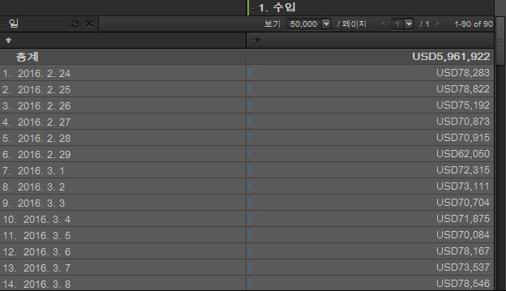

# 시간

시간은 시간, 일, 주 및 데이터 범위에 대한 트렌드를 표시하는 데 유용한 보고 차원입니다. 예를 들어 제품 보고서는 선택한 기간 동안 제품이 올린 매출을 표시합니다. [일] 차원을 추가하여 보고 기간 내의 각 날에 대한 트렌드를 확인할 수 있습니다. [시간]은 시간, 일, 주, 월, 분기 및 년으로 이루어진 세부기간 설정을 제공합니다. 날짜 범위 사전 설정에는 오늘, 어제 및 최근 7일과 같은 설정이 포함되어 있습니다.

## 시간 {#concept_CB64A0A2150C471FB0B0B42516905887}

시간은 시간, 일, 주 및 데이터 범위에 대한 트렌드를 표시하는 데 유용한 보고 차원입니다. 예를 들어 제품 보고서는 선택한 기간 동안 제품이 올린 매출을 표시합니다. [일] 차원을 추가하여 보고 기간 내의 각 날에 대한 트렌드를 확인할 수 있습니다. [시간]은 시간, 일, 주, 월, 분기 및 년으로 이루어진 세부기간 설정을 제공합니다. 날짜 범위 사전 설정에는 오늘, 어제 및 최근 7일과 같은 설정이 포함되어 있습니다.

[시간] 차원을 추가하려면 하나 이상의 날짜 범위를 [시간] 도구 창에서 보고서 테이블이나 테이블 빌더로 드래그합니다.

이 예는 매출 관련 트렌드가 있는 [일] 차원을 보여줍니다.

## 시간 - 정의 {#reference_6E718B78E437438E825DB9262086A987}

시간 창에서는 날짜 범위 및 트렌드 사전 설정을 선택한 다음 선택 사항을 [!UICONTROL 테이블 빌더]나 보고서 격자로 드래그할 수 있습니다.

<!-- 

r_time_panel.xml

 -->

| 필드 | 정의 |
|--- |--- |
| 데이터 범위 | 하나 이상의 기간을 선택하고 이것을 테이블 빌더나 보고서 격자로 드래그할 수 있도록 해줍니다. 시간을 행의 분류로, 또는 열 헤더로 볼 수 있습니다. 일, 주, 월 또는 사용자 지정 날짜 범위와 같은 기간을 선택할 수 있습니다. SiteCatalyst에서 사용자 지정 달력을 사용하는 경우 보고서 세트는 이 설정을 상속합니다. |
| 트렌딩 | 시간, 일, 주, 월 등에 대한 보고 트렌드를 표시할 수 있도록 해줍니다. [트렌딩]의 항목을 보고서로 드래그하면 달력에서 지정한 날짜 범위에 의해 제어되는 시간 설정에 대한 데이터를 보게 됩니다. |