# 분석 작업 공간 개요

Analysis Workspace에서는 단일 Analytics 보고서의 모든 일반적인 제한이 적용되지 않습니다. 사용자 지정 분석 프로젝트를 작성하기 위한 강력하고 유연한 캔버스를 제공합니다. 원하는 수의 데이터 테이블, 시각화 및 구성 요소(차원, 지표, 세그먼트 및 시간 세부기간)를 프로젝트에 드래그하여 놓으십시오. 즉시 분류 및 세그먼트를 만들고, 분석할 집단을 만들고, 경고를 만들고, 세그먼트를 비교하고, 플로우 및 폴아웃 분석을 하고, 회사 동료와 공유할 보고서를 조정 및 예약하십시오.

**[!UICONTROL Analytics]** &gt; **[!UICONTROL 작업 영역]**

## Overview video {#section_B99BF8A326D94ECB91BD69C9888AD10C}

>[!VIDEO](https://www.youtube.com/watch?v=IHOy-QsvVcA)

전체 Youtube 재생 목록은 [여기](https://www.youtube.com/playlist?list=PL2tCx83mn7GuNnQdYGOtlyCu0V5mEZ8sS)에서 사용할 수 있습니다.

>[!NOTE]
>
>See [What's New in Analysis Workspace](../../analyze/analysis-workspace/new-features-in-analysis-workspace.md#concept_EDB651D6F41E4F7BB4EB5E1EBB95D195) for updates about features.

## Full control over project elements and components {#section_B7E3EDA3EDEE407D833F4FDB69646EEC}

Analysis Workspace에서는 다음과 같은 작업을 자유롭고 유연하게 수행할 수 있습니다.

* 구성 요소 드래그하여 놓기(차원, 지표, 세그먼트 및 시간 세부기간)
* 여러 가지 시각화를 프로젝트에 드래그하여 놓기
* 프로젝트 내의 원하는 곳에서 시각화를 이동, 크기 변경, 스택

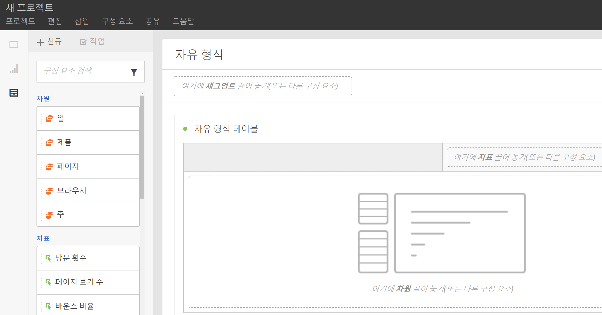

자세한 내용은 [Analysis Workspace 프로젝트 만들기](../../analyze/analysis-workspace/build-workspace-project/t-freeform-project.md#task_C2C698ACC7954062A28E4784911E6CF2)를 참조하십시오.

## Multiple visualizations in a project {#section_B7670740C2D44130B21DAF0873280DA5}

프로젝트에 시각화를 원하는 만큼 드래그하여 놓으십시오.

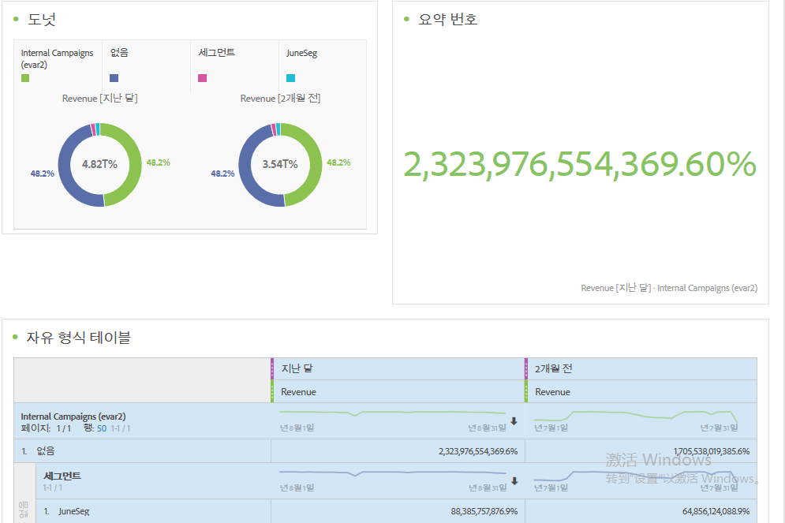

자유 형식 데이터 테이블의 셀에 따라 여러 가지 시각화로 변화율을 보여주는 프로젝트를 만들어 보십시오.

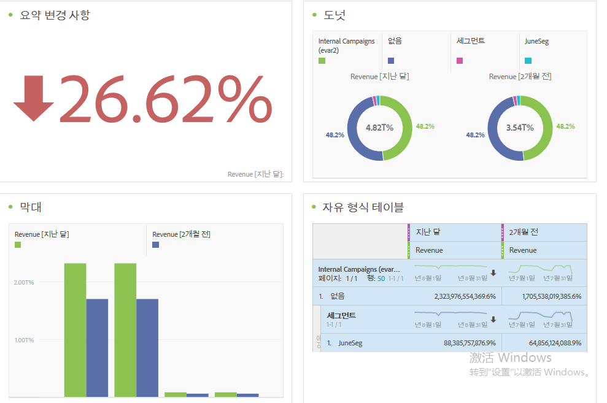

See [Create an Analysis Workspace project](../../analyze/analysis-workspace/build-workspace-project/t-freeform-project.md#task_C2C698ACC7954062A28E4784911E6CF2) for more information.

## Intra-linking to panels and visualizations {#section_253EA04E067F4A29A8B54CE2B7631086}

In conjunction with the [rich text editing](../../analyze/analysis-workspace/visualizations/text.md#concept_2315D97E27364E3194AC1C459B654B2F) capabilities of Analysis Workspace, you can link down to specific panels and visualizations within a project from a text box, such as to create a project's table of contents. 프로젝트 링크를 공유하는 것처럼 이 링크를 공유하여 프로젝트 내의 특정 시각화 또는 패널을 다른 사람에게 표시할 수 있습니다. 마우스 오른쪽 버튼으로 클릭하는 새로운 옵션인 "패널 링크 가져 오기" 및 "시각화 링크 가져오기"가 추가되었습니다. 프로젝트에 인트라 링크를 추가하려면 다음을 수행하십시오.

1. 텍스트 시각화를 프로젝트 내의 맥락이 필요한 시각화 또는 테이블 옆으로 드래그합니다.
1. 예를 들어 목차로 텍스트 상자를 채운 다음 패널이나 시각화에 연결할 항목(예: 성공 지표)을 강조 표시합니다.

   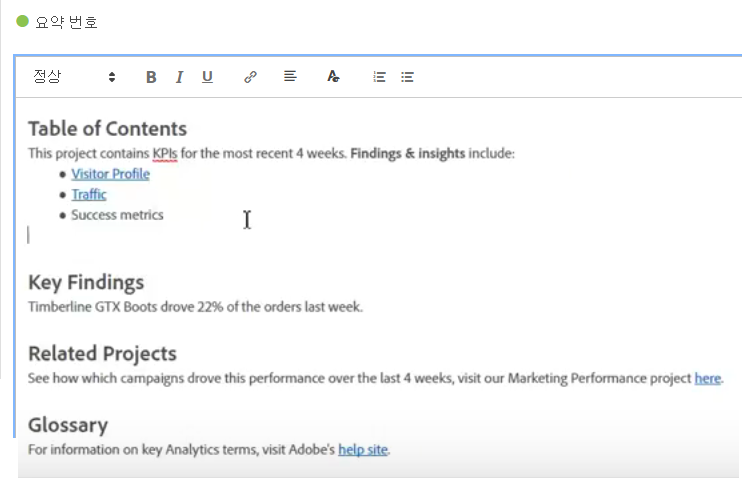

1. 해당 패널 또는 시각화로 스크롤하고 패널의 헤더를 마우스 오른쪽 버튼으로 클릭합니다.
1. Scroll down and select **[!UICONTROL Get Panel Link]** or **[!UICONTROL Get Visualization Link]**:

   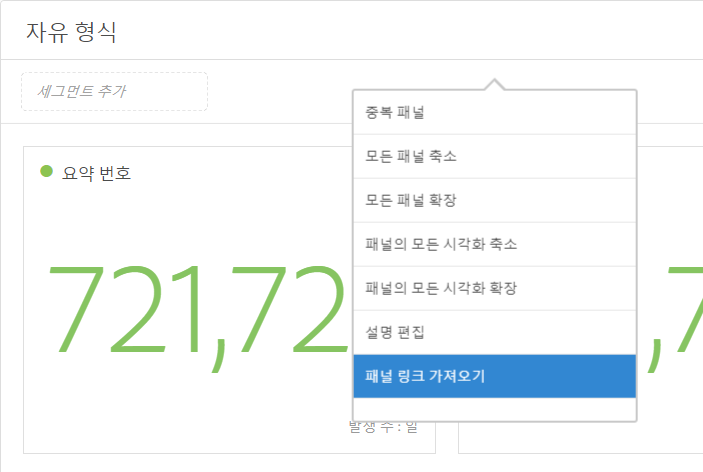

1. 해당 링크를 복사하여 텍스트 시각화의 성공 지표 하이퍼링크에 추가하십시오. 확인 표시를 클릭하여 텍스트를 저장하십시오.

프로젝트 내에서 패널 또는 시각화가 축소된 경우 링크를 클릭하면 패널/시각화가 확장되어 사용자가 볼 수 있습니다.

>[!NOTE]
>
>**[!UICONTROL 편집 설명]** 마우스 오른쪽 단추 클릭 옵션 내에서 이 기능을 사용할 수도 있습니다.

## Link to other projects {#section_AE886C367C3E4F189B65B1BD9BCDBD8C}

You can link users to other projects that may be of interest to them by going to  **[!UICONTROL Share]** &gt; **[!UICONTROL Get Project Link]** and embedding this link in project descriptions, for example.

## Dynamic visualization of selected cells {#section_182CEC285E4547EBA4608D5F70C9D5D7}

개별 셀을 선택하고 시각화 표현들의 변화를 다이내믹하게 볼 수 있습니다. 선택한 셀로 시각화를 [동기화하고 잠그십시오.](../../analyze/analysis-workspace/analysis-workspace-features.md#section_9D66A001586F49CEB0C565581E44957C)

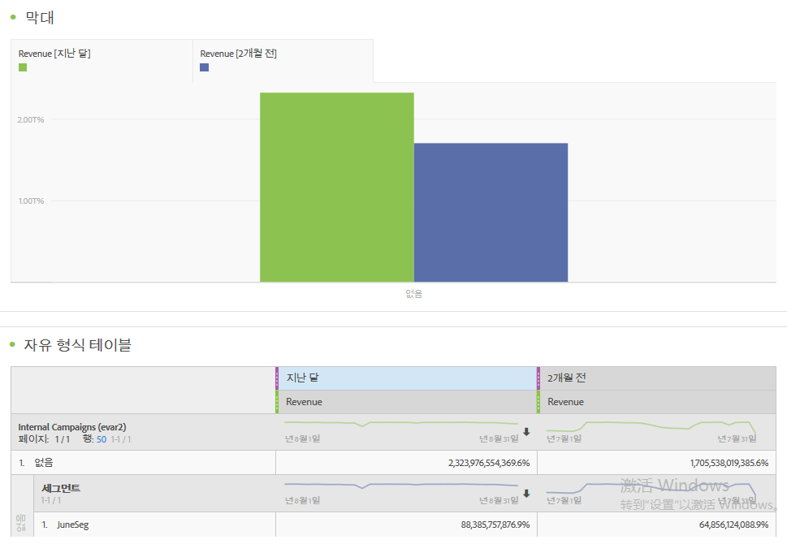

## Lock selected items or positions {#section_9D66A001586F49CEB0C565581E44957C}

시각화를 잠그면 시각화에 해당하는 자유 형식 데이터 테이블 소스를 제어할 수 있습니다.

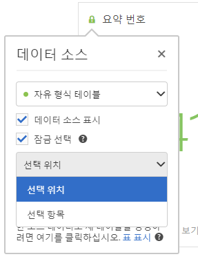

See [Manage data sources](../../analyze/analysis-workspace/visualizations/t-sync-visualization.md#task_A73B065DC3834AFCA422E364A1468099).

## Trend visualizations from selected cells {#section_34930C967C104C2B9092BA8DCF2BF81A}

선택한 셀에서 시각화를 만들어 보십시오. (Right-click &gt; **[!UICONTROL Trend Selection]**.)

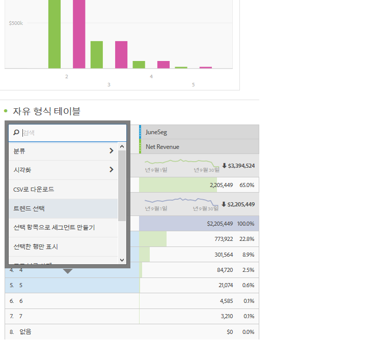

이제 트렌드 선택이 아래 테이블에 **연결**&#x200B;되므로 테이블에서 다른 행을 선택하면 트렌드 차트에 해당 행이 반영됩니다.

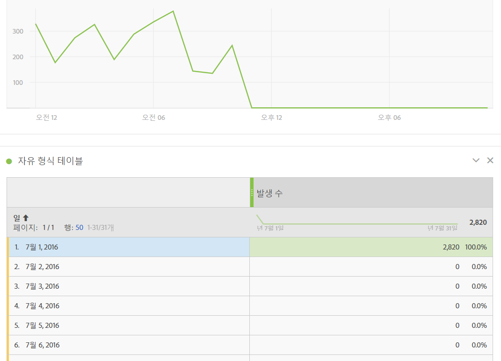

## Dimensions and dimension item breakdowns {#section_1380C1F9E51E4BFB8C5D35E7A53BC70D}

소매업자의 경우, 고객을 더 잘 참여시키는 방법을 알기 위해 그 어느 때보다 더 캠페인에 깊이 관여할 수 있습니다. 구체적인 필요 사항들을 위해 원하는 방법으로 데이터를 분류할 수 있습니다. 적절한 지표, 차원, 세그먼트, 타임라인 및 기타 분석 분류 값을 사용하여 쿼리를 작성해 보십시오.

See [Break down dimensions](../../analyze/analysis-workspace/components/dimensions/t-breakdown-fa.md#task_B594DA2476E84DFDA8279E831F0BD9C4).

## Segments from table selections {#section_73BC3688089B426D969B3D5B606DA970}

자유 형식 테이블에서 셀을 선택하고 선택 내용에서 세그먼트를 만듭니다.

여러 세그먼트를 비교하고 즉시 세그먼트를 만들고 적용합니다. 여러 세그먼트를 적용하여 동작과 상호 작용을 기반으로 특정 고객에 초점을 맞춘 다음 비교 및 대비시킬 수 있습니다.

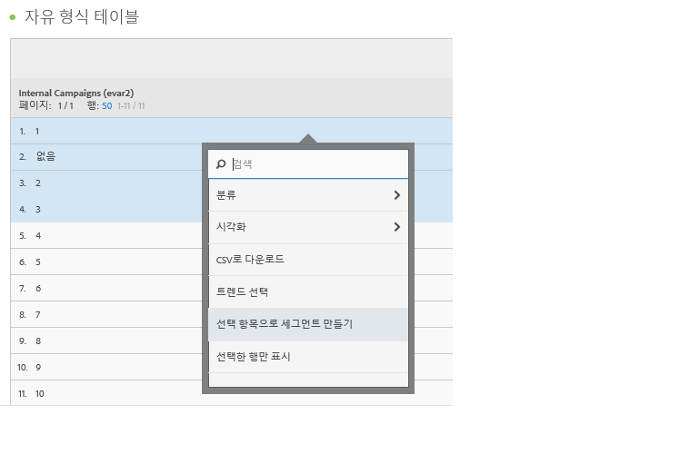

프로젝트 수준에서 세그먼트를 자유 형식 패널에 놓으십시오. 그러면 세그먼트가 전체 프로젝트에 적용됩니다.

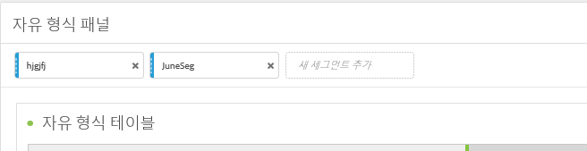

see [세그먼트](../../analyze/analysis-workspace/components/t-freeform-project-segment.md#task_11C6A2C7717B48049E5750B9D20FEC80)를 참조하십시오.

## Project and component tagging {#section_F54D688132A541F2982326D5E022B90D}

Analysis Workspace에서 프로젝트 및 구성 요소에 태그를 적용할 수 있습니다.

* [정보] 패널에서 프로젝트 수준 태그를 적용하거나 만들 수 있습니다. (

* 구성 요소를 마우스 오른쪽 단추로 클릭하여 [구성 요소] 패널에서 태그를 지정합니다.(또는 태그를 만듭니다.)
* [검색] 필드에 #를 사용하여 태그를 찾습니다.

## Component actions {#section_CBF4D0A5F63E4B0883077B8D852B800B}

구성 요소 왼쪽 레일의 위쪽에 있는 작업 메뉴에서 구성 요소 수준의 작업을 수행합니다. 구성 요소를 선택하고 **[!UICONTROL 작업]을 클릭하여 작업을 봅니다.**

| 구성 요소 작업 | 설명 |
|--- |--- |
| 태그 | 구성 요소에 태그를 적용하여 구성 요소를 구성하거나 관리합니다. 그러면 각 구성 요소 관리자에 Analytics &gt; 구성 요소 &gt; 세그먼트 또는 Analytics &gt; 구성 요소 &gt; 프로젝트와 같이 표시됩니다. |
| 즐겨찾기 | 구성 요소를 즐겨찾기 목록에 추가합니다. 그러면 각 구성 요소 관리자에 Analytics &gt; 구성 요소 &gt; 세그먼트 또는 Analytics &gt; 구성 요소 &gt; 프로젝트와 같이 표시됩니다  . |
| 승인 | 정형화되도록 구성 요소를 승인합니다. 그러면 각 구성 요소 관리자에 Analytics &gt; 구성 요소 &gt; 세그먼트 또는 Analytics &gt; 구성 요소 &gt; 프로젝트와 같이 표시됩니다. |
| 공유 | 세그먼트에만 적용됩니다. |
| 삭제 | 세그먼트에만 적용됩니다. |

See [Visualizations](../../analyze/analysis-workspace/visualizations/freeform-analysis-visualizations.md#concept_09242627629147A88A68F1506954C276) for more information.

## Additional feature descriptions {#section_5F06AE43C0194CFDBCA7EE0EA3C30B05}

**드래그 및 스택할 수 있는 사항**

구성 요소

* 차원
* 세그먼트
* 지표
* 날짜 범위
* 시간 세부기간(시간, 일, 주 등).

**여러 자유 형식 테이블 및 여러 가지 시각화**

패널에 추가할 수 있는 자유 형식 테이블 및 시각화의 수에는 기술적 제한이 없습니다. 또한 각 자유 형식 테이블 또는 테이블의 선택된 행에 대해 새 시각화를 실행(또는 CSV로 내보내기)할 수 있습니다.

**열 배열, 정렬 및 복사**

* 날짜 범위 사전 설정 정렬(사용자 지정 날짜 범위를 포함하지 않습니다.)
* 열을 Ctrl(또는 Command) + 클릭 + 드래그하면 열이 복사되며, 복사본을 드래그하면 테이블에서 새 위치로 붙여넣기가 됩니다.

See [Hotkeys Available in Analysis Workspace](../../analyze/analysis-workspace/build-workspace-project/fa-shortcut-keys.md#concept_9A6356084DBC4D468E265E7A65B3E051) for more information.

**선택 및 작업**

Excel에서 선택할 수 있는 방식과 유사하게 행과 열을 선택할 수 있습니다. 그런 다음, 해당 선택 내용에 대해 작업을 수행할 수 있습니다. 예:

* 선택 내용에서 시각화 만들기
* 클립보드에 복사(CTRL 또는 Command + C)
* 다중 선택 행들을 분류합니다. 행을 선택한 다음, 차원을 선택 항목 위로 드래그합니다. 또는 선택한 항목을 마우스 오른쪽 단추로 클릭하고 [분류] 메뉴를 사용합니다.

**자동 저장 및 저장하지 않은 변경 사항**

프로젝트를 저장하지 않고 브라우저를 닫으려고 하거나 [뒤로] 단추를 사용하려고 하면 변경 사항을 저장하라는 메시지가 표시됩니다. 시스템이 충돌하는 경우, 프로젝트를 로드할 때 이전 프로젝트 상태로 복원하라는 경고가 표시됩니다.

이미 기존(신규 아님) 프로젝트는 브라우저가 충돌하는 경우 또는 다른 환경에서 프로젝트를 저장할 기회가 제공되지 않은 경우에만 자동으로 저장됩니다.

**모든 방문**

Analysis Workspace에 고유한 기본 세그먼트. *`All Visits`* 에는 테이블에 추가하는 구성 요소에 대한 합계가 표시됩니다.

**계산된 지표**

표준 지표를 사용할 때와 동일한 방식으로 계산을 사용하십시오.

[계산된 지표](https://marketing.adobe.com/resources/help/en_US/analytics/calcmetrics/)를 참조하십시오.
