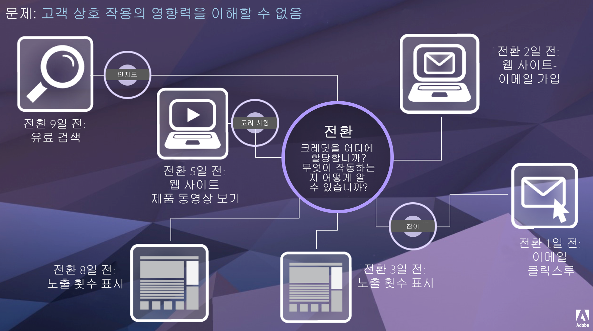

# 속성 IQ

기여도 IQ는 마케팅 활동이 전환에 기여하는 방법에 대한 추가적인 통찰력을 제공하는 Adobe Analytics의 기능 세트입니다.

고객 여정은 선형적이지 않고 예측 불가합니다. 각 고객은 각자의 진도에 따라 수익을 창출합니다.종종 다른 비선형 동작을 이중 뒤로, 정지, 다시 시작하거나 참여를 유도합니다. 이러한 유기적 행동은 고객 여정 전반에서 마케팅 활동의 영향을 파악하기 어렵습니다. 또한 여러 채널의 데이터를 통합하려는 노력에 방해가 됩니다.

최신 인텔리전스 팀은 Adobe Analytics 기여도 IQ를 사용하여 고객 여정 전체에서 의미 있는 참여도가 어떻게 이루어지는지 파악하여 고객 타겟팅으로 이어지는 요인을 식별할 수 있습니다. 고객 여정의 이러한 측면을 이해하면 마케팅 전략을 효과적으로 최적화할 수 있습니다.

Adobe Analytics는 다음을 통해 속성을 강화합니다.

* 유료 미디어 이외의 속성 정의: 차원, 지표, 채널 또는 이벤트는 마케팅 캠페인뿐 아니라 모델(예: 내부 검색)에 적용할 수 있습니다.
* 무제한 속성 모델 비교를 사용: 원하는 수만큼 모델을 동적으로 비교합니다.
* 구현 변경 방지: 보고서 처리 시간 및 컨텍스트 인식 세션으로 고객 움직임 컨텍스트를 구축하고 런타임에 적용할 수 있습니다.
* 사용자의 속성 시나리오와 일치하는 세션을 생성합니다.
* 세그먼트별 속성 분류: 중요한 모든 세그먼트(예: 신규 및 반복 고객, 제품 X와 제품 Y, 로열티 수준 또는 CLV)에서 마케팅 채널의 실적을 쉽게 비교할 수 있습니다.
* 채널 교차 및 다중 터치 분석 검사:벤 다이어그램 및 히스토그램을 사용하고 트렌드 기여도 분석 결과를 사용합니다.
* 주요 마케팅 시퀀스를 시각적으로 분석할 수 있습니다.다중 노드 흐름과 폴아웃 시각화를 통해 시각적으로 전환으로 이어지는 경로를 살펴볼 수 있습니다.
* 계산된 지표 작성: 여러 속성 할당 방법을 사용합니다.

## 기능

속성 IQ는 다음 기능으로 구성됩니다.

* [속성 패널:](c-panels/attribution/attribution.md)
