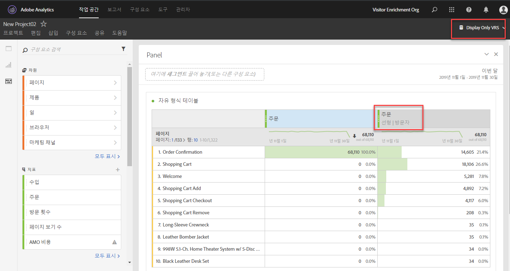

# 기여도 분석 FAQ

**기여도 분석을 사용할 때 &quot;없음&quot; 라인 항목은 무엇입니까?**

&#39;없음&#39; 라인 항목은 전환 확인 기간 내에 터치 포인트 없이 발생한 모든 전환을 나타내는 잡동사니 주머니입니다. &#39;없음&#39; 라인 항목에 속하는 전환 수를 줄이려면, 더 긴 조회 기간과 함께 사용자 지정 조회 창을 사용해 보십시오.

**기여도 분석 모델을 사용할 때때로 보고 기간 밖의 날짜가 표시되는 이유는 무엇입니까?**

이러한 추가적인 날짜는 방문자 보고 전환 확인 기간으로 인한 것입니다. 자세한 내용은 Analytics KB의 [보고 기간을 벗어나서 나타나는 데이터](https://helpx.adobe.com/kr/analytics/kb/data-appearing-outside-reporting-window.html)를 참조하십시오.

**방문, 방문자 또는 사용자 지정 어트리뷰션 룩백을 언제 사용해야 합니까?**

기여도 분석 전환 확인의 선택은 사용 사례에 따라 다릅니다. 일반적으로 전환 시간이 단일 방문보다 오래 걸리는 경우 방문자 또는 사용자 지정 룩백이 권장됩니다. 전환 주기가 길어질 경우 보고 창 이전에 데이터를 가져올 수 있는 유일한 형식이므로 사용자 지정 전환 조회 창이 가장 좋습니다

**기여도 분석을 사용할 때 prop 및 eVar는 어떻게 비교합니까?**

기여도 분석은 보고서 런타임 시 다시 계산되며 따라서 기여도 분석 모델링을 위한 prop 또는 eVar(또는 다른 차원) 간 차이점은 없습니다. Prop은 모든 전환 확인 기간 또는 기여도 분석 모델을 사용하여 지속될 수 있으며 eVar 할당/만료 설정은 무시됩니다.

**데이터 피드 또는 Data Warehouse와 같은 다른 Analytics 기능에서 기여도 분석 모델을 사용할 수 있습니까?**

아니요. 기여도 분석 모델은 Analysis Workspace에서만 사용할 수 있는 보고서 처리 시간을 사용합니다. 자세한 내용은 [보고서 처리 시간](/help/components/vrs/vrs-report-time-processing.md)을 참조하십시오.

**보고서 처리 시간이 활성화된 가상 보고서 세트를 사용하는 경우에만 기여도 분석 모델을 사용할 수 있습니까?**

기여도 분석 모델은 가상 보고서 세트의 외부에서 사용할 수 있습니다. 백엔드에서 보고서 처리 시간을 사용하는 동안 표준 보고서 세트와 가상 보고서 세트 모두에서 기여도 분석 모델을 사용할 수 있습니다.

**지원되지 않는 차원 및 지표는 무엇입니까?**

기여도 분석 패널은 모든 차원을 지원합니다. 지원되지 않는 지표는 다음과 같습니다.

* 고유 방문자 수
* 방문 횟수
* 발생
* 페이지 보기 횟수
* A4T 지표
* 체류 시간 지표
* 바운스 수
* 바운스 비율
* 항목
* 종료
* 페이지를 찾을 수 없음
* 검색 결과
* 단일 페이지 방문 횟수
* 단일 액세스

**기여도 분석은 분류와 함께 작동합니까?**

예. 분류는 완전히 지원됩니다.

**기여도 분석이 데이터 소스에서 작동합니까?**

예. 대부분의 데이터 소스가 지원됩니다. 요약 수준 데이터 소스는 Analytics 방문자 식별자에 연결되지 않으므로 요약 수준 데이터 소스를 사용할 경우에는 기여도 분석을 사용할 수 없습니다. 또한 거래 ID 데이터 소스도 보고서-시간 처리가 활성화된 가상 보고서 세트에서 사용되지 않는 한 지원됩니다.

**기여도 분석은 Advertising Analytics 통합에서 작동합니까?**

일치 유형 및 키워드와 같은 메타데이터 차원은 기여도 분석에서 작동합니다. 그러나 지표(노출 횟수, 비용, 클릭 수, 평균 위치 및 평균 품질 점수 포함)는 요약 수준 데이터 소스를 사용하므로 호환되지 않습니다.

**어트리뷰션은 마케팅 채널과 어떻게 작동합니까?**

마케팅 채널이 처음 도입되었을 때에는 첫 번째 터치와 마지막 터치 차원에서만 제공되었습니다. 현재 버전의 어트리뷰션을 사용할 경우 명확한 첫 번째/마지막 터치 차원이 더 이상 필요하지 않습니다. Adobe는 일반 &#39;마케팅 채널&#39; 및 &#39;마케팅 채널 세부 사항&#39; 차원을 제공하므로 원하는 속성 모델과 함께 사용할 수 있습니다. 이러한 일반 차원은 마지막 터치 채널 크기와 동일하게 동작하지만 다른 속성 모델과 함께 마케팅 채널을 사용할 때 혼동을 방지하기 위해 다르게 레이블이 지정됩니다.

마케팅 채널 차원은 기존 방문 정의(처리 규칙으로 정의됨)에 따라 다르므로 이 차원의 방문 정의는 가상 보고서 세트를 사용하여 변경할 수 없습니다.

**목록 변수 등의 다중 값 변수와 관련하여 속성이 어떻게 작동합니까?**

Analytics의 일부 차원은 하나의 히트에 여러 값을 포함할 수 있습니다. 일반적인 예로는 목록 변수와 제품 변수가 있습니다.

기여도 분석이 다중 값 히트에 적용되면 동일한 히트에 있는 모든 값이 동일한 크레딧을 받습니다. 많은 값이 이 크레딧을 받을 수 있으므로 보고서 합계는 각 개별 라인 항목을 합산한 경우와 다를 수 있습니다. 보고서 합계는 중복 제거되고 각 개별 차원값은 적절한 크레딧을 받습니다.

**기여도는 세그먼테이션과 어떻게 연동됩니까?**

기여도 분석은 항상 세그멘테이션 전에 실행되며, 세그멘테이션은 보고서 필터가 적용되기 전에 실행됩니다. 이 개념은 세그먼트를 사용하는 가상 보고서 세트에도 적용됩니다.

예를 들어 &quot;디스플레이 히트&quot; 세그먼트가 적용된 VRS를 만드는 경우 일부 기여도 분석 모델을 사용하여 테이블에서 다른 채널을 볼 수도 있습니다.

>[!NOTE] 세그먼트가 지표를 포함하는 히트를 억제하면 해당 지표 인스턴스는 어떤 차원에서든 기여하지 않습니다. 하지만 비슷한 보고서 필터는 속성 모델별로 처리된 지표에 영향을 주지 않고 일부 차원 값을 숨기기만 합니다. 따라서 세그먼트는 비교 가능한 정의가 있는 필터보다 낮은 값을 반환할 수 있습니다.
