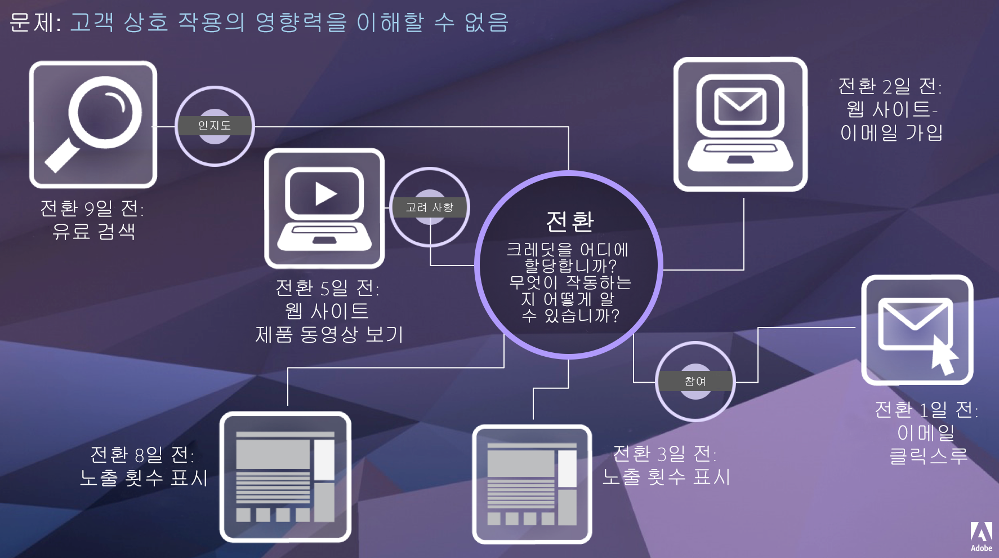

# 기여도 분석 개요

기여도 분석가는 차원 값이 성공 이벤트에 대한 크레딧을 받는 방법을 사용자 정의할 수 있습니다. 예:

1. 사이트 방문자가 제품 페이지 중 하나에 대한 유료 검색 링크를 클릭합니다. 장바구니에 제품을 추가하지만 구매하지 않습니다.
2. 다음날 친구 중 한 사람의 소셜 미디어 게시물을 보고 링크를 클릭한 다음 구매를 완료합니다.

일부 보고서에서는 유료 검색으로 인한 주문을 원할 수 있습니다. 다른 보고서에서는 Social에 속하는 순서를 원할 수도 있습니다. 속성을 사용하면 보고의 이러한 측면을 제어할 수 있습니다. Adobe Analytics Ultimate, Prime, Select 및 Foundation을 사용하는 모든 조직에서 사용할 수 있습니다. Adobe와 어떤 유형의 계약을 체결했는지 확실하지 않은 경우 조직의 계정 관리자에게 문의하십시오.

## 기여도 IQ의 가치

지정된 고객 움직임은 선형적이지 않고 종종 예측할 수 없습니다. 각 고객은 작자의 진도에 따라 수익을 창출합니다. 고객은 종종 되돌아가거나 시간을 끌거나 다시 시작하거나 다른 비선형 동작에 참여합니다. 이러한 자연스러운 동작은 고객 움직임 전반에서 마케팅 노력이 미치는 영향을 알기 어렵게 합니다. 또한 여러 채널의 데이터를 함께 통합하려는 노력에 방해가 됩니다.

Adobe Analytics는 다음을 통해 기여도 분석을 강화합니다.

* 유료 미디어 이외의 기여도 분석 정의: 차원, 지표, 채널 또는 이벤트는 마케팅 캠페인뿐 아니라 모델(예: 내부 검색)에 적용할 수 있습니다.
* 무제한 기여도 분석 모델 비교를 사용: 원하는 수만큼 모델을 동적으로 비교합니다.
* 구현 변경 방지: 보고서 처리 시간 및 컨텍스트 인식 세션으로 고객 움직임 컨텍스트를 구축하고 런타임에 적용할 수 있습니다.
* 사용자의 기여도 분석 시나리오와 일치하는 세션을 생성합니다.
* 세그먼트별 기여도 분석 분류: 중요한 모든 세그먼트(예: 신규 및 반복 고객, 제품 X와 제품 Y, 로열티 수준 또는 CLV)에서 마케팅 채널의 실적을 쉽게 비교할 수 있습니다.
* 채널 교차 및 다중 터치 분석: 벤 다이어그램, 히스토그램 및 트렌드 기여도 분석 결과를 사용합니다.
* 주요 마케팅 시퀀스를 시각적으로 분석: 다중 노드 플로우 및 폴아웃 시각화를 통해 시각적으로 전환된 경로를 탐색합니다.
* 계산된 지표 작성: 여러 기여도 분석 할당 방법을 사용합니다.

## 기능

기여도 분석 IQ는 다음 기능으로 구성됩니다.

* [속성 패널](../c-panels/attribution.md): 모든 차원과 지표를 가져와 다양한 속성 모델과 신속하게 비교할 수 있습니다.
* [지표에 속성 적용](../build-workspace-project/column-row-settings/column-settings.md): 프로젝트의 모든 지표에 대해 기본이 아닌 속성을 사용하십시오.
* [분류에 속성 적용](../components/dimensions/t-breakdown-fa.md): 분류에서 기본이 아닌 속성을 사용합니다.
* [기여도 모델 비교](../components/apply-create-metrics.md): 모든 지표에 대해 다양한 기여도 모델을 비교하는 방법을 신속하게 확인할 수 있습니다.
