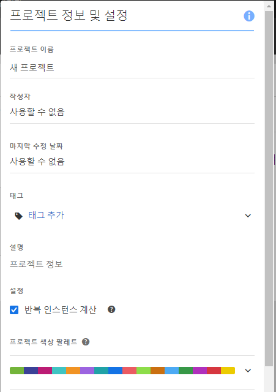
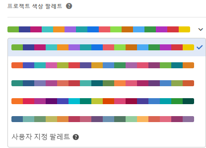

# 시각화 색상 팔레트

다른 색상 팔레트에서 선택하거나 기업의 브랜드 색상을 일치시킬 수 있는 사용자가 보유한 팔레트를 지정하여 작업 영역에서 사용되는 시각화 색상 팔레트를 변경할 수 있습니다. 이 기능은 작업 영역의 대부분 시각화에 영향을 주지만 **요약 변경 사항, 자유 형식 테이블의 조건부 서식 설정, 맵 시각화에는 영향을 미치지 않습니다**.

>[!NOTE]
>
>Internet Explorer 11 에서는 색상 팔레트 지원이 활성화되지 않습니다.

다음 사항에 주의하십시오.

* 5개의 사전 설정된 색상 팔레트 중에서 선택할 수 있습니다. 기본 팔레트 및 아래는 최적의 대비를 위해 최적화되었으며 색맹인 사용자에게는 모두 더 쉽게 액세스할 수 있습니다.
* 상위 2개 팔레트의 아래에 있는 3~5번째 색상 팔레트는 색상 조화에 최적화되었습니다.

## 색상 팔레트 변경:

1. **[!UICONTROL 작업 영역]** &gt; **[!UICONTROL 프로젝트]** &gt; **[!UICONTROL 프로젝트 정보 및 설정으로 이동합니다]**.
1. **[!UICONTROL 프로젝트 색상 팔레트]드롭다운에서 5개의 사전 설정된 색상 구성표 중 하나를 선택할 수 있습니다.**

   

1. 보유한 팔레트를 지정하려면 미리 설정된 옵션 아래에서 **[!UICONTROL 사용자 지정 팔레트]를 선택하십시오.**
1. 사용하려는 색상에 대해 최대 16개의 쉼표로 구분된 16진수 값(예: #00a4e4)을 지정합니다. 예를 들어 4개의 값만 사용하려는 경우, 이러한 색상은 더 많은 색상을 보유한 시각화에서 자동으로 반복됩니다.

