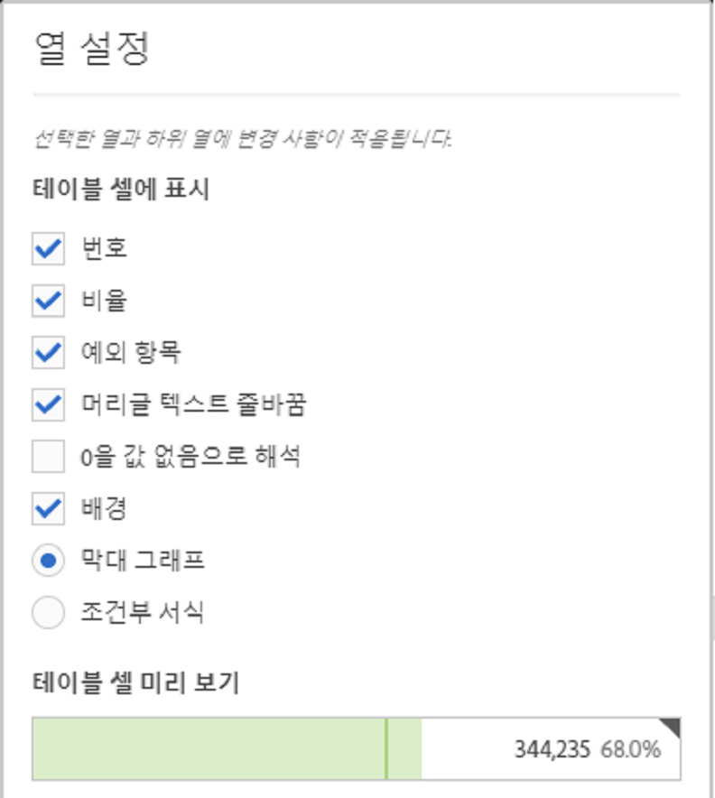
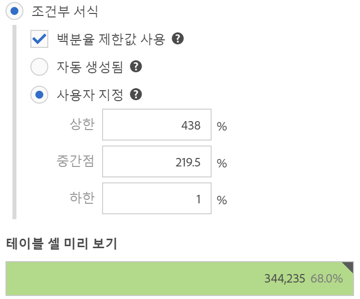

# 열 설정

열 설정을 사용하면 열 서식을 구성할 수 있으며, 열 서식 일부는 조건부일 수 있습니다.

## Column settings {#section_C5A9C13553BF4BFDAD7FACE0139AECA3}

[!UICONTROL 열 설정]에 액세스하려면 자유 형식 테이블을 프로젝트로 드래그한 다음 열 제목에서 톱니바퀴 아이콘을 클릭합니다.

**한 번에 여러 열에 대한** 설정을 편집할 수 있습니다. 여러 열을 선택하고 그러한 열 중 하나의 설정 아이콘을 클릭하면 됩니다. 변경 사항은 셀이 선택된 모든 열에 적용됩니다.

| 요소 | 설명 |
|--- |--- |
| 숫자 | 셀에 지표에 대한 숫자 값을 표시할지 또는 숨길지를 결정합니다. 예를 들어, 지표가 페이지 보기 횟수이면, 숫자 값은 행 항목에 대한 페이지 보기의 횟수입니다. |
| 비율 | 셀에 지표에 대한 퍼센트 값을 표시할지 또는 숨길지를 결정합니다. 예를 들어, 지표가 페이지 보기 횟수이면, 퍼센트 값은 행 항목에 대한 페이지 보기 횟수를 해당 열에 대한 총 페이지 보기 횟수로 나눈 수입니다.  참고: 정확하게 말하자면 100%보다 큰 백분율을 표시할 수 있습니다. 또한 열의 너비를 크게 늘릴 수 있도록 상한을 1,000%로 옮겼습니다. |
| 예외 항목 | 이 열의 값에 대해 예외 항목 탐지가 실행되는지 여부를 결정합니다. |
| 머리글 텍스트 줄바꿈 | 자유 형식 테이블의 머리글 텍스트를 줄바꿈하여 머리글을 더 읽기 쉽게 하고 테이블을 더 공유하기 쉽게 할 수 있습니다. 이 기능은 .pdf 렌더링 및 긴 이름을 사용하는 지표에 유용합니다. 기본적으로 사용됩니다. |
| 0을 값 없음으로 해석 | 값이 0인 셀에 대해, 0을 표시할지 아니면 빈 셀을 표시할지를 결정합니다. 달의 각 날에 대한 데이터를 보고 일부 날은 아직 일어나지 않은 경우 유용합니다.  차후의 날짜에 대해 0을 표시하는 대신 빈 셀을 표시할 수 있습니다. 차트에 이 설정도 적용됩니다(즉, 이 설정을 선택한 경우 차트에 값이 0인 줄 또는 막대가 표시되지 않습니다). |
| 배경 | 막대 그래프 및 조건부 서식을 포함하여, 셀에 모든 셀 서식을 표시할지 또는 숨길지를 결정합니다. |
| 막대 그래프 | 열에 대한 합계와 상대적인 셀 값을 나타내는 수평 막대 그래프를 표시합니다. |
| 조건부 서식 설정 | 아래 섹션을 참조하십시오. |
| 테이블 셀 미리 보기 | 각 셀이 현재 선택된 서식 옵션이 적용되면 어떻게 나타나는지 미리 보기를 표시합니다. |

## Conditional formatting {#section_3DD847151DA14914888A70FC4FD7BDFB}

조건부 서식을 지정하면 정의할 수 있는 상한, 중간점 및 하한에 서식이 적용됩니다. "사용자 지정" 제한을 선택하지 않은 경우 자유 형식 테이블 내의 조건부 서식 지정(예: 색상)이 분류에서도 자동으로 사용됩니다.

| 요소 | 설명 |
|--- |--- |
| 조건부 서식 설정 | 데이터 값에 따라 셀에 다음 색상을 적용합니다. <ul><li>녹색: 높은 값</li><li>노란색: 중간 값</li><li>빨간색: 낮은 값</li></ul> 테이블에서 차원을 바꾸면 조건부 서식 제한이 재설정됩니다. 지표를 바꾸면 해당 열에 대한 제한이 재계산됩니다(지표는 X축에 있고 차원은 Y축에 있음). |
| 백분율 제한값 사용 | 각 지표에 대한 비율 값을 기반으로 상한, 중간점 및 하한을 사용할 수 있도록 해줍니다. 개수와 비율(페이지 보기 횟수 등)이 있는 지표는 물론, 비율만 기반으로 하는 지표(바운스 비율 등)에도 작동합니다. |
| 자동 생성 | 조건부 서식에 대한 제한을 자동으로 생성합니다. 상한은 이 열에서 가장 큰 값입니다. 하한은 가장 낮은 값이며, 중간점은 상한과 하한의 평균입니다. |
| 사용자 지정 | 조건부 서식에 대해 상한, 중간점 및 하한 필드 값을 수동으로 할당할 수 있습니다. 이렇게 하면 열 값이 양호, 평균 또는 나쁨일 때를 유연하게 확인할 수 있습니다. |
| 테이블 셀 미리 보기 | 각 셀이 현재 선택된 서식 옵션이 적용되면 어떻게 나타나는지 미리 보기를 표시합니다. |

>[!MORE_LIKE_THIS]
>
>* [데이터 소스 관리](/help/analyze/analysis-workspace/visualizations/t-sync-visualization.md)

