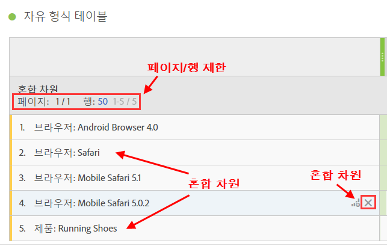
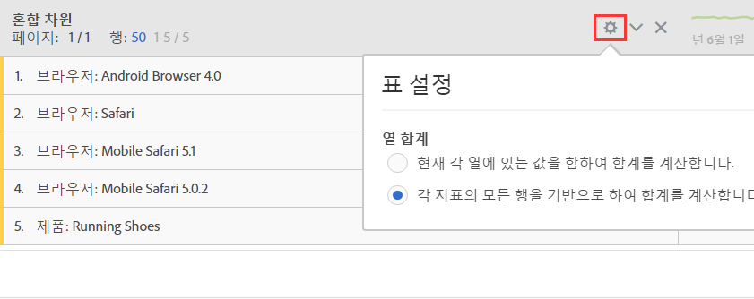

# 정적 행과 동적 행 비교

Analysis Workspace 테이블은 사용자가 차원을 테이블에 놓을 때 "다이내믹" 행을 생성합니다. 즉, 지정된 지표에 대해 차원에 해당하는 모든 항목이 테이블로 가져오게 됩니다.

예를 들어 브라우저 차원을 테이블로 드래그하면 모든 차원 항목(예: Android Browser, Mobile Safari, Firefox 등)이 동적으로 테이블로 가져와집니다.

반대로, 특정 지표, 세그먼트, 데이터 범위 또는 개별 차원 항목을 수동으로 선택한 후 테이블에 좋으면 결과는 하드 코딩되었거나 "정적"의 행이나 목록이 됩니다. 이제 다음과 같은 방식으로 정적 행을 조작할 수 있습니다.

* 정적 행에서 세그먼트, 지표, 날짜 범위를 미리 볼 수 있도록 해주는 [미리 보기] 아이콘을 클릭합니다.
* "x" 아이콘을 클릭하여 테이블에서 해당 행을 삭제합니다.
* 표시되는 행 수를 제한하고 페이징을 사용하도록 설정합니다.
* "혼합 차원 항목"을 추가합니다. 예를 들어 브라우저 차원의 한 항목과 제품 차원의 한 항목을 추가합니다.

   다음은 그림 예제입니다.

   

또한 정적 행 모드인 경우 이제 열 총계가 계산되는 방식을 변경할 수 있습니다. 톱니바퀴 아이콘을 클릭하고 다음 두 옵션 간을 전환합니다.

| 옵션 | 설명 |
|---|---|
| 현재 각 열에 있는 값을 합하여 합계를 계산합니다. | 이 옵션은 현재 테이블에 있는 행만 계산합니다. (클라이언트 측 계산) |
| 각 지표의 모든 행을 기반으로 하여 합계를 계산합니다. | 이 옵션에는 테이블에 표시되지 않더라도 이 차원의 모든 차원 항목을 포함합니다. (서버 측 계산) |

