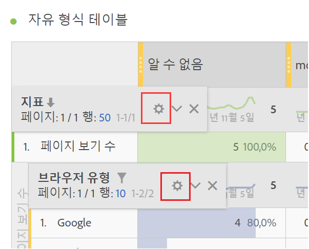
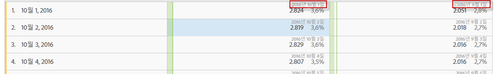

# 행 설정

행 설정은 테이블로 드래그한 구성 요소에 따라 다릅니다.

[테이블에서 작업을 마우스 오른쪽 단추로 클릭](../../../../analyze/analysis-workspace/visualizations/freeform-table.md#concept_0D2E24FCCBAF4194AA941448860E422F)하여 선택한 행을 관리할 수도 있습니다.

테이블 행 설정에 액세스하려면 이러한 각 항목 내에서 차원, 세그먼트, 지표, 기간 또는 분류 옆에 있는 [설정] 아이콘을 클릭합니다.

<table id="table_7ACE6413DB1F40349ED2860020F92E55"> 
 <thead> 
  <tr> 
   <th colname="col1" class="entry"> 행 설정 </th> 
   <th colname="col2" class="entry"> 설명 </th> 
  </tr>
 </thead>
 <tbody> 
  <tr> 
   <td colname="col1"> 
<a href="../../../../analyze/analysis-workspace/components/calendar-date-ranges/time-comparison.md#concept_93BCAD81B7A54ABBBA5CD9E419F6F764" format="dita" scope="local"> 날짜 비교</a> 
 </td> 
   <td colname="col2"> 
<b>각 열의 날짜가 같은 행에서 모두 시작하도록 맞춥니다. </b> 
 
날짜를 맞추도록 선택한 경우 예를 들어, 2016년 10월과 9월 간 월별 비교에서는 왼쪽 열이 10월 1일로 시작되고 오른쪽 열이 9월 1일로 시작됩니다. 
 
 
 
기본적으로 비활성화되어 있습니다. 
 </td> 
  </tr> 
  <tr> 
   <td colname="col1"> 
백분율 
 </td> 
   <td colname="col2"> 
<b>행별로 백분율 계산</b> 
 
자유 형식 테이블이 열 방향이 아니라 행 방향으로 셀 백분율을 계산합니다. 이 기능은 특히 트렌드 백분율에 유용하며, 시각화 아이콘을 사용할 때 기본적으로 설정되어 있습니다. 
 </td> 
  </tr> 
  <tr> 
   <td colname="col1"> 
열 합계 
 </td> 
   <td colname="col2"> 
이러한 설정은 <a href="../../../../analyze/analysis-workspace/build-workspace-project/column-row-settings/manual-vs-dynamic-rows.md#concept_C50E7DFBC0504C72A973123192F487D8" format="dita" scope="local">동적 행(모든 항목을 표시하는 차원에 놓은 경우)이 아닌 수동(정적) 행</a>(유한 항목 세트를 선택한 경우)에만 표시됩니다. 
참고: <i>지표</i> 수동 행의 경우 설정이 테이블의 현재 행 옆에 있는 지표 합계를 이해하지 못하므로 비활성화됩니다. 
 
 
<b>현재 각 열에 있는 값을 합하여 합계 계산(기본적으로 활성화됨):</b> 
 
이 옵션은 현재 테이블에 있는 행만 계산합니다. (클라이언트 측 계산) 
 
<b>각 지표에 대한 모든 행에 기반을 두고 합계 계산(기본적으로 비활성화됨):</b> 
 
이 옵션에는 테이블에 표시되지 않더라도 이 차원의 모든 차원 항목을 포함합니다. (서버 측 계산) 
 </td> 
  </tr> 
  <tr> 
   <td colname="col1"> 
분류 
 </td> 
   <td colname="col2"> 
<b>위치별 분류:</b> 
 
자유 형식 테이블에서 고정 위치를 기반으로 분류를 수행할 수 있습니다. 예를 들어, 상위 7개 행이 항상 분류되도록 지정할 수 있습니다. 
 
(이전에는 분류에 있는 값 목록이 "잠겨"있었습니다. 예를 들어, 이 문제로 인해  예를 들어 이 문제로 인해 날짜를 페이지별로 분류한 경우 선택한 날짜 범위에 대해 상위 50페이지의 목록을 받는 상황이 발생했습니다. 해당 보기를 저장하고 한 달 후 실행한 경우, 상위 50페이지가 변경되었을 것입니다. 하지만 Analysis Workspace에서는 원래의 분류로 인한 결과를 사용하여 동일한 페이지를 반환하긴 했지만, 현재 달을 날짜 범위로 사용했습니다.) 
 
고정된 위치에 기반을 두고 분류를 수행하려면: 
 
    <ol id="ol_A396A11566AA4F52BC3ABBC373CEF477"> 
     <li id="li_BDAB1E9A48D44944A4F7C31F1182B923">테이블에서 행 일부를 분류합니다. </li> 
     <li id="li_C5610437D3714CCEB9F3C771864B4336">고정된 위치에 지정할 테이블 행 옆에 있는 [설정](톱니바퀴) 아이콘을 클릭합니다. </li> 
     <li id="li_675E429DC3B94201978166F9408D30B1">위치별 분류 옆에 있는 확인란을 선택합니다. </li> 
     <li id="li_E8A417D0D6D1438CAE825843BA0A7060">정렬 순서 또는 날짜 범위를 변경하고 분류가 하드코딩된 행이 아닌 행 위치에 연결되었는지 확인합니다. </li> 
    </ol> 
기본적으로 비활성화되어 있습니다. 
 </td> 
  </tr> 
 </tbody> 
</table>

