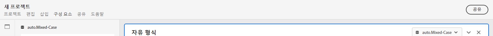
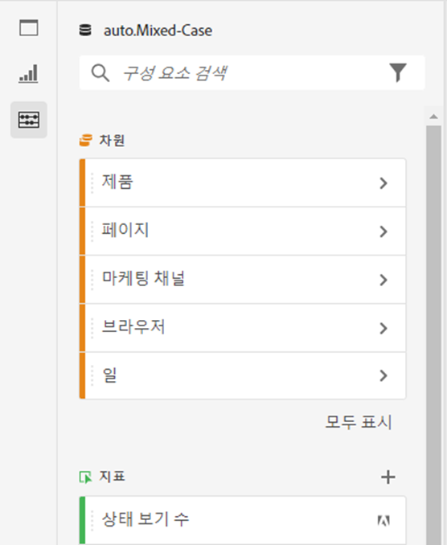
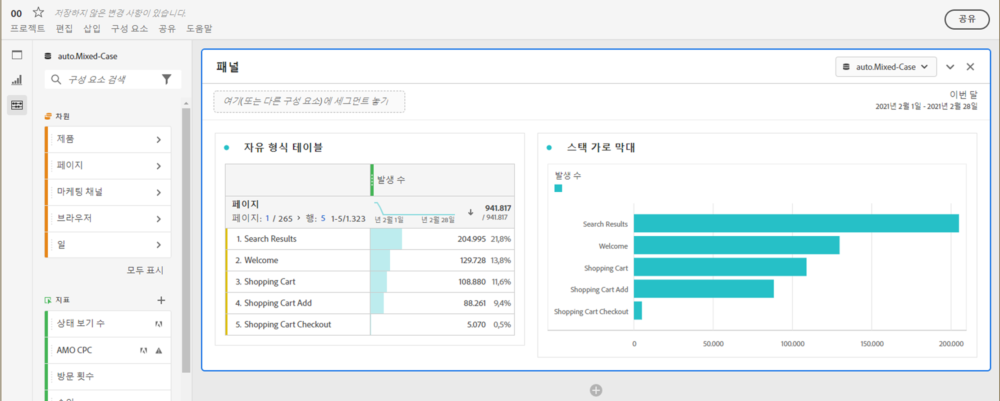
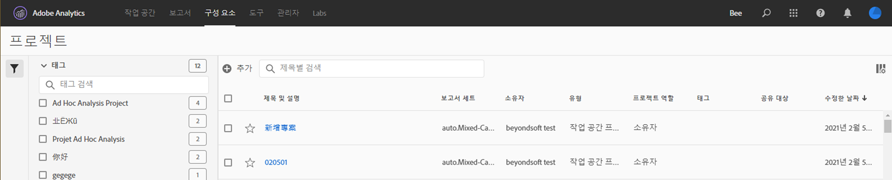

# 프로젝트 개요

Workspace 프로젝트를 사용하면 데이터 구성 요소, 테이블 및 시각화를 결합하여 분석을 작성하고 조직의 모든 사람과 공유할 수 있습니다. 첫 번째 프로젝트를 시작하기 전에 프로젝트에 액세스, 탐색 및 관리하는 방법에 대해 살펴보십시오.

## 프로젝트 목록 {#project-list}

처음 **[!UICONTROL Analytics]** > **[!UICONTROL Workspace]**&#x200B;로 이동하면 페이지에 사용자가 보유하거나 사용자와 공유된 모든 프로젝트가 나열됩니다. 이전에 맞춤형 랜딩 페이지를 설정한 경우가 아니면 이 페이지가 Adobe Analytics의 랜딩 페이지이기도 합니다.

작업 공간 프로젝트 목록 페이지에는 다음 정보가 포함되어 있습니다.

| 요소 | 설명 |
|---|---|
| [새 프로젝트 만들기](/help/analyze/analysis-workspace/home.md) | 이 링크를 클릭하여 새 프로젝트를 처음부터 시작하거나 자동으로 생성된 [템플릿](https://experienceleague.adobe.com/docs/analytics/analyze/analysis-workspace/build-workspace-project/starter-projects.html?lang=ko-KR#analysis-workspace)에서 시작합니다. |
| 프로젝트 관리 | 이 링크를 클릭하면 모든 프로젝트를 나열해 보여 주고, 태그 지정, 공유, 삭제, 이름 변경, 승인, 복사 및 프로젝트를 CSV로 내보내기를 할 수 있는 프로젝트 구성 요소 관리자(**[!UICONTROL 분석]** > **[!UICONTROL 구성 요소]** > **[!UICONTROL 프로젝트]**)로 이동합니다. |
| 랜딩 페이지로 설정 | 이 페이지를 Workspace 랜딩 페이지로 바꿉니다. |
| [튜토리얼 보기](https://docs.adobe.com/content/help/ko-KR/analytics-learn/tutorials/analysis-workspace/analysis-workspace-basics/analysis-workspace-introduction.html) | Analysis Workspace 비디오 튜토리얼로 이동합니다. |
| 이름 | 작업 공간 프로젝트의 이름. |
| 소유자 | 이 프로젝트를 만든 사람(귀하 또는 프로젝트를 귀하와 공유한 사용자) |
| 유형 | Workspace 프로젝트인지 [모바일 스코어카드](https://docs.adobe.com/content/help/ko-KR/analytics/analyze/mobapp/home.html)인지 여부를 나타냅니다. |
| [프로젝트 역할](https://experienceleague.adobe.com/docs/analytics/analyze/analysis-workspace/curate-share/share-projects.html?lang=ko-KR) | 프로젝트에 대한 역할(소유자, 편집, 복제, 보기)을 나타냅니다. |
| 태그 | 프로젝트에 적용된 태그. |
| 마지막 수정 날짜 | 프로젝트가 마지막으로 수정된 날짜와 시간. |
| 내가 즐겨 찾는 프로젝트 | 프로젝트를 즐겨찾기로 표시하려면 프로젝트를 열고 이름 옆에 있는 별표를 클릭합니다. 다음에 Workspace를 열 때 이 목록에 표시됩니다. |
| 자주 조회하는 프로젝트 | 쉽게 액세스할 수 있도록 자주 여는 모든 프로젝트를 나열합니다. |

## 메뉴 바 {#menu-bar}

프로젝트 내에서 메뉴는 프로젝트 관리, 구성 요소 추가, 도움말 찾기 등의 옵션을 제공합니다. 각 메뉴 옵션은 키보드 [단축키](https://experienceleague.adobe.com/docs/analytics/analyze/analysis-workspace/build-workspace-project/fa-shortcut-keys.html?lang=ko-KR)로도 액세스할 수 있습니다.

| 메뉴 항목 | 설명 |
|---|---|
| 프로젝트 | 새로 만들기, 열기, 저장, 다른 이름으로 저장, [템플릿으로 저장](https://experienceleague.adobe.com/docs/analytics/analyze/analysis-workspace/build-workspace-project/starter-projects.html?lang=ko-KR) 등 프로젝트 관리를 위한 일반적인 작업이 포함됩니다. 프로젝트 새로 고침을 클릭하여 전체 프로젝트를 새로 고쳐 최신 데이터 및 정의를 검색할 수도 있습니다. [CSV 및 PDF 다운로드](https://experienceleague.adobe.com/docs/analytics/analyze/analysis-workspace/curate-share/download-send.html?lang=ko-KR) 옵션을 사용하면 Workspace에서 데이터를 내보낼 수 있습니다. [프로젝트 정보 및 설정](https://experienceleague.adobe.com/docs/analytics/analyze/analysis-workspace/build-workspace-project/freeform-overview.html?lang=ko-KR?#info-settings)은 프로젝트 관리를 위한 다양한 옵션을 제공합니다. |
| 편집 | 마지막 작업을 실행 취소하거나 다시 실행합니다. 모두 지우기는 프로젝트를 빈 시작 지점으로 재설정합니다. |
| 삽입 | 이 메뉴에서 새 패널 또는 시각화를 삽입합니다. 왼쪽 레일에서 새 패널과 시각화를 삽입할 수도 있습니다. |
| [구성 요소](https://experienceleague.adobe.com/docs/analytics/analyze/analysis-workspace/components/analysis-workspace-components.html?lang=ko-KR) | 프로젝트에서 새 세그먼트, 계산된 지표, 날짜 범위 또는 경고 구성 요소를 만듭니다. 왼쪽 레일에서 새 구성 요소를 만들 수도 있습니다. 구성 요소 정의가 최근에 변경된 경우 구성 요소 새로 고침이 최신 정의를 검색합니다. |
| [공유](https://experienceleague.adobe.com/docs/analytics/analyze/analysis-workspace/curate-share/send-schedule-files.html?lang=ko-KR) | 조직의 수신자에게 PDF/CSV 프로젝트를 조정, 공유 및 예약합니다. |
| 도움말 | 도움말 문서, 비디오 및 Analytics [Experience League 커뮤니티](https://experienceleaguecommunities.adobe.com/t5/adobe-analytics/ct-p/adobe-analytics-community)에 액세스합니다. [디버거](https://www.adobe.io/apis/experiencecloud/analytics/docs.html#!AdobeDocs/analytics-2.0-apis/master/reporting-tricks.md) 외에도 Workspace 팁의 가시성을 관리합니다. 프로젝트 [성능](https://experienceleague.adobe.com/docs/analytics/analyze/analysis-workspace/workspace-faq/optimizing-performance.html?lang=ko-KR)에 영향을 미치는 Workspace 및 요인에 대한 세부 정보를 확인할 수 있습니다. |
| 공유 버튼 또는 소유자 | 프로젝트를 소유 또는 편집 중인 경우 오른쪽 상단의 공유 버튼을 클릭하면 프로젝트 수신자를 관리할 수 있습니다. 프로젝트에 대한 중복 또는 보기 역할이 있는 경우 프로젝트 소유자의 이름이 표시됩니다. |

### 프로젝트 정보 및 설정 {#info-settings}

**[!UICONTROL 작업 공간]** > **[!UICONTROL 프로젝트]** > **[!UICONTROL 프로젝트 정보 및 설정]** 는 현재 활성화된 프로젝트에 대한 프로젝트 수준 정보를 제공합니다.

설정에는 다음이 포함됩니다.

| 설정 | 설명 |
|---|---|
| 프로젝트 이름 | 프로젝트에 지정된 이름. 이름을 더블 클릭하여 편집할 수 있습니다. |
| 작성자 | 프로젝트 소유자 이름 |
| 마지막 수정 날짜 | 프로젝트의 마지막 수정 날짜. |
| 태그 | 더 쉬운 분류를 위해 프로젝트에 적용된 모든 태그를 나열합니다. |
| 설명 | 설명은 프로젝트의 목적을 명확히 하는 데 유용합니다. 설명을 더블 클릭하여 편집할 수 있습니다. |
| 프로젝트에서 반복 인스턴스 계산 | 보고서에서 반복 인스턴스가 카운트되는지 여부를 지정합니다. 참고: 이 설정은 흐름 또는 폴아웃 시각화에 적용되지 않습니다. |
| [프로젝트 색상 팔레트](https://experienceleague.adobe.com/docs/analytics/analyze/analysis-workspace/build-workspace-project/color-palettes.html?lang=ko-KR) | 색맹 사용자에 최적화된 비맞춤형 팔레트에서 선택하거나 맞춤형 팔레트를 지정하여 Workspace에서 사용되는 범주별 색상 팔레트를 변경할 수 있습니다. 이 기능은 대부분의 시각화를 포함하여 작업 공간의 많은 사항에 영향을 줍니다. |
| [보기 밀도](https://experienceleague.adobe.com/docs/analytics/analyze/analysis-workspace/build-workspace-project/view-density.html?lang=ko-KR) | 자유 형식 테이블 및 집단 테이블에서 왼쪽 레일의 수직 안쪽 여백을 줄여 화면에서 더 많은 데이터를 볼 수 있습니다. |

## 왼쪽 레일 {#left-rail}

프로젝트 내에서 [패널](https://experienceleague.adobe.com/docs/analytics/analyze/analysis-workspace/panels/panels.html?lang=ko-KR), 테이블, [시각화](https://experienceleague.adobe.com/docs/analytics/analyze/analysis-workspace/visualizations/freeform-analysis-visualizations.html?lang=ko-KR), [구성 요소](https://experienceleague.adobe.com/docs/analytics/analyze/analysis-workspace/components/analysis-workspace-components.html)는 왼쪽 레일에서 액세스됩니다. 이는 프로젝트 구성 요소입니다.

[빈 패널](https://experienceleague.adobe.com/docs/analytics/analyze/analysis-workspace/panels/blank-panel.html?lang=ko-KR)에서도 시각화 및 패널에 액세스할 수 있습니다.

왼쪽 레일의 구성 요소(차원, 메트릭, 세그먼트, 날짜 범위)는 활성 패널 보고서 세트와 관련되어 있습니다. 활성 패널 주위에 파란색 테두리가 있고 활성 보고서 세트가 구성 요소 레일의 맨 위에 나열됩니다.

## 프로젝트 캔버스 {#canvas}

프로젝트 캔버스에서는 패널, 테이블, 시각화, 구성 요소를 결합하여 분석을 작성합니다. 프로젝트에는 여러 패널이 포함될 수 있으며 각 패널에는 여러 테이블과 시각화가 포함될 수 있습니다

패널은 기간, 보고서 세트 또는 분석 사용 사례에 따라 프로젝트를 구성하려는 경우 유용합니다. 활성 패널 주위에 파란색 테두리가 있으며 왼쪽 레일에서 어떤 구성 요소를 사용할 수 있는지가 결정됩니다.

프로젝트를 위해 선택한 시작 지점에 따라 캔버스에 [자유형 테이블](https://experienceleague.adobe.com/docs/analytics/analyze/analysis-workspace/visualizations/freeform-table/freeform-table.html?lang=ko-KR) 또는 [빈 패널](https://experienceleague.adobe.com/docs/analytics/analyze/analysis-workspace/panels/blank-panel.html)이 표시됩니다. 분석을 시작하는 가장 빠른 방법은 하나 이상의 구성 요소를 선택하여 프로젝트 캔버스로 끌어서 놓는 것입니다. 데이터 테이블이 자동으로 렌더링됩니다. 테이블 작성하기 위한 다양한 옵션에 대해 [자세히 알아보거나](https://experienceleague.adobe.com/docs/analytics/analyze/analysis-workspace/visualizations/freeform-table/freeform-table.html) [교육 튜토리얼](https://experienceleague.adobe.com/docs/analytics/analyze/analysis-workspace/home.html?lang=ko-KR?#training-tutorial)을 활용하여 첫 번째 프로젝트 작성에 대한 자세한 지침을 확인하십시오.

## 프로젝트 관리자 {#manager}

Analysis Workspace 프로젝트는 **Analytics > 구성 요소 > 프로젝트**&#x200B;에서 관리할 수 있습니다. 프로젝트 관리자는 특정 사용자가 만든 항목을 보여 줍니다. 관리자 > Analytics 사용자 및 에셋 > 에셋 전송에서 프로젝트 소유권을 새 사용자에게 이전할 수 있습니다.

프로젝트 관리자에서 추가, 태그, 공유, 복제/복사 등을 할 수 있습니다. 검색 창에서 또는 왼쪽 레일의 필터 옵션을 사용하여 프로젝트를 검색합니다. 태그, 소유자, 프로젝트 유형 등을 기준으로 필터링할 수 있습니다.

다음은 프로젝트 관리자의 일반적인 작업이며 한 번에 하나 이상의 프로젝트에서 수행할 수 있습니다.

| 작업 | 설명 |
|---|---|
| 추가 | 새 프로젝트를 처음부터 만들거나 [템플릿](https://experienceleague.adobe.com/docs/analytics/analyze/analysis-workspace/build-workspace-project/starter-projects.html)에서 시작할 수 있습니다. |
| 태그 또는 승인 | “태그” 또는 “승인”을 선택하여 프로젝트를 구성하고 쉽게 검색할 수 있도록 만듭니다. |
| [공유](https://experienceleague.adobe.com/docs/analytics/analyze/analysis-workspace/curate-share/share-projects.html) | 프로젝트를 조직의 다른 Analysis Workspace 사용자가 사용할 수 있게 합니다. |
| 삭제 | 프로젝트를 삭제합니다. |
| 이름 변경 | 프로젝트의 이름을 편집합니다. |
| 복사 | 프로젝트의 복사본을 만듭니다. 그러면 새 프로젝트와 프로젝트 ID가 생성됩니다. 원본 프로젝트에 연결된 공유 또는 예약은 복사되지 않습니다. |
| CSV로 내보내기 | 일반 텍스트 데이터가 포함된 CSV 파일로 프로젝트를 다운로드합니다. |
