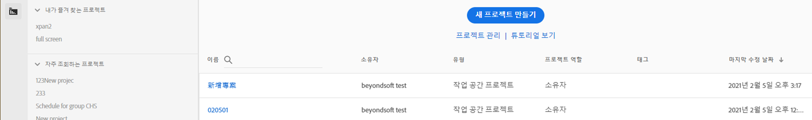
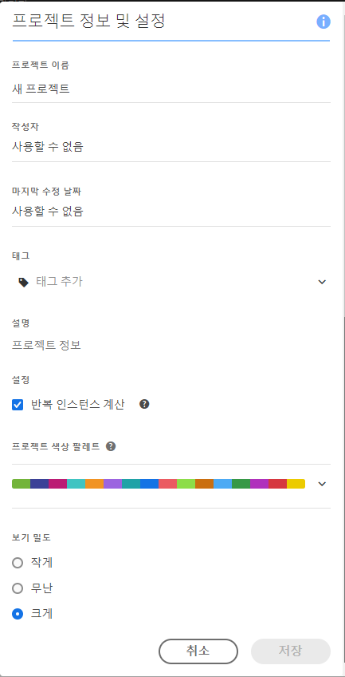
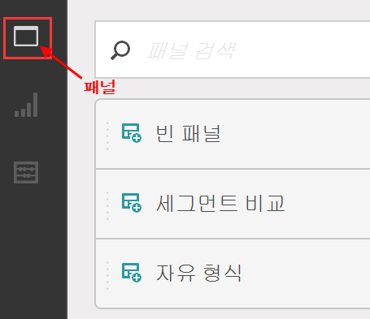

# 프로젝트 만들기 - 개요

**[!UICONTROL Analytics]** &gt; **[!UICONTROL 작업 영역]**

시각화, 보고서 구성 요소 및 데이터 테이블의 조합을 기반으로 하여 강력한 Analytics 프로젝트를 만들 수 있습니다. 이 기능에서는 Ad Hoc Analysis의 테이블 빌더 기능들 중 많은 기능을 Analytics로 가져옵니다.

Analysis Workspace에서는 이전에는 가능하지 않던 방식으로 데이터를 비교하고 분석할 수 있습니다. 예를 들어 등급 보고서를 구성하고 데이터 쿼리를 즉시 반복적으로 변경한 다음 보고 수준에서 값을 액세스하고 조작합니다.

쿼리는 보고 엔진에 바로 적용됩니다. 다른 보고서를 가져오지 않고 인라인으로 변경 작업을 수행하여 분석을 만들 수 있습니다. 브라우저를 새로 고침하지 않고 결과가 바로 반환됩니다.

## Workspace 프로젝트 목록 페이지 {#section_39AA007D7C384F4E869F842F1C7B11F8}

**[!UICONTROL 처음 Analytics]** &gt; **[!UICONTROL 작업 영역으로]**&#x200B;이동하면 페이지에 소유하거나 액세스 권한이 부여된 프로젝트가 모두 나열됩니다. You can set this page to be your Adobe Analytics landing page by clicking **[!UICONTROL Set as Landing Page]**. (아래의 스크린샷과 같이 이 옵션이 표시되지 않으면 이미 랜딩 페이지입니다.)

Workspace 프로젝트 목록 페이지에는 다음 정보가 포함되어 있습니다.

| 요소 | 설명 |
|---|---|
| 프로젝트 [템플릿](../../../analyze/analysis-workspace/build-workspace-project/starter-projects.md#concept_49B9A327C5004DB0A4BE6291435625C5)을 참조하십시오 | 이렇게 사전에 채워진 프로젝트 템플릿을 그대로 사용하거나 필요에 맞게 조정(예를 들어 지표나 시각화를 추가 또는 교체하여)하고 새 이름으로 저장할 수 있습니다. |
| [새 프로젝트 만들기](../../../analyze/analysis-workspace/build-workspace-project/t-freeform-project.md#task_C2C698ACC7954062A28E4784911E6CF2) | 새 프로젝트를 처음부터 시작하려면 이 링크를 클릭하십시오. |
| 프로젝트 관리 | Clicking this link takes you to the Projects Component Manager ( **[!UICONTROL Analytics]** &gt; **[!UICONTROL Components]** &gt; **[!UICONTROL Projects]**), which lists all your projects and lets you tag, share, delete, rename, approve, copy, and export projects to CSV. |
| 자습서 보기 | [Analysis Workspace YouTube 비디오](https://www.youtube.com/playlist?list=PL2tCx83mn7GuNnQdYGOtlyCu0V5mEZ8sS)로 이동합니다. |
| 이름 | Workspace 프로젝트의 이름. |
| 작성자 | 이 프로젝트를 만든 사람(귀하 또는 프로젝트를 귀하와 공유한 사용자) |
| 태그 | Tags that were applied to the project, either in the Projects Component Manager or under **[!UICONTROL Workspace]** &gt; **[!UICONTROL Project]** &gt; **[!UICONTROL Project Info &amp; Settings]**. |
| 마지막 수정 날짜 | 프로젝트가 마지막으로 수정된 날짜와 시간. |

## 프로젝트 정보 및 설정 {#section_63773D0B9E4543E88068ECECB9EEB4C6}

**[!UICONTROL 작업 영역]** &gt; **[!UICONTROL 프로젝트]** &gt; **[!UICONTROL 프로젝트 정보 및 설정]**

**[!UICONTROL 프로젝트 정보 및 설정]**&#x200B;에서는 현재 활성 상태인 프로젝트에 대한 프로젝트 수준의 정보를 제공합니다. 

| 설정 | 설명 |
|---|---|
| 프로젝트 이름 | 프로젝트에 지정된 이름. 이름을 두 번 클릭하여 편집할 수 있습니다.  |
| 작성자 | 프로젝트 소유자 이름 |
| 마지막 수정 날짜 | 프로젝트의 마지막 수정 날짜.  |
| 태그 | 더 쉬운 분류를 위해 프로젝트에 적용된 모든 태그를 나열합니다. 프로젝트를 저장하는 동안 태그를 지정할 수도 있습니다. Workspace 랜딩 페이지의 [!UICONTROL 태그] 열에서 프로젝트의 태그를 봅니다. |
| 설명 | 설명은 프로젝트의 목적을 명확히 하는 데 유용합니다. 설명을 두 번 클릭하여 편집할 수 있습니다.  |
| 프로젝트에서 반복 인스턴스 계산 | 보고서에서 반복 인스턴스가 카운트되는지 여부를 지정합니다. 동일한 변수에 대해 순차적인 여러 개의 값을 가지고 있으면 변수에 대해 하나 또는 여러 개의 인스턴스로 계산할 수 있습니다. |
| 시각화 색상 구성표 | 다른 색상 팔레트에서 선택하거나 사용자가 보유한 팔레트를 지정하여 작업 공간에서 사용되는 색상 구성표를 변경할 수 있습니다. 이 기능은 대부분의 시각화를 포함하여 작업 공간의 많은 사항에 영향을 줍니다. |
| 보기 밀도 | 자유 형식 테이블 및 집단 테이블에서 왼쪽 레일의 수직 안쪽 여백을 줄여 화면에서 더 많은 데이터를 볼 수 있습니다. |

## 프로젝트 메뉴 {#section_850CDFCB86A64EB0A0AD5B9E0FCB7013}

위쪽 프로젝트 메뉴는 다음과 같은 모습입니다. 

하위 메뉴에는 다음 옵션이 포함됩니다.

>[!NOTE]
>
>Options marked by an asterisk (*) display only with **saved** projects.

| 프로젝트 | 편집 | 삽입 | 구성 요소 | 공유 | 도움말 |
|---|---|---|---|---|---|
| 신규 | 실행 취소 | 새 패널 | 새 세그먼트 | 프로젝트 공유 | 비디오 |
| 열기 | 지우기 | 새 자유 형식 패널 | 새 지표 | 프로젝트 링크 가져오기* | 단축키 |
| 저장 | 모두 삭제 | 새 세그먼트 비교 패널 | 새 날짜 범위 | 지금 파일 보내기* | 도움말 포럼 |
| 다른 이름으로 저장* |  | 새 자유 형식 테이블 | 새 경고 | 일정에 따라 파일 보내기* |  |
| 랜딩 페이지로 설정* |  | 새 라인 | 구성 요소 새로 고침 | 프로젝트 데이터 조정 |  |
| 프로젝트 새로 고침 |  | 새로운 막대 |  |  |  |
| CSV 다운로드 |  |  |  |  |  |
| PDF 다운로드* |  |  |  |  |  |
| 프로젝트 정보 및 설정 |  |  |  |  |  |

## 왼쪽 레일 {#section_271295C26EC840ABB2A8E7EC0498B60E}

The left rail has 3 icons, allowing you access to Panels, [Visualizations](../../../analyze/analysis-workspace/visualizations/freeform-analysis-visualizations.md#concept_09242627629147A88A68F1506954C276), and [Components](../../../analyze/analysis-workspace/components/analysis-workspace-components.md#concept_BEBE3A75E072495D9E2F895567BBD462)(Dimensions, Metrics, Segments, Data Ranges) with one click:

  

왼쪽 레일에서 액세스할 수 있는 패널 목록에 **[!UICONTROL 빈 패널]이 추가되었습니다.** **새 집단 패널**&#x200B;을 생성하려면 빈 패널로 드래그하고 집단 테이블 시각화로 드래그합니다.
