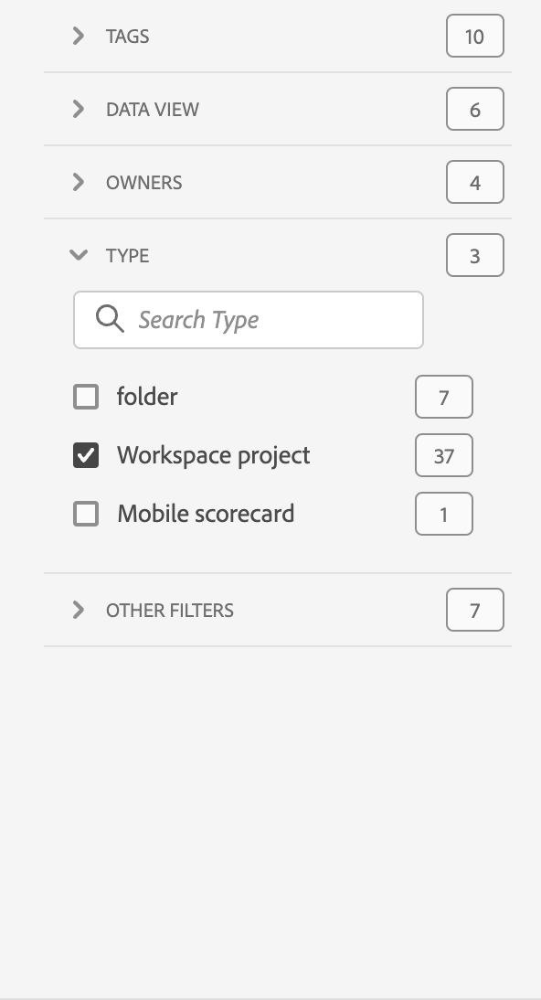

# 프로젝트 개요

Workspace 프로젝트를 사용하면 패널, 시각화 및 구성 요소를 결합하여 분석을 작성하고 조직의 모든 사람과 공유할 수 있습니다. 첫 번째 프로젝트를 시작하기 전에 프로젝트에 액세스, 탐색 및 관리하는 방법을 살펴보십시오.

Adobe Analytics의 프로젝트에 액세스하려면 **[!UICONTROL Workspace]**&#x200B;을(를) 선택하십시오.  **[!UICONTROL 프로젝트]** 관리자는 사용자가 소유한 프로젝트나 사용자와 공유된 프로젝트를 모두 나열합니다. 환경 설정에서 달리 구성하지 않은 경우 프로젝트 목록이 있는 프로젝트 관리자는 Adobe Analytics의 기본 랜딩 페이지이기도 합니다.

## 제목 영역

제목 영역(➊)에서 프로젝트를 만들고, 폴더를 만들고, 기본 설정을 편집하고, 추가 타일이 있는 패널을 표시하거나 숨길 수 있습니다.

* **[!UICONTROL 프로젝트]**&#x200B;와 **[!UICONTROL 학습]**&#x200B;을 선택할 수 있는 왼쪽 패널을 표시하거나 숨기려면 을 선택합니다.
* 제목에는 프로젝트가 표시되며, 선택에 따라 선택한 폴더의 경로가 추가됩니다. 예: [!UICONTROL 프로젝트] > **[!UICONTROL 회사 폴더]**. 개별 하위 폴더 부분을 선택하면 특정 폴더로 바로 이동할 수 있습니다.
* [**[!UICONTROL 빈 프로젝트]**](create-projects.md), [**[!UICONTROL 빈 모바일 스코어카드]**](/help/analyze/mobile-app/create-scorecard.md), **[!UICONTROL 설명서 열기]** 및 **[!UICONTROL 릴리스 정보 열기]**&#x200B;에 대한 타일을 표시하려면  **[!UICONTROL 자세히 표시]**&#x200B;를 선택합니다. 타일이 있는 영역을 숨기려면  **[!UICONTROL 간단히 표시]**&#x200B;를 선택합니다.
* 표시할 항목에 따라 [선택기 표시](#show-selector)를 사용하여 **[!UICONTROL 프로젝트]**&#x200B;에 표시된 현재 폴더에서 환경 설정을 편집하고 액션을 수행할 수 있습니다.

  | 액션 | 설명 |
  |---|---|
  | **[!UICONTROL 프로젝트 만들기]** | [새 프로젝트를 만들려면](create-projects.md) 선택합니다. |
  | **[!UICONTROL 폴더 만들기]** | [새 폴더를 만들려면](workspace-folders/create-folders.md) 선택합니다. |
  |  **[!UICONTROL 환경 설정 편집]** | 모든 프로젝트에 적용되는 [환경 설정을 편집](/help/analyze/analysis-workspace/user-preferences.md)합니다. 경로로 인해 공간이 제한되는 경우 이 액션은  하위 메뉴의 일부입니다. |
  | **[!UICONTROL 프로젝트 추가]** | 현재 폴더에 [프로젝트를 추가](workspace-folders/add-projects.md)하려면 선택합니다. 경로로 인해 공간이 제한되는 경우 이 액션은  하위 메뉴의 일부입니다. |
  | **[!UICONTROL 폴더 이름 바꾸기]** | 현재 폴더의 [이름을 변경](workspace-folders/manage-folders.md#rename-folders)합니다. |
  | **[!UICONTROL 폴더 이동]** | 현재 폴더를 [이동](workspace-folders/manage-folders.md#move-folders)합니다. |
  | **[!UICONTROL 폴더 삭제]** | 현재 폴더를 [삭제](workspace-folders/manage-folders.md#delete-folders)합니다. |

## 프로젝트 목록

프로젝트 목록(➋)에는 사용자가 소유한 모든 프로젝트와 사용자에게 공유된 모든 프로젝트가 표시됩니다. 목록은 다음과 같습니다.

| 열 | 설명 |
| --- | --- |
|  | 하나 이상의 프로젝트를 선택하면 프로젝트 인터페이스 하단에 파란색 작업 표시줄이 나타납니다. 자세한 내용은 [액션](#actions)을 참조하십시오. |
|  | 프로젝트를  즐겨찾기에 추가하거나  추가하지 않을지 선택합니다. |
| **[!UICONTROL 제목 및 설명]** | 프로젝트를 편집하려면 제목 링크를 선택해 [Workspace 프로젝트](/help/analyze/analysis-workspace/home.md)를 엽니다. 공유된 프로젝트는 로 표시됩니다. 을 선택해 프로젝트에 대한 더 자세한 내용이 있는 팝업 메뉴를 표시합니다. 를 선택해 액션이 있는 컨텍스트 메뉴를 엽니다. 자세한 내용은 [액션](#actions)을 참조하십시오. |
| **[!UICONTROL 유형]** | Workspace 프로젝트,  폴더 또는 [ 모바일 스코어카드](/help/analyze/mobile-app/home.md). |
| **[!UICONTROL 태그]** | 프로젝트에 적용된 태그. |
| **[!UICONTROL 예약됨]** | 프로젝트가 수신자에게 이메일로 전송되도록 예약되어 있는지 여부. 옵션은  **[!UICONTROL 켜짐]** 또는  **[!UICONTROL 꺼짐]**&#x200B;입니다. [다른 사람에게 프로젝트 데이터 보내기](/help/analyze/analysis-workspace/curate-share/t-schedule-report.md)를 참조하십시오. |
| **[!UICONTROL 공유 링크(누구나)]** | Analysis Workspace에 액세스할 수 없는 사람을 포함하여 프로젝트를 다른 사람과 공유하는지 여부. 옵션은  **[!UICONTROL 활성]** 또는  **[!UICONTROL 비활성]**&#x200B;입니다. 자세한 내용은 프로젝트 [공유 프로젝트](/help/analyze/analysis-workspace/curate-share/share-projects.md)의 [모두와 프로젝트 공유(로그인 필요 없음)](/help/analyze/analysis-workspace/curate-share/share-projects.md#share-a-project-with-anyone-no-login-required)를 참조하십시오. |
| **[!UICONTROL 프로젝트 역할]** | 프로젝트에서 역할. 옵션은 편집, 복제, 보기입니다. 자세한 내용은 [프로젝트 역할](/help/analyze/analysis-workspace/curate-share/curate.md)을 참조하십시오. |
| **[!UICONTROL 보고서 세트]** | 프로젝트가 연결된 보고서 세트입니다. |
| **[!UICONTROL 소유자]** | 이 프로젝트를 만든 사람 (귀하 또는 프로젝트를 귀하와 공유한 사용자) |
| **[!UICONTROL 다음 사용자와 공유]** | 프로젝트가 공유된 사용자. |
| **[!UICONTROL 마지막 수정일]** | 프로젝트가 마지막으로 수정된 날짜와 시간. |
| **[!UICONTROL 마지막으로 연 날짜]** | 프로젝트를 마지막으로 연 날짜와 시간. |
| **[!UICONTROL 구성 요소 ID]** | 구성 요소 ID입니다. |
| **[!UICONTROL 가장 긴 날짜 범위]** | 프로젝트의 모든 패널이나 시각화 중 가장 긴 날짜 범위. |
| **[!UICONTROL 쿼리 개수]** | 프로젝트에서 포함된 총 쿼리 수. |
| **[!UICONTROL 위치]** | 프로젝트가 있는 폴더. |

열 머리글 위에 마우스를 가져다 대어 이 표시되면 컨텍스트 메뉴에서 선택합니다.

* **[!UICONTROL 오름차순 정렬]**
* **[!UICONTROL 내림차순 정렬]**
* **[!UICONTROL 열 크기 조정]**. 열 크기를 조정하는 데 도움이 되는 파란색 선이 나타납니다.

### 액션

컨텍스트 메뉴  또는 파란색 작업 표시줄을 사용하여 하나 이상의 프로젝트에 대한 액션을 수행할 수 있습니다.

| 아이콘 | 액션 | 설명 |
|:---:| ---|---|
|  | **[!UICONTROL *x *선택됨]** | 선택한 프로젝트와 폴더의 선택을 해제하고 파란색 작업 표시줄을 제거합니다. |
|  | **[!UICONTROL 삭제]** | 하나 이상의 프로젝트나 폴더를 삭제합니다. 확인 메시지가 표시됩니다. 
삭제하는 프로젝트:
<ul><li>복구할 수 없음</li><li>프로젝트 목록에서 제거됨</li><li>더 이상 해당 URL로 액세스할 수 없음</li><li>더 이상 예약된 게재에 포함되지 않습니다(이전에 예약된 게재를 위해 구성된 경우) 예약된 게재에 대한 자세한 내용은 [예약된 프로젝트](/help/components/scheduled-projects-manager.md)를 참조하십시오.  
 |
|  | **[!UICONTROL 공유]** | 프로젝트를 공유합니다. 자세한 내용은 [프로젝트 공유](/help/analyze/analysis-workspace/curate-share/share-projects.md)를 참조하십시오. |
|  | **[!UICONTROL 이름 바꾸기]** | 프로젝트의 이름을 바꿉니다. **[!UICONTROL 이름 바꾸기: *프로젝트 이름 대화 상자&#x200B;*]**를 엽니다. 새로운 이름을 입력하고**[!UICONTROL 저장&#x200B;]**을 선택합니다. |
|  | **[!UICONTROL 복사]** | 하나 이상의 프로젝트를 복사합니다. 프로젝트에 동일한 이름과 접미사 `(Copy)`가 붙습니다. |
|  | **[!UICONTROL 고정]** 또는 **[!UICONTROL 고정 해제]** | 하나 이상의 프로젝트나 폴더를 고정하거나 고정 해제합니다. 고정된 프로젝트와 폴더는 목록 맨 위에 나타나며, 지정한 정렬 순서를 무시합니다. |
|  | **[!UICONTROL 위로 이동]** | 프로젝트 목록에서 고정된 프로젝트나 폴더를 위로 이동합니다. |
|  | **[!UICONTROL 아래로 이동]** | 프로젝트 목록에서 고정된 프로젝트나 폴더를 아래로 이동합니다. |
|  | **[!UICONTROL 태그]** | 하나 이상의 프로젝트나 폴더를 태그 지정합니다. **[!UICONTROL 태그 구성 요소]** 대화 상자가 표시되어 하나 이상의 태그를 선택할 수 있습니다. **[!UICONTROL 저장]**&#x200B;을 선택하여 선택한 프로젝트 또는 폴더의 태그를 저장합니다. |
|  | **[!UICONTROL 승인]** 또는 **[!UICONTROL 승인 취소]** | 프로젝트를 승인하거나 승인 취소합니다. 관리자만 프로젝트를 승인할 수 있습니다. |
|  | **[!UICONTROL CSV 내보내기]** | 선택한 프로젝트를 이름 `Project List.csv`가 포함된 CSV 파일로 내보냅니다. |
|  | **[!UICONTROL 프로젝트 추가]** | 선택한 폴더에 하나 이상의 프로젝트를 추가합니다. **[!UICONTROL 프로젝트 추가]**&#x200B;에서 하나 이상의 프로젝트를 선택할 수 있습니다. **[!UICONTROL 추가]**&#x200B;를 선택하여 폴더에 프로젝트를 추가합니다. 자세한 내용은 [폴더에 프로젝트 추가](workspace-folders/add-projects.md#from-inside-a-folder)를 참조하십시오. |
|  | **[!UICONTROL 다음으로 이동]** | 폴더에 하나 이상의 선택한 프로젝트를 이동합니다. **[!UICONTROL 폴더 선택]**&#x200B;에서 선택한 프로젝트를 이동할 폴더를 선택하고 **[!UICONTROL 이동]**&#x200B;을 선택합니다. 자세한 내용은 [폴더에 프로젝트 추가](workspace-folders/add-projects.md#from-the-project-list)를 참조하십시오. |

## 표시 선택기

**[!UICONTROL 표시]** 선택기(➌)를 사용하여 프로젝트 인터페이스의 디자인을 전환할 수 있습니다. **[!UICONTROL 표시]** 선택기는 [제목 영역](#title-area)에서 사용할 수 있는 옵션과 [프로젝트 목록](#project-list)에 표시되는 열을 정의합니다.

* [제목 영역](#title-area)에 사용할 수 있는 옵션을 변경하려면 **[!UICONTROL 모든 프로젝트]** **[!UICONTROL 표시]** 또는 **[!UICONTROL 폴더 및 프로젝트]** **[!UICONTROL 표시]**&#x200B;를 선택합니다.

* [프로젝트 목록](#project-list)에 표시할 열을 정의하려면 을 선택하고 **[!UICONTROL 테이블 사용자 정의]** 대화 상자에서 열을 선택하거나 선택 취소합니다. **[!UICONTROL 적용]**&#x200B;을 선택하여 사용자 정의를 적용합니다. 해당 열에 대한 자세한 내용은 [프로젝트 목록](#project-list)을 참조하십시오.

## 필터 패널

필터 패널(➍)을 사용하여 [프로젝트 목록](#project-list)에서 프로젝트와 폴더를 필터링할 수 있습니다. 필터 패널을 표시하거나 숨기려면 를 사용합니다.

필터 패널은 다음 섹션으로 구성되어 있습니다.

### 태그

| 태그 | 설명 |
|---|---|
| {width="300"} | **[!UICONTROL 태그]** 섹션에서는 태그를 필터링할 수 있습니다. <ul><li> *태그 검색*&#x200B;을 사용하면 필터링할 태그를 검색할 수 있습니다.</li><li>둘 이상의 태그를 선택할 수 있습니다. 사용할 수 있는 태그는 필터 패널의 다른 섹션에서 선택한 내용에 따라 달라집니다.</li><li>숫자는 다음을 나타냅니다.<ul><li>**2︎⃣**: 현재 필터에 따라 생성된 프로젝트에 사용할 수 있는 태그 수.</li><li>7︎⃣: 특정 태그와 연관된 프로젝트의 수.</li></ul></li></ul> |

### 보고서 세트

| 보고서 세트 | 설명 |
|---|---|
| {width="300"} | **[!UICONTROL 보고서 세트]** 섹션을 통해 보고서 세트를 필터링할 수 있습니다. <ul><li> *보고서 세트 검색*&#x200B;을 사용하여 필터링하는 데 사용할 보고서 세트를 검색합니다.</li><li>두 개 이상의 보고서 세트를 선택할 수 있습니다. 사용 가능한 보고서 세트는 필터 패널의 다른 섹션에서 선택한 항목에 따라 다릅니다.</li><li>숫자는 다음을 나타냅니다.<ul><li>**3︎⃣**: 현재 필터로 인해 프로젝트에 사용할 수 있는 보고서 세트 수입니다.</li><li>⃣4︎: 특정 보고서 세트와 연결된 프로젝트 수입니다.</li></ul></li></ul> |

### 소유자

| 소유자 | 설명 |
|---|---|
| {width="300"} | **[!UICONTROL 소유자]** 섹션에서는 소유자를 필터링할 수 있습니다. <ul><li> *소유자 검색*&#x200B;을 사용하여 필터링할 소유자를 검색합니다.</li><li>둘 이상의 소유자를 선택할 수 있습니다. 사용할 수 있는 소유자는 필터 패널의 다른 섹션에서 선택한 내용에 따라 달라집니다.</li><li>숫자는 다음을 나타냅니다.<ul><li>**3︎⃣**: 현재 필터에 따라 생성된 프로젝트에 사용할 수 있는 소유자 수.</li><li>4︎⃣: 특정 소유자와 연관된 프로젝트의 수.</li></ul></li></ul> |

### 유형

| 유형 | 설명 |
|---|---|
| {width="300"} | **[!UICONTROL 유형]** 섹션에서는 프로젝트나 폴더의 유형을 필터링할 수 있습니다.<ul><li>다음 옵션 중 하나 이상을 선택할 수 있습니다.<ul><li> **[!UICONTROL 폴더]**</li><li>**[!UICONTROL Workspace 프로젝트]**</li><li>**[!UICONTROL 모바일 스코어카드]**</li></ul> <li>둘 이상의 기타 필터를 선택할 수 있습니다. 사용할 수 있는 기타 필터는 필터 패널의 다른 섹션에서 선택한 내용에 따라 달라집니다.</li><li>숫자는 다음을 나타냅니다.<ul><li>**5︎⃣**: 현재 필터에 따라 생성된 프로젝트에 사용할 수 있는 기타 필터 수.</li><li>4︎⃣: 특정 기타 필터와 연관된 프로젝트 수.</li></ul></li></ul> |

### 기타 필터

| 기타 필터 | 설명 |
|---|---|
| {width="300"} | **[!UICONTROL 기타 필터]** 섹션에서는 미리 정의된 다른 필터를 필터링할 수 있습니다.<ul><li>다음 옵션 중 하나 이상을 선택할 수 있습니다.<ul><li> **[!UICONTROL 모두 표시]**</li><li>**[!UICONTROL 나와 공유됨]**</li><li>**[!UICONTROL 내 소유]**</li><li>**[!UICONTROL 승인됨]**</li><li>**[!UICONTROL 즐겨찾기]**</li></ul> 선택할 수 있는 내용은 역할과 권한에 따라 달라집니다.</li><li>둘 이상의 기타 필터를 선택할 수 있습니다. 사용할 수 있는 기타 필터는 필터 패널의 다른 섹션에서 선택한 내용에 따라 달라집니다.</li><li>숫자는 다음을 나타냅니다.<ul><li>**5︎⃣**: 현재 필터에 따라 생성된 프로젝트에 사용할 수 있는 기타 필터 수.</li><li>4︎⃣: 특정 기타 필터와 연관된 프로젝트 수.</li></ul></li></ul> |

## 검색

 필드를 사용하여 프로젝트와 폴더를 검색하려면 검색 영역(➎)을 사용합니다. 입력을 시작하면 [프로젝트 목록](#project-list)에서 검색 입력 내용이 자동으로 필터링됩니다.

검색 영역에는 필터 패널에서 적용된 필터도 표시됩니다.

* 필터를 제거하려면 필터의 를 선택합니다.
* 모든 필터를 제거하려면 모두 지우기를 선택합니다.

개별 필터를 표시할 공간이 제한되어 있는 경우, **[!UICONTROL *x* 필터로 세그먼트화]**&#x200B;하는 것이 표시됩니다.

* 필드 제거 방법:

   1. **[!UICONTROL *x *필터]**를 사용하여 필터 유형과 개별 필터를 나열하는 컨텍스트 메뉴를 엽니다.
   1. 필터를 제거하려면 를 사용합니다.

<!--

# Projects overview

Workspace projects allow you to combine data components, tables and visualizations to craft your analysis and share with anyone in your organization. Before starting your first project, learn about how to access, navigate and manage your projects. 

Here is a video on how to build a Workspace project:

>[!BEGINSHADEBOX]

See  [Build a Workspace project](https://video.tv.adobe.com/v/334076?quality=12&learn=on){target="_blank"} for a demo video.

>[!ENDSHADEBOX]

## Project list {#project-list}

When you first go to **[!UICONTROL Analytics]** > **[!UICONTROL Workspace]**, the page lists all the projects you own or have been shared to you. This page is also the landing page for Adobe Analytics, unless you have previously set a custom landing page. 

The Projects page contains the following information: 

|  Element  | Description  |
|---|---|
| [Edit preferences](/help/analyze/analysis-workspace/user-preferences.md) | Manage settings for Analysis Workspace and its related components for all new projects or panels that you create.  |
| [Create folder](/help/analyze/analysis-workspace/build-workspace-project/workspace-folders/create-folders.md)  | Add a new folder or subfolder to the list of projects and folders. |
| [Create project](/help/analyze/analysis-workspace/build-workspace-project/create-projects.md)  | Start a new project from scratch or from a report.  |
|  Show more  | This selection reveals options for creating a blank project or mobile scorecard, [viewing training tutorials](https://experienceleague.adobe.com/en/docs/analytics-learn/tutorials/analysis-workspace/analysis-workspace-basics/analysis-workspace-introduction), or [viewing release notes](/help/release-notes/latest.md).  |
|  | To show or hide filters. You can filter on tags, report suite, owners, type (project, folder, mobile scorecard), and other filters. |
|  | Use the search field to search for folders, Workspace projects or mobile scorecards. |
| Show Folders & Projects| Choose whether to show the folder structure of projects. For more information, see [About Folders in Analytics](/help/analyze/analysis-workspace/build-workspace-project/workspace-folders/about-folders.md). |
|   | This icon allows you to customize the columns you see for each project in the projects list.  |

The list of projects can display the following columns:

|  Column  | Description  |
|---|---|
| [!UICONTROL Name]  | Name of the Workspace project. Select  to show a popup with more details on a project or folder. Select  to show actions available. See [Manage projects](#manage-projects) for more details.  |
| [!UICONTROL Type] | Indicates whether this entry is a Workspace project, a folder, or a [Mobile scorecard](/help/analyze/mobile-app/home.md). |
| [!UICONTROL Tags]  |Tags that were applied to the project.  |
| [!UICONTROL Scheduled] | Indicates whether projects are scheduled to be emailed to recipients. See [Schedule projects](/help/analyze/analysis-workspace/curate-share/t-schedule-report.md). |
| Shared link (anyone) | Projects can be shared with anyone, even with people who don't have access to Analysis Workspace. This column shows whether projects have been shared in this way. See [Share a project with anyone (no login required)](/help/analyze/analysis-workspace/curate-share/share-projects.md#share-public-link) in [Share projects](/help/analyze/analysis-workspace/curate-share/share-projects.md) for more information. |
| [Project Role](/help/analyze/analysis-workspace/curate-share/share-projects.md) | Indicates your role for the project - owners, edit, duplicate, view. |
| [!UICONTROL Report suite] | The report suite that the project is associated with. |
| [!UICONTROL Owner]  | The person who created this project (either you or someone who shared the project with you.)  |
| [!UICONTROL Shared with]  | Users that the project has been shared with.  |
| [!UICONTROL Last Modified]  | Date and time when the project was last modified.  |
| [!UICONTROL Last Opened]  | Date and time when the project was last opened.  |
| [!UICONTROL Last Used] | Date and time when the project was last used. |
| [!UICONTROL Project ID]  | The ID of the project.  |
| [!UICONTROL Longest Date Range]  | The longest date range of the project.  |
| [!UICONTROL Number of Queries]  | The total number of queries contained in the project.  |
| [!UICONTROL Location]  | The folder where the project resides.  |

### Manage projects

To manage projects, select one or more projects from the project list. 

From the blue action bar, you can select the following actions:

| Action | Description |
|---|---|
|  Delete | When selected, a confirmation dialog prompts you to confirm the deletion of a Workspace project or Mobile scorecard. Select **[!UICONTROL OK]** to confirm. |
|  Share | This action allows you to share your project. See [Share projects](../curate-share/share-projects.md).|
|  Rename | Opens up a **[!UICONTROL Rename: *name*]** dialog to rename your project. Select **[!UICONTROL Save]** to save the new name for the project. |
|  Copy | Immediately copies the selected project to a new project with name *original name* (Copy).  |
|  Pin | Immediately pins the project to the top of the list. Adds the  indicator. |
|  Tag | Opens up the **[!UICONTROL Tag Project]** dialog. You can select an existing tag or add new tags. Select **[!UICONTROL Save]** to save the tags for the project. |
|  Approve or Unapprove |  Approves or unapproves the project.  |
|  Export CSV | Immediately downloads a file containing a comma-separated value list of the projects. |
|  Move to | This action allows you to move the project to a folder. In the **[!UICONTROL Select Folder]** dialog, select a folder from the **[!UICONTROL Folder]** list, and select **[!UICONTROL Move]**. |

## Menu bar {#menu-bar}

Within a project, the menu provides options for managing your project, adding components, finding help, and more. You can also access each menu option by keyboard [shortcuts](/help/analyze/analysis-workspace/build-workspace-project/fa-shortcut-keys.md).

|  Menu item  | Description  |
|---|---|
|  Project  | This menu includes common actions for project management, including New, Open, Save, Save as, and [Save as company report](/help/analyze/analysis-workspace/build-workspace-project/starter-projects.md). You can also refresh the entire project to retrieve the most recent data and definitions by clicking Refresh Project. [Download CSV and PDF](/help/analyze/analysis-workspace/curate-share/download-send.md) options enable you to export data from Workspace. [Project Info & Settings](/help/analyze/analysis-workspace/build-workspace-project/freeform-overview.md) offers many options for managing your project.  |
|  Edit  | Undo or redo your last action. Clear All resets your project to a blank starting point. |
|  Insert  | Insert new panels or visualizations from this menu. You can also insert new panels and visualizations from the left rail.  |
|  [Components](/help/analyze/analysis-workspace/components/analysis-workspace-components.md)  | Create new segment, calculated metric, date range, or alert components from your project. You can also create new components from the left rail. If your component definitions have recently changed, Refresh Components retrieves the latest definitions. |
|  [Share](/help/analyze/analysis-workspace/curate-share/send-schedule-files.md)  | Curate, share and schedule PDF/CSV projects to recipients in your organization.  |
|  Help  | Access help documentation, videos, and the Analytics [Experience League community](https://experienceleaguecommunities.adobe.com/t5/adobe-analytics/ct-p/adobe-analytics-community). Manage the visibility of Workspace tips as well as the [debugger](https://developer.adobe.com/analytics-apis/docs/2.0/). Find details about Workspace and factors that impact project [performance](/help/analyze/analysis-workspace/workspace-faq/optimizing-performance.md).  |
|  Share button or Owner  | If you are in an Own or Edit for the project, the Share button in the top-right gives you one-click access to manage your project recipients. If you are in a Duplicate or View role for the project, you see the project owner's name. |

### Project Info & Settings {#info-settings}

>[!CONTEXTUALHELP]
>id="workspace_project_countrepeatinstances"
>title="Count repeat instances"
>abstract="Specifies whether repeat instances are counted in reports.  Note: this setting does not apply to Flow or Fallout visualizations."

>[!CONTEXTUALHELP]
>id="workspace_project_repeatinstances"
>title="Count repeat instances"
>abstract="Specifies whether repeat instances are counted in reports. Note: this setting does not apply to Flow or Fallout visualizations."

>[!CONTEXTUALHELP]
>id="workspace_project_commenting"
>title="Allow commenting"
>abstract="When enabled, a comments area is available in the right rail of the project in Analysis Workspace."

**[!UICONTROL Workspace]** > **[!UICONTROL Project]** > **[!UICONTROL Project Info & settings]** provides project-level information on the currently active project.

Settings include:

|  Setting  | Description  |
|---|---|
|  Project Name  | The name given to the project. You can double-click the name to edit it.  |
|  Owner  | Project owner name  |
|  Last Modified  | Date of last modification to the project.  |
|  Tags  |Lists any tags applied to a project for easier categorization.  |
|  Description  | A description is useful for clarifying the purpose of a project. You can double-click the description to edit it.  |
|  Count repeat instances  | Specifies whether repeat instances are counted in reports. For example, this setting (when activated) treats multiple consecutive pages views to the same page as multiple page views. With it off, they count as a single page view (this setting only affects certain metrics, such as Single Page Visits). **Note**: This setting does not apply to Flow or Fallout visualizations.  |
| [Show annotations](/help/analyze/analysis-workspace/components/annotations/overview.md) | Specify whether to show annotations in the project or not. |
|  [Project color palette](/help/analyze/analysis-workspace/build-workspace-project/color-palettes.md)  | You can change the categorical color palette used in Workspace, by choosing from out-of-the-box palettes that have been optimized for color blindness, or by specifying your custom palette. This feature affects many things in Workspace, including most visualizations.  |
| [View Density](/help/analyze/analysis-workspace/build-workspace-project/view-density.md) | Lets you see more data on the screen by reducing the vertical padding of the left rail, freeform tables and cohort tables. |

## Left rail {#left-rail}

Within a project, various icons are available in the left rail, and each represents important tools to build your project:

| Icon | Functionality |
|---|---|
|  | [Panels](/help/analyze/analysis-workspace/c-panels/panels.md) |
|  |[Visualizations](/help/analyze/analysis-workspace/visualizations/freeform-analysis-visualizations.md) |
|  | [Components](/help/analyze/analysis-workspace/components/analysis-workspace-components.md) |
|  | [Data dictionary](/help/analyze/analysis-workspace/components/data-dictionary/data-dictionary-overview.md) |
|  | [Table of contents](/help/analyze/analysis-workspace/build-workspace-project/project-table-of-contents.md) |

Components (dimensions, metrics, segments, date ranges) in the left rail relate to the active panel data view. A blue border identifies the active panel, and the active report suite is listed at the top of the component rail.

## Right-click menu

Here is a video on using the right-click menu in Analysis Workspace:

>[!BEGINSHADEBOX]

See  [Using the context menu](https://video.tv.adobe.com/v/23981?quality=12&learn=on){target="_blank"} for a demo video.

>[!ENDSHADEBOX]

## Project canvas {#canvas}

The project canvas is where you bring together panels, tables, visualizations, and components to build your analysis. A project can contain many panels, and each panel can contain many tables and visualizations.

Panels are helpful when you want to organize your projects according to time periods, report suites, or analysis use case. The active panel has a colored border around it, and determines what components are available in the left rail.

Depending on the starting point you chose for your projects, you either have a [freeform table](/help/analyze/analysis-workspace/visualizations/freeform-table/freeform-table.md) or a [blank panel](/help/analyze/analysis-workspace/c-panels/blank-panel.md) in the canvas to begin with. The quickest way to start analyzing is to select one or many components and simply drag & drop them into the project canvas. A table of data is rendered automatically for you. [Learn more](/help/analyze/analysis-workspace/visualizations/freeform-table/freeform-table.md) about the different options for building a table, or leverage the available [training tutorial](/help/analyze/analysis-workspace/home.md) for more guidance on building your first project.

-->