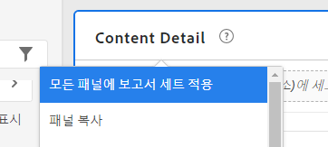
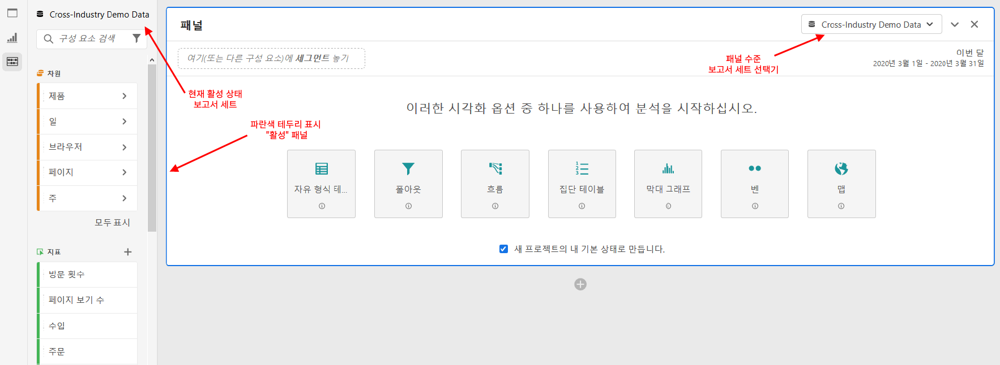
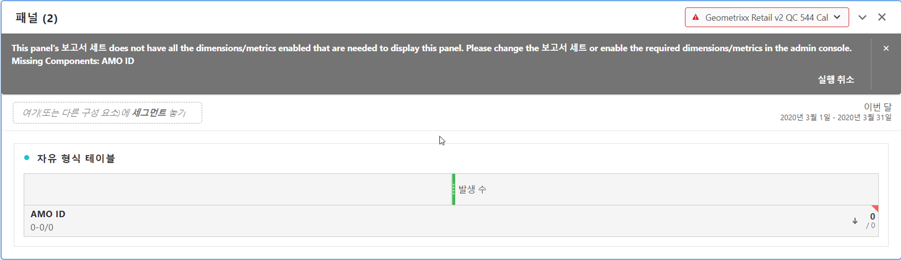

# 여러 보고서 세트

두 개 이상의 보고서 세트의 데이터를 사용하여 Analysis Workspace에서 프로젝트를 만들 수 있습니다. 보고서 세트는 패널 수준에서 선택되므로 동일한 Workspace 프로젝트 내에서 각 패널에 대해 다른 보고서 세트를 선택할 수 있습니다.

이 기능은 다음과 같은 경우에 유용합니다.

* 다른 두 지역의 데이터를 비교하고, 해당 데이터가 서로 다른 보고서 세트에 있습니다. 테이블 및 시각화를 작성하여 데이터를 나란히 비교할 수 있습니다.

* 다른 조직에 보고할 지표 및 시각화 대시보드를 작성합니다. 다양한 보고서 세트의 데이터를 동일한 프로젝트로 가져올 수 있습니다.

>[!BEGINSHADEBOX]

데모 비디오는  [여러 보고서 세트](https://experienceleague.adobe.com/ko/docs/analytics-learn/tutorials/analysis-workspace/using-panels/multiple-report-suites-in-analysis-workspace){target="_blank"}를 참조하십시오.

>[!ENDSHADEBOX]

## 모든 패널에 보고서 세트 적용

패널 헤더를 마우스 오른쪽 버튼으로 클릭하고 **[!UICONTROL 모든 패널에 보고서 세트 적용]**&#x200B;을 선택하여 모든 패널에 보고서 세트를 적용할 수 있습니다.

## 활성 패널

주위의 연한 파란색 테두리로 활성 패널을 인식할 수 있습니다. 패널 내부를 선택하여 해당 패널을 활성 패널로 전환하면 됩니다.

>[!TIP]
>
>활성 패널과 동일한 보고서 세트에 있는 모든 패널로 끌어다 놓을 수 있습니다. 동일한 보고서 세트의 비활성 패널로 끌어오면 패널이 활성화됩니다.
>

## 여러 보고서 세트로 작업

1. Analysis Workspace에서 2개 이상의 패널을 사용하여 새 프로젝트를 만듭니다.

1. 구성 요소(지표, 차원, 세그먼트, 날짜 범위)를 패널로 끌어서 놓습니다. 패널에 데이터와 보고서 세트에만 적용되는 시각화가 있는지 확인합니다.

   >[!NOTE]
   >
   >프로젝트에 포함된 구성 요소의 일부만이 보고서 세트에 포함된 경우 프로젝트를 로드할 때 (또는 보고서 세트로 전환할 때) 배너가 표시되는 경우가 있습니다. 누락된 구성 요소가 나열됩니다. [다음 지침](/help/admin/admin-console/permissions/product-profile.md)에 따라 필요한 지표/차원으로 권한을 설정합니다.
   >

   

   다음 세 가지 옵션을 사용하여 이러한 비호환성 문제를 해결할 수 있습니다.
   * 필요한 차원/지표 활성화
   * 보고서 세트 변경.
   * 일부 구성 요소가 누락된 상태로 계속 진행. 이렇게 하면 해당 구성 요소에 대한 데이터가 없고, 빈 시각화가 표시됩니다.

1. 패널을 다른 보고서 세트로 변경하고 구성 요소 레이블 (현재 활성화된 보고서 세트) 및 나열된 구성 요소가 새 보고서 세트를 기준으로 하여 어떻게 업데이트되는지 확인합니다.

1. 키보드 단축키를 사용 (`shift` 키를 누른 채 끌어오기)하여 비활성 패널을 활성 패널로 변환합니다.

1. (선택 사항) 다른 Analytics 구성 요소 빌더로 이동하여 다음을 나타내는 보고서 세트 레이블이 이제 표시되는지 확인합니다.

   * 세그먼트를 만들 위치: [세그먼트 빌더](/help/components/segmentation/segmentation-workflow/seg-build.md).
   * 계산된 지표를 만들 위치: [계산된 지표 빌더](/help/components/calculated-metrics/workflow/c-build-metrics/cm-build-metrics.md).
   * 경고를 만들 위치: [경고 빌더](/help/components/alerts/alert-builder.md).
