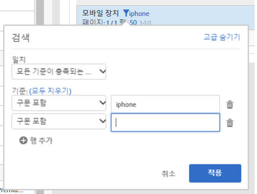

# 페이지 매김, 표 필터링 및 정렬

개요를 보려면 YouTube에서 다음 비디오를 시청하십시오.

[분석 작업 공간에서 페이지 매김, 필터링 및 정렬](https://www.youtube.com/watch?v=2zxpRPCGspg)

## Advanced filtering options {#section_36E92E31442B4EBCB052073590C1F025}

필터 아이콘을 클릭한 다음 자유 형식 테이블의 차원 옆에 있는 [고급 표시]를 클릭하면 다음 기준을 사용하여 필터링할 수 있습니다.

* 포함
* 포함하지 않음
* 다음 검색어 포함
* 검색어를 하나라도 포함
* 구문 포함
* 검색어 포함 안 함
* 다음 구문 포함 안 함
* 같음
* 같지 않음
* 다음으로 시작
* 다음으로 끝남

