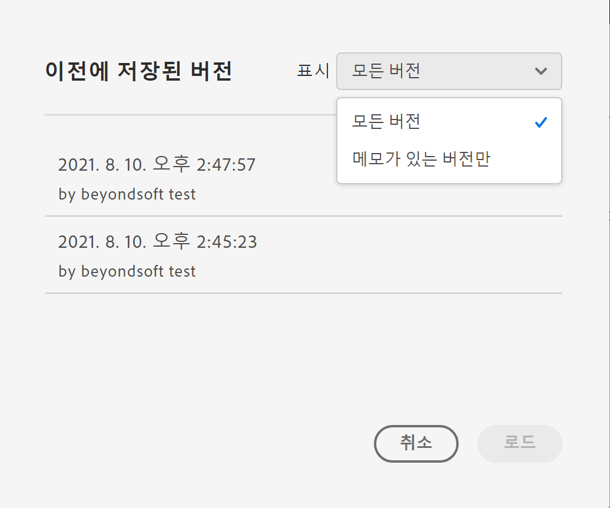

# 프로젝트 저장

프로젝트에 대한 변경 사항을 저장하려면 Analysis Workspace **[!UICONTROL 프로젝트]** 메뉴로 이동합니다. 또한 작업 영역은 특정 경우에 프로젝트를 자동으로 저장합니다.

## 프로젝트 저장 옵션 {#Save}

나중에 분석에 액세스하는 방식에 따라 **[!UICONTROL 프로젝트]** 메뉴 아래에서 수행할 수 있는 서로 다른 저장 작업이 있습니다.

| 작업 | 설명 |
|---|---| 
| **[!UICONTROL 저장]** | 프로젝트에 변경 사항을 저장합니다. 프로젝트가 공유되면 프로젝트의 수신자도 변경 내용을 보게 됩니다. 프로젝트를 처음 저장할 때 프로젝트에 이름, 설명 및 추가(선택 사항) 태그를 지정하라는 메시지가 표시됩니다. |
| **[!UICONTROL 메모와 함께 저장]** | 프로젝트가 저장되기 전에 프로젝트에서 변경된 사항에 대한 메모를 추가합니다. 메모는 프로젝트 버전과 함께 저장되며 [!UICONTROL 프로젝트] > [!UICONTROL 이전 버전 열기]의 모든 편집자가 사용할 수 있습니다. |
| **[!UICONTROL 다른 이름으로 저장]** | 프로젝트의 복제본을 만듭니다. 원본 프로젝트는 영향을 받지 않습니다. |
| **[!UICONTROL 템플릿으로 저장]** | 프로젝트를 **[!UICONTROL 프로젝트 > 새로 만들기]** 아래에서 조직에서 사용할 수 있게 되는 [사용자 지정 템플릿](https://docs.adobe.com/content/help/ko-KR/analytics/analyze/analysis-workspace/build-workspace-project/starter-projects.html)으로 저장합니다. |

## 자동 저장 {#Autosave}

이전에 최소 한 번이라도 저장된 기존 프로젝트(즉, 프로젝트)는 2분마다 로컬 시스템에 자동으로 저장됩니다. 저장된 적이 없는 새 프로젝트는 현재 자동 저장되지 않습니다.

프로젝트에 대한 저장되지 않은 변경 내용에서 주의를 돌리게 되어 서로 다른 동작을 하게 되는 몇 가지 시나리오가 있습니다.

### 다른 Analysis Workspace 프로젝트 열기

Adobe에서는 페이지를 떠나기 전에 저장할 수 있는 옵션을 제공합니다. 기존 프로젝트를 떠난 후 자동 저장된 로컬 사본은 삭제됩니다.

### 탭 이동 또는 닫기

저장하지 않은 변경 사항이 유실된다는 경고가 브라우저에 표시됩니다. 떠나거나 취소할 수 있습니다.

### 브라우저 충돌 또는 세션 시간 초과

**기존** 프로젝트의 경우 작업 영역으로 돌아오면 **프로젝트 복구** 양식이 표시됩니다. &quot;예&quot;를 선택하면 자동으로 저장된 로컬 복사본에서 프로젝트가 복원됩니다. 아니요를 선택하면 자동 저장된 로컬 복사본이 삭제되고 사용자가 저장한 프로젝트의 마지막 버전이 열립니다.

저장되지 않은 **새** 프로젝트의 경우 저장하지 않은 변경 사항은 복구할 수 없습니다.

## 이전 버전 열기 {#previous-version}

>[!NOTE]
>
>이전 프로젝트 버전은 현재 제한된 버전입니다.

프로젝트의 이전 버전을 열려면 다음을 수행하십시오.

1. **[!UICONTROL 프로젝트]** > **[!UICONTROL 이전 버전 열기]**&#x200B;로 이동합니다.

   

1. 사용 가능한 이전 버전 목록을 검토합니다.
   [!UICONTROL 편집자] 가   저장될 때   추가된 경우 메모와 함께 타임스탬프와 편집기가   표시됩니다. 노트 없는 버전은 90일 동안 저장됩니다.메모가 있는 버전은 1년 동안 저장됩니다.
1. 이전 버전을 선택하고 **[!UICONTROL 로드]**를 클릭합니다.
그런 다음 이전 버전이 알림과 함께 로드됩니다. **[!UICONTROL 저장]**&#x200B;을 클릭해야만 이전 버전이 프로젝트의 현재 저장된 버전이 아닙니다. 로드된 버전을 벗어나는 경우, 돌아오면 마지막으로 저장된 버전의 프로젝트가 표시됩니다.
