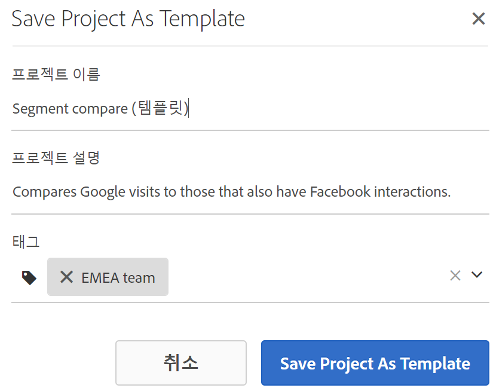
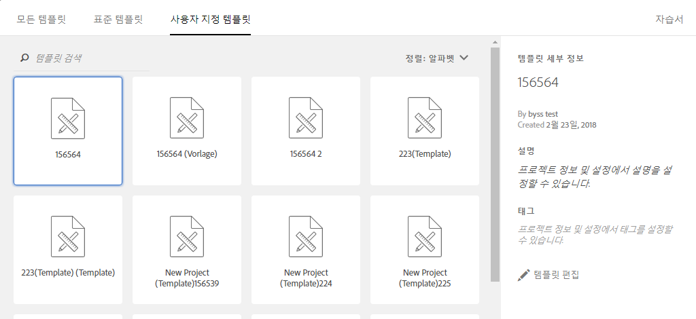

# 템플릿

## 템플릿{#topic_40932F09E18A467983AFBB29908E1CB8}을 참조하십시오 

프로젝트를 만들지 여부를 선택할 수 있습니다.

* 빈 프로젝트(기본값). 자세한 내용은 [분석 작업 공간 프로젝트 만들기](../../../analyze/analysis-workspace/build-workspace-project/t-freeform-project.md#task_C2C698ACC7954062A28E4784911E6CF2).
* 표준 템플릿. 이러한 템플릿은 Adobe가 만들어 특별 배송합니다.
* 사용자 지정 템플릿. [템플릿으로 저장] 권한이 부여된 경우 관리 권한이 있는 사용자나 관리자가 아닌 사용자가 이 템플릿을 생성할 수 있습니다. (See [Manage product permissions](https://helpx.adobe.com/enterprise/using/manage-permissions-and-roles.html) in the Admin Console documentation for more information.

* [사용자 정의 템플릿 만들기](../../../analyze/analysis-workspace/build-workspace-project/starter-projects.md#task_279637F56CFD4B6094D7CBDB82FA4835)
* [표준 템플릿](../../../analyze/analysis-workspace/build-workspace-project/starter-projects.md#concept_4FE900FEEC894E849CB6C6A0E0ADA524)

## Create a custom template {#task_279637F56CFD4B6094D7CBDB82FA4835}

관리자 권한이 있는 사용자는 자신이 만드는 프로젝트를 사용자 지정 템플릿으로 만들 수 있습니다. 방법은 다음과 같습니다.

1. 프로젝트를 엽니다.
1. **[!UICONTROL 프로젝트]** &gt; 템플릿으로 **[!UICONTROL 저장을]**&#x200B;선택합니다.

   

   프로젝트는 현재 프로젝트 이름 아래에 저장되며 프로젝트 이름 다음에 괄호를 사용한 단어 (템플릿)이 표시됩니다. 관리자는 템플릿을 편집하여 이 이름을 변경할 수 있습니다.

   >[!NOTE]
   >
   >기본적으로 프로젝트 템플릿은 조직의 모든 사람에게 표시됩니다. 태그를 적용하여 템플릿을 구성할 수도 있습니다. **[!UICONTROL (프로젝트]** &gt; **[!UICONTROL 프로젝트 정보 및 설정으로]** 이동하여 태그 및 설명을 편집합니다.)

### 사용자 지정 템플릿에서 수행할 수 있는 작업

<table id="table_D7C7B0CA1EE64E108484C03426800EBC"> 
 <thead> 
  <tr> 
   <th colname="col1" class="entry"> 작업 </th> 
   <th colname="col2" class="entry"> 설명 </th> 
  </tr>
 </thead>
 <tbody> 
  <tr> 
   <td colname="col1"> 
편집 template 
 </td> 
   <td colname="col2"> 
관리자가 데이터 소스를 변경하고 구성 요소, 시각화, 날짜 범위 등을 수정하여 템플릿을 편집할 수 있습니다. 
 
사용자 지정 템플릿을 편집하려면 다음을 수행하십시오. 
 
    <ul id="ul_2B3A371F83334E14806385753A360903"> 
     <li id="li_EE75E0281B764BA9B56FF1DB1B12D2CC">Analysis Workspace에서 사용자 지정 템플릿 목록을 표시하고 하나를 선택한 다음 템플릿 편집을 클릭합니다. 또는 </li> 
     <li id="li_4934DAAA46204990A295E22A97F81EDA">Analytics에서 구성 요소 &gt;  프로젝트로 이동한 다음 템플릿에 대해 필터링합니다. 편집할 템플릿의 이름을 클릭하십시오. </li> 
    </ul> 
 
 
참고: 상황에 따라 템플릿을 편집한 후에는 저장과 다른 이름으로 저장, 이렇게 두 가지 옵션이 있습니다. 다음은 두 옵션이 어떻게 다른지 설명합니다. 
     <ul id="ul_87E2842C8AA442399585B1C6189F5E16"> 
      <li id="li_AB7B189729E14E40A0141ECE2A24C113"><b>저장</b>: 모든 사용자의 사용자 지정 템플릿을 업데이트합니다. 다른 사용자가 이 사용자 지정 템플릿에서 프로젝트를 작성할 때에는 변경한 내용이 표시됩니다. </li> 
      <li id="li_C85B0B9873A3404D8B443BBD30B37CEB"><b>다른 이름으로 저장</b>: 사용자의 변경 내용이 적용된 사용자 지정 템플릿을 만듭니다. </li> 
     </ul> 
 
(공유 &gt; 프로젝트 공유 메뉴 항목 사용이 비활성화되어 있으면 편집 모드 상태임을 알 수 있습니다.) 
 </td> 
  </tr> 
  <tr> 
   <td colname="col1"> 
템플릿 검색 
 </td> 
   <td colname="col2"> 
[사용자 지정 템플릿] 대화 상자에서 템플릿 검색을 클릭합니다. 
 </td> 
  </tr> 
  <tr> 
   <td colname="col1"> 
템플릿 정렬 
 </td> 
   <td colname="col2"> 
템플릿을 알파벳순, 관련성 및 작성 날짜별로 정렬할 수 있습니다. 
 
[사용자 지정 템플릿] 대화 상자에서 정렬:을 클릭합니다. 
 </td> 
  </tr> 
  <tr> 
   <td colname="col1"> 
템플릿에 태그 적용 
 </td> 
   <td colname="col2"> 
템플릿을 열고 프로젝트 &gt; 프로젝트 정보 및 설정으로 이동합니다. 태그 추가를 클릭합니다. 
 </td> 
  </tr> 
  <tr> 
   <td colname="col1"> 
템플릿 설명 수정 
 </td> 
   <td colname="col2"> 
템플릿을 열고 프로젝트 &gt; 프로젝트 정보 및 설정으로 이동합니다. 설명을 두 번 클릭하고 편집합니다. 
 </td> 
  </tr> 
 </tbody> 
</table>

## Standard templates {#concept_4FE900FEEC894E849CB6C6A0E0ADA524}

작업 영역을 처음 열면 왼쪽 레일에서 템플릿을 사용할 수 있습니다. Analysis Workspace 템플릿은 일반적인 사용 사례를 다룹니다. 이 프로젝트들은 해당 프로젝트가 속해 있는 특성으로 그룹화되고 보고서 세트에 따라 서로 다른 측정 기준, 세그먼트, 지표 및 시각화로 사전에 채워지게 됩니다.

이렇게 사전에 채워진 템플릿을 그대로 사용하거나 필요에 맞게 조정(예를 들어 지표나 시각화를 추가 또는 교체하여)하고 새 이름으로 저장할 수 있습니다. 

[YouTube](https://www.youtube.com/watch?v=aRgYwPneVXg&list=PL2tCx83mn7GuNnQdYGOtlyCu0V5mEZ8sS&index=6) 의 분석 작업 공간에서 표준 템플릿 (2:46)

다음은 사용 가능한 템플릿과 각 템플릿이 응답하는 데 도움이 되는 질문입니다.

### 광고

* **Seach 엔진**: 이 템플릿은 광고 트렌드, 광고 플랫폼 합계, 키워드 등을 분류합니다. **참고:** 이 템플릿 프로젝트를 표시하려면 선택한 보고서 세트가 Advertising Cloud에 대해 활성화되어 있어야 합니다.

## 상거래

* **Autonomy: 마케팅 및 상거래**: 이 템플릿은 마케팅 채널 기여도 분석으로 전자 상거래 전환을 분류하며 검색 키워드, 랜딩 페이지, 지리적 위치 등을 통해 통찰력을 제공합니다.

### 미디어

* **컨텐츠 소비**: 어떤 콘텐츠가 가장 많이 소비되고 있으며 사용자가 참여합니까?
* **최근 - 빈도 - 충성도**: 충성도 높은 독자는 누구입니까?

### 모바일

>[!IMPORTANT]
>
>모바일 템플릿은 보고서 세트가 모바일에 대해 활성화된 경우에만 사용할 수 있습니다.

* **메시징:** 인앱 및 푸시 메시징 성능에 중점을 둡니다.
* **위치:** 지도 표시 위치 데이터가 포함되어 있습니다.
* **주요 지표:** 앱의 주요 측정 지표에 대한 정보를 얻을 수 있습니다.
* **앱 사용:** 앱이 보유한 앱 사용자, 시작 및 첫 번째 실행 수와 평균 세션 길이가 얼마였습니까?
* **고객 확보:** 모바일 획득 링크가 어떻게 작동하는지 살펴보십시오.
* **성능:** 앱이 어떻게 수행되고 있으며 사용자에게 문제가 있는 곳은 어디입니까?
* **유지:** 단골 사용자는 누구이며 어떻게 해야 합니까?
* **여정:** 앱에 사용할 수 있는 사용 패턴은 무엇입니까?

### 소매

* **캠페인 성과:** 가장 많은 매출을 창출하는 캠페인은 무엇입니까?
* **제품:** 어떤 제품이 가장 효과적입니까?

### 웹

* **고객 확보:** 내 웹 사이트에 가장 인기 있는 트래픽 드라이버는 무엇입니까?
* **컨텐츠 소비:** 사람들이 사이트에서 가장 많이 방문하는 곳은 어디입니까?
* **유지:** 내 사이트의 단골 사용자가 될 가능성이 높은 사용자 유형은 무엇입니까?
* **기술:** 사람들이 내 사이트에 액세스하는 데 사용하는 기술은 무엇입니까?

### 사람

>[!NOTE]
>
>The People template and its associated People metric is available for use only as part of the [Adobe Experience Cloud Device Co-op](https://marketing.adobe.com/resources/help/en_US/mcdc/mcdc-people.html).

고유 방문자 수 지표의 중복이 제거된 버전인 사람 지표를 기반으로 합니다. 사람 지표에서는 여러 장치를 사용하는 소비자가 브랜드와 상호 작용하는 빈도를 측정합니다. 템플릿을 사용하면 다음 작업을 수행할 수 있습니다.

* 미국/캐나다와 나머지 세계에 대한 데이터를 나눕니다. Device Co-op는 현재 북미에서만 사용할 수 있습니다.
* 사람 지표와 고유 방문자 수 지표를 나란히 비교합니다.
* 사람 지표가 고유 방문자 수의 비율로서 얼마나 작은지를 계산하는 계산된 지표인 "압축 비율"을 참조하십시오.
* 고객이 사용하는 장치 유형 합계를 비교합니다.
* 사람당 몇 개의 평균 장치가 사용되는지를 확인합니다.
* 사람 지표를 사용하는 세그먼트 스택 사용 방법을 알아봅니다.
* 사용 중인 환경에서 Experience Cloud ID를 사용하는 것이 어떻게 사람 지표의 효과를 개선하는지 알아봅니다.

