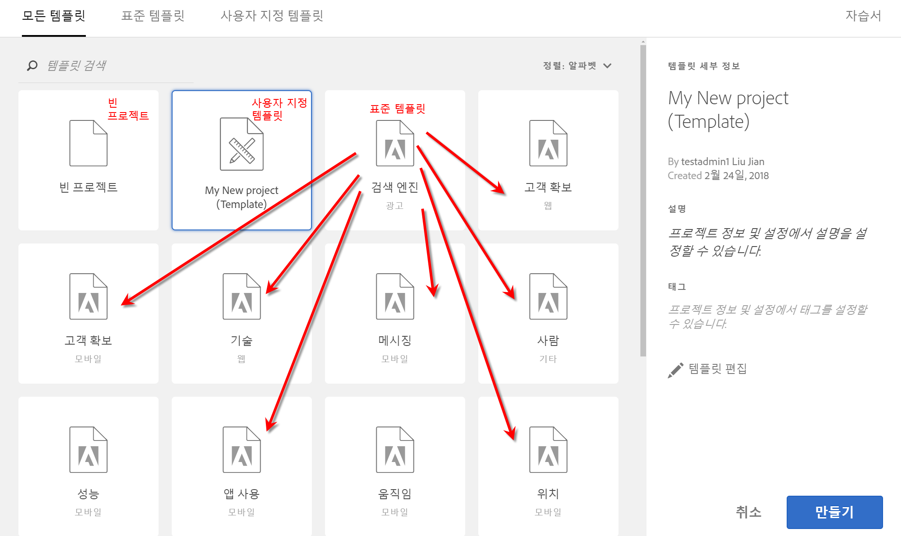

# 템플릿

프로젝트를 다음 중 어느 방법으로 작성할지 선택할 수 있습니다.

* **빈 프로젝트(기본값)**: 자세한 내용은 [Analysis Workspace 프로젝트 만들기](/help/analyze/analysis-workspace/build-workspace-project/t-freeform-project.md)를 참조하십시오.
* **표준 템플릿**: 이러한 템플릿은 Adobe에서 만들어 제품과 함께 제공됩니다.
* **사용자 지정 템플릿**: Admin Console에서 [!UICONTROL Analysis Workspace: Save as Template] 권한이 부여된 경우 이러한 템플릿은 관리자 권한이 있는 사용자 또는 비관리자가 생성, 공유 또는 삭제할 수 있습니다. [추가 정보...](https://docs.adobe.com/content/help/ko-KR/analytics/admin/admin-console/permissions/product-profile.html)

## 사용자 지정 템플릿 만들기 {#create-custom-template}

관리자 권한이 있는 사용자는 자신이 만드는 프로젝트를 사용자 지정 템플릿으로 만들 수 있습니다. 방법은 다음과 같습니다.

1. 프로젝트를 엽니다.
1. **[!UICONTROL Project]** > **[!UICONTROL Save As Template]**&#x200B;으로 이동합니다.

   

   프로젝트는 현재 프로젝트 이름 아래에 저장되며 프로젝트 이름 다음에 괄호를 사용한 단어 (템플릿)이 표시됩니다. 관리자는 템플릿을 편집하여 이 이름을 변경할 수 있습니다.

   >[!NOTE]
   >
   >기본적으로 조직의 모든 사용자가 프로젝트 템플릿을 볼 수 있습니다. 태그를 적용하여 템플릿을 구성할 수도 있습니다. (**[!UICONTROL Project]** > **[!UICONTROL Project Info & Settings]**&#x200B;로 이동하여 태그 및 설명을 편집합니다.)

### 사용자 지정 템플릿에서 수행할 수 있는 작업

| 작업 | 설명 |
|--- |--- |
| 편집 template | 관리자가 데이터 소스를 변경하고 구성 요소, 시각화, 날짜 범위 등을 수정하여 템플릿을 편집할 수 있습니다.  사용자 지정 템플릿을 편집하려면 다음을 수행하십시오.<ul><li>Analysis Workspace에서 사용자 지정 템플릿 목록을 표시하고 하나를 선택한 다음 템플릿 편집을 클릭합니다. 또는</li><li>Analytics에서 구성 요소 >  프로젝트로 이동한 다음 템플릿에 대해 필터링합니다. 편집할 템플릿의 이름을 클릭하십시오.</li></ul>**참고:** 상황에 따라 템플릿을 편집한 후에는 저장과 다른 이름으로 저장, 이렇게 두 가지 옵션이 있습니다. 다음은 두 옵션이 어떻게 다른지 설명합니다.<ul><li>**저장**: 모든 사용자의 사용자 지정 템플릿을 업데이트합니다. 다른 사용자가 이 사용자 지정 템플릿에서 프로젝트를 작성할 때에는 변경한 내용이 표시됩니다.</li><li>**다른 이름으로 저장**: 사용자의 변경 내용이 적용된 사용자 지정 템플릿의 사본을 만듭니다. (공유 > 프로젝트 공유 메뉴 항목 사용이 비활성화되어 있으면 편집 모드 상태임을 알 수 있습니다.)</li></ul> |
| 템플릿 검색 | 사용자 지정 템플릿 대화 상자에서 템플릿 검색을 클릭합니다. |
| 템플릿 정렬 | 템플릿을 알파벳순, 관련성 및 작성 날짜별로 정렬할 수 있습니다.  사용자 지정 템플릿 대화 상자에서 정렬:을 클릭합니다. |
| 템플릿에 태그 적용 | 템플릿을 열고 프로젝트 > 프로젝트 정보 및 설정으로 이동합니다. 태그 추가를 클릭합니다. |
| 템플릿 설명 수정 | 템플릿을 열고 프로젝트 > 프로젝트 정보 및 설정으로 이동합니다. 설명을 두 번 클릭하고 편집합니다. |

## 표준 템플릿

작업 공간을 처음 열면 왼쪽 레일에서 템플릿을 사용할 수 있습니다. Analysis Workspace 템플릿은 일반적인 사용 사례를 다룹니다. 이 프로젝트들은 해당 프로젝트가 속해 있는 특성으로 그룹화되고 보고서 세트에 따라 서로 다른 측정 기준, 세그먼트, 지표 및 시각화로 사전에 채워지게 됩니다.

이렇게 사전에 채워진 템플릿을 그대로 사용하거나 필요에 맞게 조정(예를 들어 지표나 시각화를 추가 또는 교체하여)하고 새 이름으로 저장할 수 있습니다. 

[Analysis Workspace 표준 템플릿 - YouTube](https://www.youtube.com/watch?v=aRgYwPneVXg&amp;list=PL2tCx83mn7GuNnQdYGOtlyCu0V5mEZ8sS&amp;index=6)(2:46)

다음은 템플릿과 각 템플릿을 사용하여 해결할 수 있는 질문입니다.

### 교육

이러한 표준 템플릿은 작업 공간에 첫 번째 분석을 작성하는 일반적인 용어 및 단계를 안내합니다. 이 템플릿은 새 프로젝트 모달에서 표준 템플릿으로 사용할 수 있으며 목록에 다른 프로젝트가 없는 신규 사용자에게 현재 표시되는 샘플 프로젝트를 대체합니다.

* **교육 자습서 - 내부 검색 분석**: 내부 검색 자습서는 방문자가 웹사이트 또는 앱에서 찾고 있는 항목을 지원하고 이해합니다. 이러한 유형의 데이터를 분석하면 컨텐츠 최적화의 기회를 포착할 수 있습니다.

* **교육 자습서 - 마케팅 분석**: 이 자습서에서는 사용자 지정 차원 및 지표가 중요한 사항을 포함하여 경영진을 위한 마케팅 분석을 구성하는 방법을 보여줍니다.

### 광고

>[!IMPORTANT]
>
>광고 템플릿은 Advertising Cloud에 대해 보고서 세트가 활성화되어 있을 경우에만 사용할 수 있습니다.

* **유료 검색 엔진**: 이 템플릿은 광고 트렌드, 광고 플랫폼, 키워드, 계정, 캠페인 등을 분류합니다.

### 상거래

* **마젠토: 마케팅 및 상거래**: 이 템플릿은 마케팅 채널 기여도 분석으로 전자 상거래 전환을 분류하고 검색 키워드, 랜딩 페이지, 지리적 위치 등을 통해 통찰력을 제공합니다. 비디오 개요가 필요하면 [!VIDEO](https://www.youtube.com/watch?v=AQOViVLEMHw)를 참조하십시오.

### 미디어

* **오디오 소비**: 가장 많이 소비되고 사용자가 참여하는 컨텐츠 식별
* **최신성 - 빈도 - 충성도**: 충성스런 독자 식별

### 모바일

>[!IMPORTANT]
>
>모바일 템플릿은 모바일에 대해 보고서 세트가 활성화되어 있을 경우에만 사용할 수 있습니다. 

* **메시징:** in-app 및 푸시 메시지 성능 지표에 중점 두기
* **위치:** 위치 데이터를 표시하는 지도 포함
* **주요 지표:** 앱의 주요 지표에 대한 지속적인 모니터링
* **앱 사용:** 앱이 보유한 앱 사용자, 시작 및 첫 번째 시작의 수와 평균 세션 길이
* **고객 확보:** 모바일 획득 링크가 수행되는 방식을 참조하십시오.
* **성능:** 앱이 수행되는 방식과 사용자에게 문제가 발생하는 위치
* **유지:** 충성스런 사용자 식별과 이들이 수행하는 작업
* **움직임:** 내 앱에 대해 두드러진 사용 패턴 식별

### 소매

* **캠페인 성과:** 가장 많은 수입을 파생시키는 캠페인
* **제품:** 성과가 가장 좋은 제품

### 웹

* **고객 확보:** 내 웹 사이트를 방문하는 상위 트래픽 파생자
* **컨텐츠 사용량:** 내 사이트에서 사람들이 방문하는 상위 위치
* **유지:** 내 사이트에 충성스런 사용자가 되는 사용자 유형
* **기술:** 사람들이 내 사이트에 액세스하는 데 사용하는 기술

### 사람

>[!NOTE] 사람 템플릿과 관련 사람 지표는 [Adobe Experience Cloud Device Co-op](https://docs.adobe.com/content/help/ko-KR/device-co-op/using/data/people.html)의 일부로서만 사용할 수 있습니다.

이 템플릿은 다시 말해, 고유 방문자 수 지표의 중복이 제거된 버전인 사람 지표를 기반으로 합니다. 사람 지표에서는 여러 장치를 사용하는 소비자가 브랜드와 상호 작용하는 빈도를 측정합니다. 템플릿을 사용하면 다음 작업을 수행할 수 있습니다.

* 미국/캐나다와 나머지 세계에 대한 데이터를 나눕니다. Device Co-op는 현재 북미에서만 사용할 수 있습니다.
* 사람 지표와 고유 방문자 수 지표를 나란히 비교합니다.
* 사람 지표가 고유 방문자 수의 비율로서 얼마나 작은지를 계산하는 계산된 지표인 &quot;압축 비율&quot;을 참조하십시오.
* 고객이 사용하는 장치 유형 합계를 비교합니다.
* 사람당 몇 개의 평균 장치가 사용되는지를 확인합니다.
* 사람 지표를 사용하는 세그먼트 스택 사용 방법을 알아봅니다.
* 사용 중인 환경에서 Experience Cloud ID를 사용하는 것이 어떻게 사람 지표의 효과를 개선하는지 알아봅니다.

### 여정 IQ: 장치 간 분석 템플릿

<!-->This content is mirrored in the CDA doc.<-->

이 템플릿을 사용하면 중요한 장치 간 성능 데이터를 볼 수 있습니다. CDA([Cross-Device Analytics](https://docs.adobe.com/content/help/ko-KR/analytics/components/cda/cda-home.html))에 액세스할 수 있는 고객에게만 제공됩니다.

* **Co-op 그래프의 구성원을 위한 특수 참고 사항**: co-op 그래프가 지원되는 지역에서 방문자가 포함된 보고서 세트의 일부 및 지원되지 않는 지역을 표시합니다.
* **사용자 식별**: 장치 간 분석을 기반으로 한 방법을 사용하여 사이트 방문자가 식별되는 빈도를 표시합니다.
* **대상 크기 측정**: &#39;사용자&#39;과 &#39;고유 장치&#39;의 비교를 보여줍니다. 이 두 숫자의 비율은 이 패널에 표시되는 계산된 지표인 &#39;장치 간 압축&#39;이라고 합니다. 이 압축 지표는 다양한 요인에 따라 다릅니다.
   * **Co-op 그래프 또는 Private 그래프 사용: 일반적으로 얘기하자면, Device Co-op을 사용하는 조직은 Private 그래프를 사용하는 조직보다 압축률이 더 높은 경향이 있습니다.**
   * **로그인 비율**: 사이트에 로그인하는 사용자가 많을수록 Adobe가 장치들 간에 더 많은 방문자를 식별하고 결합할 수 있습니다. 로그인 비율이 낮은 사이트는 압축률도 낮습니다.
   * **Experience Cloud ID 범위**: ECID가 있는 방문자만 결합할 수 있습니다. ECID를 사용하는 사이트에 대한 방문자의 낮은 비율은 낮은 압축률과 상호 연관성이 있습니다.
   * **여러 장치 사용**: 사이트 방문자가 여러 장치를 사용하지 않는다면 압축률도 낮습니다.
   * **보고 세부기간**: 일별 압축은 일반적으로 월별 또는 연별 압축보다 작습니다. 개인이 여러 장치를 사용할 가능성은 범위가 한 달일 때보다 하루일 때 더 작아집니다. 세그먼트화, 필터링 또는 분류 차원 사용 시에도 압축률이 더 낮아질 수 있습니다.
* **사용자 기반 세그먼트**: 장치별 데이터를 볼 수 있는 세그먼트 드롭다운이 포함되어 있습니다. 이 패널에서는 장치 유형을 포함하거나 제외하는 것이 보고서에 영향을 미치는 방식을 세그먼트로 실험해 볼 것을 권장합니다.
* **장치 간 여정 분석**: 장치 유형에 따라 흐름 및 폴아웃 보고서를 제공합니다.
* **장치 간 속성**: Journey IQ와 Attribution IQ의 기능을 함께 결합합니다.
* **기타 팁 및 기법**: CDA를 최대한 활용할 수 있는 유용한 주제입니다.