# Workspace 프로젝트 만들기

프로젝트를 만들고 구성 요소(차원, 지표, 세그먼트 및 날짜 범위)를 자유 형식 패널에 추가합니다.

이 문서는 Analysis Workspace 인터페이스 요소에 익숙해지도록 하고 프로젝트를 만드는 방법을 보여줍니다. 특정 사용 사례에 대해서는 분석 작업 [공간에 대한 사용 사례를 참조하십시오](../../../analyze/analysis-workspace/freeform-analysis-examples-use-cases.md#concept_173D1EB783F24EA89E754628BA30FF4B).

## 프로젝트를 만듭니다

1. 프로젝트를 생성하고 조정하는 사용자 권한을 지정합니다.

   Analysis Workspace 프로젝트를 만들거나 조정하기 전에 관리자가 **[!UICONTROL Analysis Workspace에서 프로젝트 만들기 / 조정]** 권한이 활성화된 그룹이나 **모든 보고서 액세스]사용자 그룹에 사용자를 추가해야 합니다.[!UICONTROL ** ( **[!UICONTROL Admin]** &gt; **[!UICONTROL User Management]** &gt; [Groups](https://marketing.adobe.com/resources/help/en_US/reference/groups.html)).

1. In the [!DNL Experience Cloud], click **[!UICONTROL Analytics]** &gt; **[!UICONTROL Workspace]**.

   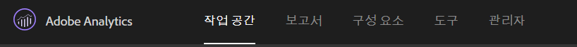

   Alternatively, enter a forward slash (/) to open the report search bar, then type *`workspace`*.

   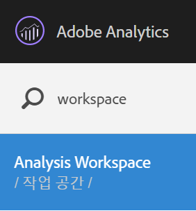

1. Click **[!UICONTROL Create New Project]**.

   프로젝트를 다음 중 어느 방법으로 작성할지 선택할 수 있습니다.

* 빈 프로젝트(기본값). 자세한 내용은 다음을 참조하십시오.
* 표준 템플릿. 이러한 템플릿은 Adobe가 만들어 특별 배송합니다. 자세한 내용은 [템플릿](../../../analyze/analysis-workspace/build-workspace-project/starter-projects.md#concept_49B9A327C5004DB0A4BE6291435625C5)을 참조하십시오.
* 사용자 지정 템플릿. 이러한 템플릿은 관리자 권한을 가진 사용자가 작성합니다. 자세한 내용은 [템플릿](../../../analyze/analysis-workspace/build-workspace-project/starter-projects.md#concept_49B9A327C5004DB0A4BE6291435625C5)을 참조하십시오.

   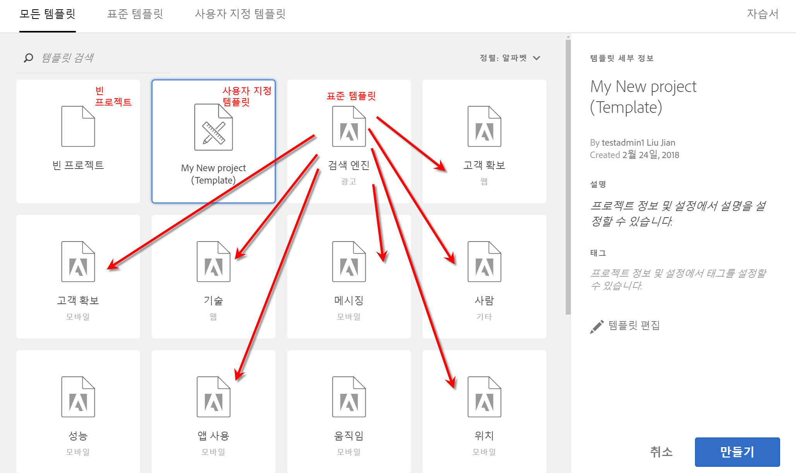

1. To create a project from a blank project, click **[!UICONTROL Blank Project]**.

   * Then click **[!UICONTROL Create]**, or
   * 간단히 **[!UICONTROL Enter를 클릭합니다]**.
   자유 형식 패널과 데이터 테이블 시각화를 보여주는 빈 프로젝트가 표시됩니다.

   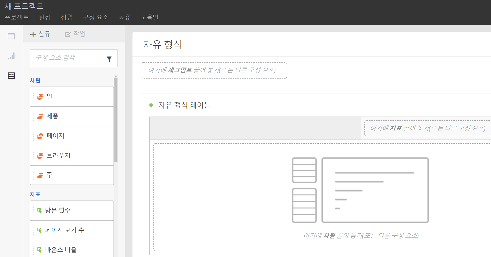

   >[!NOTE]
   >
   >Sometimes, an "Incompatible Report Suite" message shows up when loading a project (or switching to a report suite) where not all of the components (metrics/dimensions) included in the project are included in the report suite. 호환되지 않는 구성 요소 목록을 볼 수 있으므로 메시지가 표시되는 이유를 알 수 있습니다.

<table id="table_3989E45D9D4241CBB2E58B29DA257B2F"> 
 <thead> 
  <tr> 
   <th colname="col1" class="entry"> 요소 </th> 
   <th colname="col2" class="entry"> 설명 </th> 
  </tr> 
 </thead>
 <tbody> 
  <tr> 
   <td colname="col1"><a href="../../../analyze/analysis-workspace/components/analysis-workspace-components.md#concept_BEBE3A75E072495D9E2F895567BBD462" format="dita" scope="local"> 구성 요소</a> </td> 
   <td colname="col2"> 
프로젝트로 드래그할 수 있는 차원, 지표, 세그먼트 및 날짜 범위입니다. 
 </td> 
  </tr> 
  <tr> 
   <td colname="col1"><a href="../../../analyze/analysis-workspace/visualizations/freeform-analysis-visualizations.md#concept_09242627629147A88A68F1506954C276" format="dita" scope="local"> 시각화</a> </td> 
   <td colname="col2"> 
패널이나 인터페이스의 프로젝트 영역에 드래그할 수 있는 항목입니다. 
 </td> 
  </tr> 
  <tr> 
   <td colname="col1"><a href="../../../analyze/analysis-workspace/visualizations/freeform-table.md#concept_0D2E24FCCBAF4194AA941448860E422F" format="dita" scope="local"> 자유 형식 패널 </a> </td> 
   <td colname="col2"> 
Analysis Workspace에서 상호 작용하는 캔버스 또는 작업 공간입니다. 
 </td> 
  </tr> 
 </tbody> 
</table>

1. 프로젝트를 저장하십시오. 프로젝트 이름을 지정하고 (선택 사항이지만 유용한) 설명을 제공하고 프로젝트에 태그를 달고(선택 사항) **[!UICONTROL 프로젝트 저장을 클릭하십시오]**.

   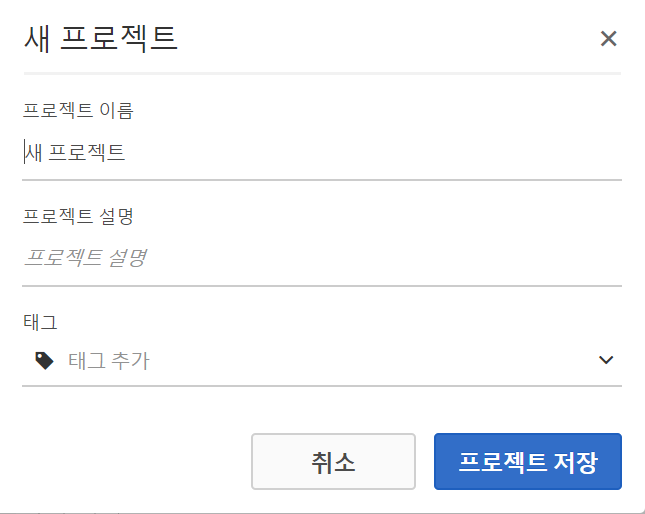

1. 이제 시각화 또는 패널을 마우스 오른쪽 단추로 클릭하고 복사한 다음, 복사한 요소를 프로젝트 내의 다른 위치 또는 다른 프로젝트에 붙여넣을("삽입") 수 있습니다.

   이 기능을 사용하면 다른 프로젝트에 복사할 수 있는 "문서 블록"(사전 정의된 시각화/패널)을 작성하여 비즈니스와 관련된 데이터로 빠르게 시작할 수 있습니다.

   >[!NOTE]
   >
   >After you copy/save-as, the intra-links are now relative to the project they live within, not the original project they were copied from.

## 구성 요소 및 시각화 추가 {#task_CDAC9B3007BE4A3790AFAD3746D669B1}

1. 프로젝트로 드래그하여 프로젝트를 *`components`* 제작할 *`visualizations`* 수 있습니다.

   **구성 요소**

   구성 요소 도구 모음에는 가장 자주 사용하는 검색 가능한 차원, 지표, 세그먼트 및 날짜 범위가 표시됩니다.

<table id="table_4626163E26DE46CB86391868BBA3AD32"> 
 <thead> 
  <tr> 
   <th colname="col1" class="entry"> 구성 요소 </th> 
   <th colname="col2" class="entry"> 설명 </th> 
  </tr> 
 </thead>
 <tbody> 
  <tr> 
   <td colname="col1"> 차원(주황색) </td> 
   <td colname="col2"> 
프로젝트 수준에서 적용합니다. 
 
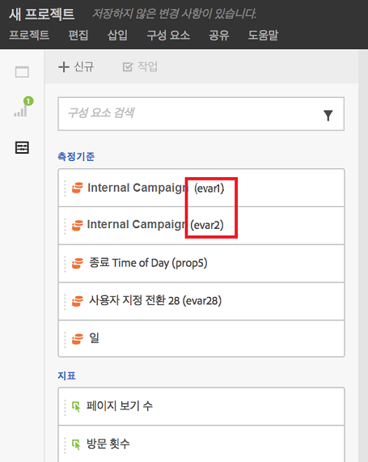 
 
Prop#, eVar# 및 event#가 차원 이름에 추가되고 해당 숫자를 검색할 수 있습니다. 예: 왼쪽 레일에 "내부 캠페인"이 "내부 캠페인(evar2)"으로 표시됩니다. 
 
 표에 prop, eVar 및 이벤트 번호가 표시되지 않습니다(제목을 짧게 유지하기 위해). 
 
일부 특별 차원을 자유 형식 테이블에 드래그하거나 왼쪽 레일에서 볼 때 이 차원들을 위한 기본 정렬 순서가 있습니다. 예를 들어, "시간"을 테이블에 놓거나 왼쪽 레일에서 보면, 오전 12시부터 오후 11시까지 정렬됩니다. 지표 열을 기준으로 정렬할 수 있습니다. 
 </td> 
  </tr> 
  <tr> 
   <td colname="col1"> 지표(녹색) </td> 
   <td colname="col2"> 
프로젝트 수준에서 적용합니다. 
 
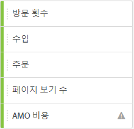 
 
  발생은 데이터 테이블의 기본 지표입니다. 
 </td> 
  </tr> 
  <tr> 
   <td colname="col1"> 세그먼트(파란색) </td> 
   <td colname="col2"> 
패널 수준에서만 드래그할 수 있지만, 데이터 테이블에서 인라인 세그먼트를 만들 수 있습니다. 
 
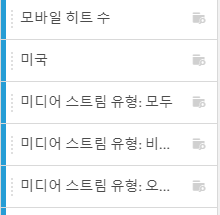 
 
자세한 <a href="../../../analyze/analysis-workspace/freeform-analysis-examples-use-cases.md#concept_173D1EB783F24EA89E754628BA30FF4B" format="dita" scope="local"> 내용은 분석 작업 공간에</a> 대한 사용 사례를 참조하십시오. 
 </td> 
  </tr> 
  <tr> 
   <td colname="col1"> 날짜 범위 및 세부기간(자주색) </td> 
   <td colname="col2"> 
패널 수준에서 드래그할 수 있습니다. 날짜 범위를 구성할 때 [일정]에서 프로젝트를 만들 수 있습니다. 
 
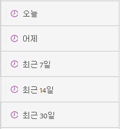 
 </td> 
  </tr> 
 </tbody> 
</table>

**[시각화](../../../analyze/analysis-workspace/visualizations/freeform-analysis-visualizations.md#concept_09242627629147A88A68F1506954C276)**

[!UICONTROL 시각화] 패널은 표준 분석 그래프, 차트, 도넛, 데이터 테이블, [집단](../../../analyze/analysis-workspace/visualizations/cohort-table/cohort-analysis.md#concept_9D240A490265427DA694D18D14EACC0E) 테이블, 벤 다이어그램 등을 제공합니다. 여러 시각화를 프로젝트로 드래그하여 놓을 수 있습니다.

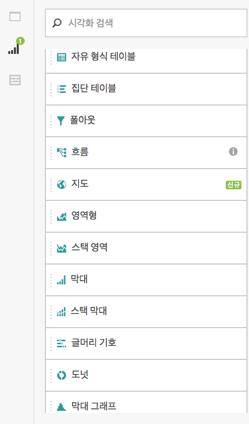

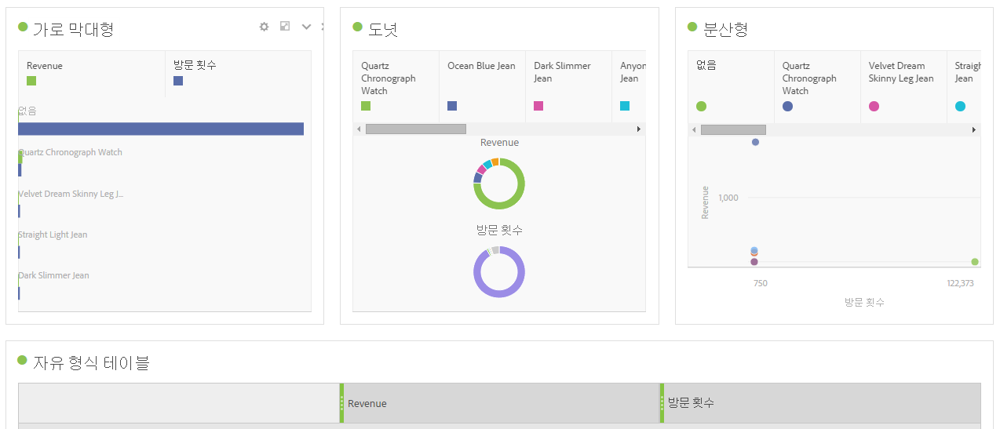

1. 단계

## 마우스 오른쪽 단추 클릭 메뉴를 사용하여 데이터 사용자 지정 {#concept_8117C300F21843B99F4E1B9AB7B11B6F}

마우스 오른쪽 버튼 클릭 메뉴를 사용하면 마우스 오른쪽 버튼으로 클릭하는 테이블의 셀에 따라 다음 작업을 수행할 수 있습니다.

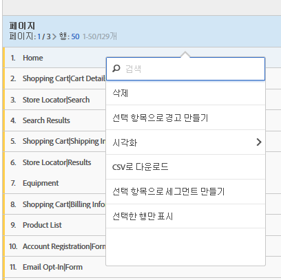

<table id="table_0F84CC5B604D4D41BD0C9668DF525929"> 
 <thead> 
  <tr> 
   <th colname="col1" class="entry"> 작업 </th> 
   <th colname="col2" class="entry"> 설명 </th> 
  </tr>
 </thead>
 <tbody> 
  <tr> 
   <td colname="col1"><a href="../../../analyze/analysis-workspace/components/calendar-date-ranges/time-comparison.md#concept_93BCAD81B7A54ABBBA5CD9E419F6F764" format="dita" scope="local"> 기간 열 추가</a> </td> 
   <td colname="col2"> </td> 
  </tr> 
  <tr> 
   <td colname="col1"><a href="../../../analyze/analysis-workspace/components/calendar-date-ranges/time-comparison.md#concept_93BCAD81B7A54ABBBA5CD9E419F6F764" format="dita" scope="local"> 기간 비교</a> </td> 
   <td colname="col2"> </td> 
  </tr> 
  <tr> 
   <td colname="col1"> 
클립보드에 복사 
 </td> 
   <td colname="col2"> </td> 
  </tr> 
  <tr> 
   <td colname="col1"> 
선택 항목 삭제 
 </td> 
   <td colname="col2"> </td> 
  </tr> 
  <tr> 
   <td colname="col1"><a href="/help/components/c-alerts/intellligent-alerts.md" format="dita" scope="local"> 선택 항목으로 경고 만들기</a> </td> 
   <td colname="col2"> </td> 
  </tr> 
  <tr> 
   <td colname="col1"><a href="../../../analyze/analysis-workspace/components/dimensions/t-breakdown-fa.md#task_B594DA2476E84DFDA8279E831F0BD9C4" format="dita" scope="local"> 분류</a> 
    <ul id="ul_18C83B8514AD4C1C86C071AA8402CB5C"> 
     <li id="li_6CA84ED293EA4940A7495DA9D9121264">차원 </li> 
     <li id="li_EA16EE017B2E4A6998918706938A21BF">지표 </li> 
     <li id="li_0405D339CD01405DB508A7D8D1A976B4">세그먼트 </li> 
     <li id="li_819CE81C552F49BB9C1B83ED3B42C5F7">시간 </li> 
    </ul> </td> 
   <td colname="col2"> </td> 
  </tr> 
  <tr> 
   <td colname="col1"><a href="../../../analyze/analysis-workspace/visualizations/freeform-analysis-visualizations.md#concept_09242627629147A88A68F1506954C276" format="dita" scope="local"> 시각화</a> </td> 
   <td colname="col2"> </td> 
  </tr> 
  <tr> 
   <td colname="col1"><a href="../../../analyze/analysis-workspace/curate-share/download-send.md#concept_BB548979F47F45739679B830428C3025" format="dita" scope="local"> CSV로 다운로드</a> </td> 
   <td colname="col2"> </td> 
  </tr> 
  <tr> 
   <td colname="col1"><a href="../../../analyze/analysis-workspace/analysis-workspace-features.md#concept_4D69EE46E3C24EEB97C935A8789364F9" format="dita" scope="local"> 트렌드 선택</a> </td> 
   <td colname="col2"> </td> 
  </tr> 
  <tr> 
   <td colname="col1"><a href="../../../analyze/analysis-workspace/components/t-freeform-project-segment.md#task_11C6A2C7717B48049E5750B9D20FEC80" format="dita" scope="local"> 선택 항목에서 세그먼트 만들기</a> </td> 
   <td colname="col2"> </td> 
  </tr> 
  <tr> 
   <td colname="col1"><a href="../../../analyze/analysis-workspace/c-panels/c-segment-comparison/segment-comparison.md#concept_74FAC1C6D0204F9190A110B0D9005793" format="dita" scope="local"> 세그먼트 비교에서 실행</a> </td> 
   <td colname="col2"> </td> 
  </tr> 
  <tr> 
   <td colname="col1"> 선택한 행만 표시 </td> 
   <td colname="col2"> </td> 
  </tr> 
  <tr> 
   <td colname="col1"> 모든 행 표시 </td> 
   <td colname="col2"> </td> 
  </tr> 
 </tbody> 
</table>

행 복사 및 선택에 대한 자세한 내용은 [Analysis Workspace에서 사용할 수 있는 키보드 및 마우스 상호 작용](../../../analyze/analysis-workspace/build-workspace-project/fa-shortcut-keys.md#concept_9A6356084DBC4D468E265E7A65B3E051)을 참조하십시오.
