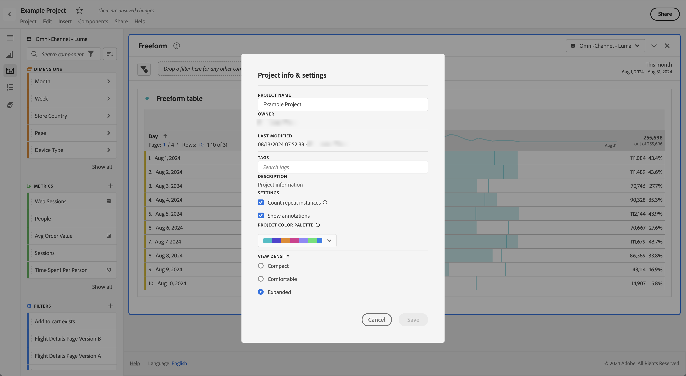

# 보기 밀도

보기 밀도를 조정하면 자유 형식 테이블 및 코호트 테이블에서 왼쪽 패널의 수직 안쪽 여백을 줄여 화면에서 더 많은 데이터를 볼 수 있습니다. 사용 가능한 옵션은 다음의 세 가지입니다.

>[!BEGINTABS]

>[!TAB 작게]

가장 압축된 보기 버전.

>[!TAB 보통]

Workspace에서 사용하는 보기.

>[!TAB 크게]

가장 확장된 보기가 있는 버전입니다.

>[!ENDTABS]

보기 밀도를 설정하려면 다음 작업을 수행하십시오.

1. Workspace에서 **[!UICONTROL 프로젝트]** > **[!UICONTROL 프로젝트 정보 및 설정]**&#x200B;으로 이동합니다.

1. **[!UICONTROL 보기 밀도]** 옵션을 선택하고 **[!UICONTROL 저장]**&#x200B;을 선택합니다.

<!--
# [!UICONTROL View Density]

Adjusting the [!UICONTROL view density] lets you see more data on the screen by reducing the vertical padding of the left rail, freeform tables and cohort tables. You have 3 options when toggling the view density via radio buttons:

- **[!UICONTROL Compact]**: This is the version with the most condensed view.
- **[!UICONTROL Comfortable]**: This leaves a little more padding than the Compact version.
- **[!UICONTROL Expanded]** (default): This is the view you are used to in Workspace.

To set the view density:

1. In Workspace, navigate to **[!UICONTROL Projects]** > **[!UICONTROL Project Info and Settings]**.

1. Select among the 3 options outlined above and click **[!UICONTROL Save]**.

>[!BEGINSHADEBOX]

See  [View density](https://experienceleague.adobe.com/ko/docs/analytics-learn/tutorials/analysis-workspace/navigating-workspace-projects/view-density-in-analysis-workspace){target="_blank"} for a demo video.

>[!ENDSHADEBOX]

-->
