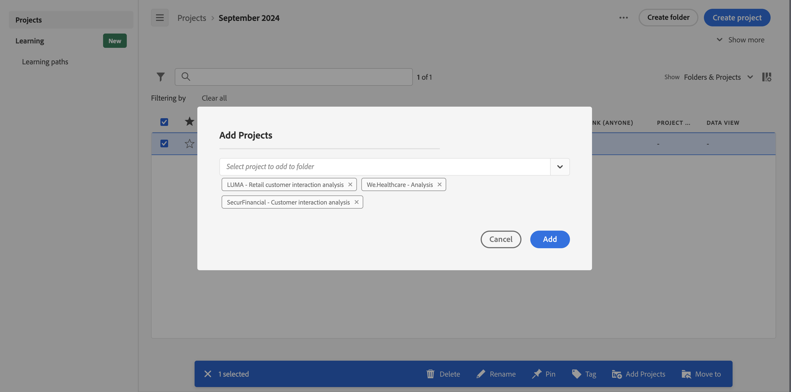

# 프로젝트를 추가하거나 폴더로 이동

[프로젝트 목록](/help/analyze/analysis-workspace/build-workspace-project/freeform-overview.md#project-list)에서 바로 폴더에 프로젝트를 추가하거나 이동할 수 있습니다.

## 폴더로 프로젝트 이동

>[!NOTE]
>
>관리자가 프로젝트를 회사 폴더로 이동하면 기존 공유 권한이 제한된 경우에도 폴더가 모든 사람과 공유됩니다. 관리자가 회사 폴더 밖으로 프로젝트를 이동하면 기존 공유 권한이 다시 적용됩니다.
>

[프로젝트 목록](/help/analyze/analysis-workspace/build-workspace-project/freeform-overview.md#project-list)에서 프로젝트를 폴더로 이동하는 방법:

1. 폴더로 이동할  프로젝트를 하나 이상 선택합니다.

1. 가능한 [액션](/help/analyze/analysis-workspace/build-workspace-project/freeform-overview.md#actions) 목록에서  **다음으로 이동**&#x200B;을 선택합니다. **[!UICONTROL 폴더 선택]** 대화 상자가 표시됩니다.

1. **[!UICONTROL 폴더]** 드롭다운 메뉴에서 폴더 이름을 선택합니다. 드롭다운 메뉴를 사용하여 폴더 계층 구조를 탐색하여 원하는 수준에서 하위 폴더를 선택할 수 있습니다.

   

1. **[!UICONTROL 이동]**&#x200B;을 선택합니다.

   선택한 프로젝트가 폴더에 추가됩니다.

## 폴더에 프로젝트 추가

[프로젝트 목록](/help/analyze/analysis-workspace/build-workspace-project/freeform-overview.md#project-list)에서 프로젝트를 폴더로 추가하는 방법:

1. 프로젝트를 추가할  폴더를 선택합니다.

1. 가능한 [액션](/help/analyze/analysis-workspace/build-workspace-project/freeform-overview.md#actions) 목록에서  **프로젝트 추가**&#x200B;를 선택합니다. **[!UICONTROL 폴더 선택]** 대화 상자가 표시됩니다.

1. [!UICONTROL *폴더에 추가할 프로젝트 선택*]&#x200B;에서 프로젝트를 하나 이상 선택합니다.

   

1. **[!UICONTROL 추가]**&#x200B;를 선택합니다.

>[!NOTE]
>
>관리자만 회사 폴더에 프로젝트를 추가하거나 새 프로젝트를 만들고 회사 폴더에 저장할 수 있습니다.

<!--
# Add Projects to Folders

You can add projects to a folder in the table view or from within a folder.

>[!NOTE]
>
>Only Analytics administrators can add projects to the Company Folder or create a new project and save it to the Company Folder

## From the table view {#table-view}

Add projects to a folder from the table view on the home page.

1.  Select one or more projects that you want to add to a folder.

    

1.  Select **Move to**. 

    The Select Folder dialogue is displayed.

1.  In the drop-down menu, select the folder where you want to move the selected projects.

    

1.  Select **Move**.

    

    The selected projects are added to the folder.

    

    The Workspace landing page now shows the folder contains (3) projects.

    

## From inside a folder {#inside-folder}

You can also add projects from inside a folder using the ellipses link.

1.  Select and open a folder from the table view.

    

1.  Select the **...** ellipsis icon in the upper-right.
   
    

1.  Select **Add projects** and select the project that you want to add from the drop-down list.

    

    
1.  (Optional) Select additional projects from the drop-down list to add multiple projects.

    

1.  Select **Add** to add the projects to the folder.

    

-->