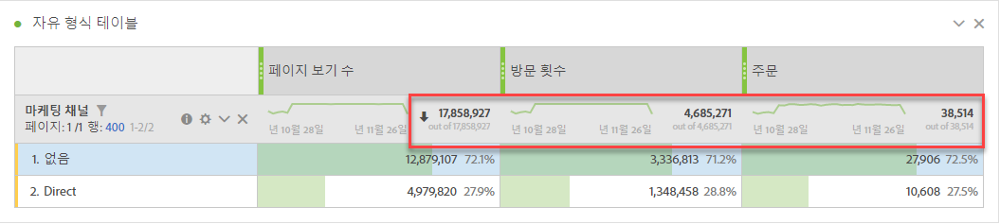
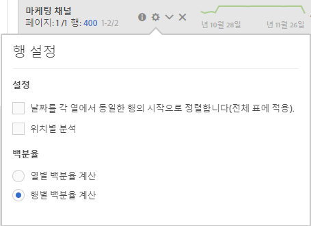

# 작업 영역 합계

자유 형식 테이블에서, 총 행이 각 분류 수준에 나타나고 두 개의 합계를 표시할 수 있습니다.

* **[!UICONTROL 총계]** (회색 '아웃' 수) - 이 합계는 수집된 모든 히트를 나타내며 경우에 따라 '보고서 세트 합계'라고도 합니다. 세그먼트가 패널 수준 또는 자유 형식 테이블 내에서 적용되면 이 합계는 세그먼트 기준과 일치하는 모든 히트를 반영하도록 조정됩니다.
* **[!UICONTROL 테이블 합계]** (검정 번호) - 이 합계는 일반적으로 총계 또는 하위 [!UICONTROL 집합과 같습니다]. [없음 포함] 옵션을 포함하여 자유 형식 테이블 내에 적용된 테이블 [!UICONTROL 필터를 반영합니다] .

## 표시 합계 설정

열 **[!UICONTROL 설정]**&#x200B;아래에는 합계 표시 및 **[!UICONTROL 합계]** 표시 **[!UICONTROL 옵션이]**&#x200B;있습니다. 이러한 설정을 선택 취소하면 표에서 합계가 제거됩니다. 예를 들어 특정 계산된 지표 시나리오에서 [합계가 적합하지 않은 경우에 이 옵션이](https://docs.adobe.com/content/help/en/analytics/components/calculated-metrics/calcmetrics-reference/cm-totals.html)바람직할 수 있습니다.

## 정적 행 합계 설정

[정적 행](https://docs.adobe.com/content/help/en/analytics/analyze/analysis-workspace/build-workspace-project/column-row-settings/manual-vs-dynamic-rows.html) 합계는 다르게 동작하며 행 설정에서 **[!UICONTROL 제어합니다]**.

* **[!UICONTROL 현재 행의 합계를 합계로]** 표시 - 이 표는 표에서 행의 클라이언트측 합계를 보여 주므로 합계에서는 방문 또는 방문자와 같은 중복 지표를 **제거하지** 않습니다.
* **[!UICONTROL 합계 표시]** - 여기에는 서버 측 합계가 표시됩니다. 즉, 합계는 방문 또는 방문자와 같은 중복 지표를 제거합니다.

## FAQ

| 질문 | 답변 |
|---|---|
| 회색 열 비율은 어떤 '합계'를 기준으로 합니까? | 이것은 행 설정에서 **[!UICONTROL 백분율]** 설정 선택 사항에 **[!UICONTROL 따라 달라집니다]**.<ul><li>열별 백분율 계산 - 기본 설정입니다. 백분율은 테이블 합계를 기반으로 합니다.</li><li>행별 백분율 계산 - 백분율은 총계를 기준으로 합니다.</li></ul> |
| 지정되지 않음( **[!UICONTROL 없음)]** 설정이 합계에 어떤 영향을 줍니까? | 지정되지 **[!UICONTROL 않음(없음)]** 설정이 선택 취소되면 없음/지정되지 않음 행이 테이블, 테이블 합계에서 제거되고, ['합계' 지표 유형을 사용하는 모든 계산된 지표로 전달됩니다](https://docs.adobe.com/content/help/en/analytics/components/calculated-metrics/calcmetric-workflow/m-metric-type-alloc.html) |
| 사용자 지정 테이블 필터가 자유 형식 테이블에 적용되는 경우 필터에 대한 모든 계산된 지표 및 조건부 서식 지정 계정을 수행합니까? | 현재 없습니다. **[!UICONTROL 지정되지 않음(없음)]** 포함은 설명되지만 사용자 지정 테이블 필터는 다음 항목에 영향을 주지 않습니다.<ul><li>조건부 서식에서 사용하는 열 최대/최소 범위는 모든 데이터에 적용됩니다.</li><li>총계 지표 유형을 활용하는 **[!UICONTROL 계산된]** 지표.</li><li>자유 형식 테이블의 행 간에 계산되는 함수(예: 열 합계, 열 최대, 열 최소, 카운트, 평균, 중간값, 백분위수, 사분위수, 행 카운트, 표준 편차, 차이, 누적 평균, 회귀 변형, T-점수, T-테스트, Z-점수, Z-테스트)가 있는 계산된 지표입니다.</li></ul> |
| 계산된 지표에서 총 **[!UICONTROL 지표 유형은]** 어떻게 반영됩니까? | **[!UICONTROL Grand]** Total은 **[!UICONTROL Grand Total을 계속 참조하며]**&#x200B;테이블이나 테이블 총계에 적용된 필터를 반영하지 **[!UICONTROL 않습니다]**. |
| 자유 형식 테이블에서 데이터를 복사하여 붙여넣거나 CSV를 통해 다운로드할 때 표시되는 총계는 무엇입니까? | 합계 행은 테이블 총계만 반영하며 **[!UICONTROL 합계 표시]** 열을 **[!UICONTROL 준수합니다]** . |

