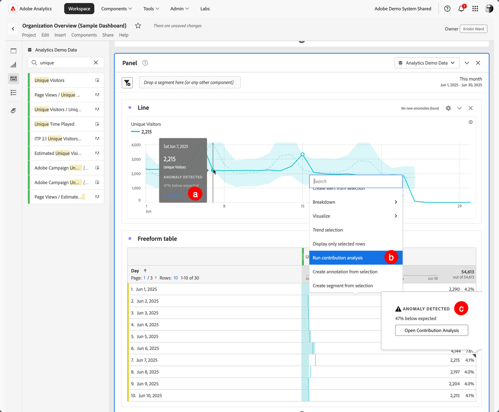

# 기여도 분석 실행

[기여도 분석](/help/analyze/analysis-workspace/c-anomaly-detection/anomaly-detection.md#contribution-analysis)은 Adobe Analytics에서 관찰된 예외 항목에 기여한 사항을 드러내도록 설계된 집중 머신 러닝 프로세스입니다. 이 프로세스의 목적은 사용자가 집중 영역이나 추가 분석 기회를 원래 가능한 것보다 훨씬 더 빨리 찾는 것을 돕는 것입니다.

>[!NOTE]
>
>기여도 분석은 일별 세부기간을 갖는 데이터에 대해서만 지원됩니다.

기여도 분석을 실행하는 단계는 다음과 같습니다.

1. 프로젝트에서 기여도 분석을 호출합니다.

   

   1. 선 시각화에서 일별 세부기간을 사용하는 자유 형식 테이블을 기반으로 예외 항목 데이터 포인트를 선택합니다. 팝업에서 **[!UICONTROL 분석]**&#x200B;을 선택합니다.
   1. 일별 세부기간을 사용하는 자유 형식 테이블에서 임의 행의 컨텍스트 메뉴에서 **[!UICONTROL 기여도 분석 실행]**&#x200B;을 선택합니다. 예외 항목을 표시하지 않는 행에서 분석을 실행할 수도 있습니다.
   1. 일별 세부기간을 사용하는 자유 형식 테이블에서 예외 항목을 나타내는 행에 대해
      1. 표시기 ◥을(를) 선택하십시오.
      1.  **[!UICONTROL 예외 항목이 검색됨]** 대화 상자에서 **[!UICONTROL 기여도 분석 열기]**&#x200B;를 선택합니다.

1. (선택 사항) [차원을 제외](#exclude-dimensions)하여 분석 범위를 좁힐 수 있습니다(따라서 분석 속도가 빨라짐).

   

1. **[!UICONTROL 기여도 분석 실행]**&#x200B;을 선택합니다.

1. 기여도 분석이 처리되는 동안 잠시 기다려 주십시오. 보고서 세트의 크기와 차원 수에 따라 처리에 상당한 시간이 걸릴 수 있습니다. 기여도 분석은 차원당 상위 50,000개 항목에 대한 분석을 수행합니다. 남은 [기여도 분석 토큰](anomaly-detection.md#contribution-analysis-tokens)의 수에 대한 알림도 표시됩니다.

   

1. Analysis Workspace은 이 프로젝트 내에 새 **[!UICONTROL 기여도 분석]** 패널을 직접 로드합니다.

   

   * [요약 번호](/help/analyze/analysis-workspace/visualizations/summary-number-change.md) 시각화.
   * 월별 트렌드 [선](/help/analyze/analysis-workspace/visualizations/line.md) 시각화.
   * **[!UICONTROL 기여도 점수]**&#x200B;별로 정렬된 이 예외 항목에 기여하는 상위 항목을 표시하는 [상위 항목](/help/analyze/analysis-workspace/visualizations/freeform-table/freeform-table.md) [자유 형식 테이블](/help/analyze/analysis-workspace/c-anomaly-detection/anomaly-detection.md#contribution-analysis). 추가 열에는 해당 지표와 컨텍스트를 제공하는 **[!UICONTROL 고유 방문자 수]** 지표가 표시됩니다.

   * **[!UICONTROL 생성된 세그먼트(상위 항목 클러스터)]** [자유 형식 테이블](/help/analyze/analysis-workspace/visualizations/freeform-table/freeform-table.md)은(는) 기여도 점수, 예외 항목 발생 횟수 및 이상 지표에 기여하는 전체적인 비율을 기반으로 상위 항목의 연결을 식별합니다. 그런 다음 이 연관은 대상 세그먼트(기여도 세그먼트 1, 기여도 세그먼트 2 등)로 캡처됩니다. 세그먼트가 구성되는 상위 항목을 포함하여 세그먼트의 정의를 표시하려면 을(를) 선택하십시오.

1. 기여도 분석은 이제 Analysis Workspace의 일부이므로 자유 형식 테이블 컨텍스트 메뉴의 여러 기능을 사용하여 다음과 같이 분석을 훨씬 더 의미 있게 만들 수 있습니다.

   * [각 차원 항목을 다른 차원으로 분류](/help/analyze/analysis-workspace/components/dimensions/t-breakdown-fa.md)
   * [하나 이상의 행에 대한 트렌드 표시](/help/analyze/analysis-workspace/home.md#section_34930C967C104C2B9092BA8DCF2BF81A)
   * [새 시각화 추가](/help/analyze/analysis-workspace/visualizations/freeform-analysis-visualizations.md)
   * [경고 만들기](/help/components/alerts/alerts-overview.md)
   * [세그먼트를 만들거나 비교합니다.](/help/analyze/analysis-workspace/c-panels/c-segment-comparison/segment-comparison.md)

>[!NOTE]
>
>분석되는 예외 항목은 기여도 분석 내에서 파란색 점으로 강조 표시되고 지능형 경고 프로젝트가 연결되어 있습니다. 이 강조 표시는 분석되는 예외 항목을 더 명확하게 보여 줍니다.

## 차원 제외

기여도 분석에서 일부 차원을 제외할 수 있습니다. 예를 들어 브라우저 또는 하드웨어와 관련된 차원을 전혀 고려하지 않을 수 있으며, 이를 제거하여 분석 속도를 높이고 싶을 수도 있습니다.

제외된 차원을 관리하려면 다음을 수행하십시오.

* 원하지 않는 차원을 **[!UICONTROL 제외된 차원]** 패널로 드래그한 다음 **[!UICONTROL 기본값으로 설정]**&#x200B;을 클릭하여 목록을 저장합니다.

* 다시 시작하려면 **[!UICONTROL 모두 지우기]**&#x200B;를 선택하십시오.

* 컨텍스트 메뉴를 표시하려면 을 선택하고 을(를) 사용하여 목록에서 제외된 선택한 차원을 제거합니다.

  

제외할 차원을 수정한 후 **[!UICONTROL 기여도 분석 실행]**&#x200B;을 다시 선택합니다.

