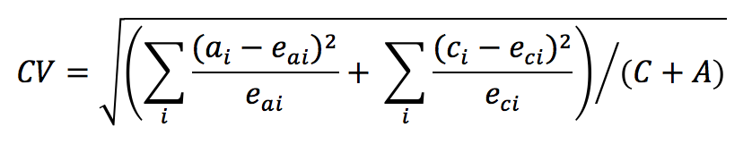

# 통계 기법

Analysis Workspace의 예외 항목 탐지에서는 일련의 고급 통계 기법을 사용하여 관찰 내용을 예외적인 것으로 간주해야 하는지 여부를 결정합니다.

보고서에 사용된 날짜 세부 기간에 따라, 시간별, 일별, 주별/월별 예외 항목 탐지, 이렇게 3가지의 통계 기법이 사용됩니다. 각 통계 기법은 아래에 요약되어 있습니다.

## 일별 세부 기간에 대한 예외 항목 탐지

일별 세부 기간 보고서의 경우, 알고리즘에서는 가능한 가장 정확한 결과를 제공하기 위해 몇 가지 중요한 요인들을 고려합니다. 먼저, 알고리즘이 두 클래스(시계열 기반 모델 또는 이상 값 감지 모델) 중 하나를 선택하는 항목의 사용 가능한 데이터를 기반으로 적용할 모델 유형을 결정합니다(기능 필터링이라고 함).

시계열 모델의 선택은 오류 유형, 트렌드 및 시즌 (ETS)에 대한 다음의 조합을 기반으로 합니다 ([Hyndman et al. (2008)](https://link.springer.com/book/10.1007/978-3-540-71918-2))에 설명됨. 특히, 알고리즘에서는 다음의 조합을 시도합니다.

1. ANA (additive error, no trend, additive seasonality)
1. AAA (additive error, additive trend, additive seasonality)
1. MNM (multiplicative error, no trend, multiplicative seasonality)
1. MNA (multiplicative error, no trend, additive seasonality)
1. AAN (additive error, additive trend, no seasonality)

알고리즘에서는 MAPE(mean absolute percentage error)가 가장 좋은 조합을 선택하여 각 조합의 적합성을 테스트합니다. 하지만, 가장 좋은 시계열 모델의 MAPE가 15%를 넘는 경우, 기능 필터링이 적용됩니다. 일반적으로, 반복 내용이 많은 데이터(예: 주 단위 또는 월 단위 반복)는 시계열 모델에 가장 적합합니다.

모델 선택 후에는 알고리즘이 휴일과 연 단위 시즌을 기반으로 결과를 조정합니다. 휴일의 경우, 알고리즘에서는 다음 휴일 중 보고 날짜 범위에 있는 것이 있는지 확인합니다.

* 메모리얼 데이
* 7월 4일
* 추수감사절
* 블랙 프라이데이
* 사이버 먼데이
* 12월 24-26일
* 1년 1월
* 12월 31일

이 휴일들은 가장 많은 수의 고객 트렌드에 가장 중요한 휴일을 식별하기 위해 많은 고객 데이터 포인트에 대한 광범위한 통계 분석을 기반으로 선택되었습니다. 모든 고객 또는 비즈니스 주기에 대해 이 목록은 완전하지 않지만, 이 휴일들을 적용할 경우 거의 모든 고객의 데이터 세트에 대해 전반적인 알고리즘 성능이 크게 개선됩니다.

모델을 선택하고 보고 날짜 범위에 있는 휴일이 식별되면 다음 방식으로 알고리즘이 계속 진행됩니다.

1. 예외 항목 참조 기간을 구성합니다. 이 기간에는 보고 날짜 범위 최대 35일과 1년 전의 해당 날짜 범위가 포함됩니다. 필요한 경우 윤일을 고려하고 이전 연도의 다른 역일에 발생할 수 있는 적용 가능한 휴일을 포함합니다.
1. 가장 최근 데이터를 기반으로 현재 기간에 있는 휴일 (이전 연도 제외)이 이례적인지 테스트합니다.
1. 현재 날짜 범위에 있는 휴일이 이례적이라면 이전 연도의 휴일을 고려할 때 현재 휴일의 예상값과 신뢰 구간 (전후 2일 고려)을 조정합니다. 현재 휴일의 수정은 다음 항목의 최저 MAPE (mean absolute percentage error)를 기반으로 합니다.

   1. 부가 효과
   1. 승법적 효과
   1. 전년 대비 차이

다음 예의 크리스마스와 설날에 대한 극적 성능 개선에 주목하십시오.

## 시간별 세부 기간에 대한 예외 항목 탐지

시간별 데이터는 일별 세부 기간 알고리즘이 수행되는 것과 동일한 시계열 알고리즘 접근 방식에 따라 다릅니다. 하지만, 이는 주말/주중 주기와 24시간 주기, 이렇게 두 개의 트렌드 패턴에도 강하게 의존합니다. 이 두 개의 시즌 효과를 캡처하기 위해 시간별 알고리즘은 위에 요약된 동일한 접근 방식을 사용하여 주말 및 주중에 대한 별도의 두 모델을 구성합니다.

시간별 트렌드에 대한 교육 기간은 336시간 전환 확인 기간에 따라 다릅니다.

## 주별 및 월별 세부 기간에 대한 예외 항목 탐지

주별 및 월별 트렌드는 일별 또는 시간별 세부 기간에 있는 것과 동일한 주별 또는 일별 트렌드를 보여 주지 않으므로, 이와 같이 별도의 알고리즘이 사용됩니다. 주별 및 월별의 경우, 2단계 이상 값 감지 접근 방식은 GESD(Generalized Extreme Studentized Deviate) 테스트로 알려져 있습니다. 이 테스트에서는 이상 값의 최대 개수를 결정하기 위해 조정된 상자 그림 접근 방식 (이상 값 발견을 위한 비-매개변수적 방식)과 결합된 예상된 예외 항목의 최대 개수를 고려합니다. 두 단계는 다음과 같습니다.

1. 조정된 상자 그림 함수: 이 함수는 입력 데이터를 고려할 때 예외 항목의 최대 개수를 결정합니다.
1. GESD 함수: 1단계의 결과가 있는 입력 데이터에 적용됩니다.

그런 다음 휴일 및 전년 대비 시즌 예외 항목 탐지 단계에서는 올해 데이터에서 지난해 데이터를 뺍니다. 그런 다음 위의 2단계 프로세스를 사용하여 데이터를 다시 반복하여 예외 항목이 시즌별로 적절한지 확인합니다. 이 날짜 세부 기간의 각각에서는 선택된 보고 날짜 범위를 포함하는 15개 기간 전환 확인 (15개월이나 15주 중 하나)과 교육을 위한 1년 전 해당 날짜 범위를 사용합니다.

## 기여도 분석에 사용된 통계 기법

기여도 분석은 Adobe Analytics에서 관찰된 예외 항목에 기여한 사항을 드러내도록 설계된 집중 머신 러닝 프로세스입니다. 이 프로세스의 목적은 사용자가 집중 영역이나 추가 분석 기회를 원래 가능한 것보다 훨씬 더 빨리 찾는 것을 돕는 것입니다.

기여도 분석은 사용자의 기여도 분석 보고서에 사용할 수 있는 모든 단일 차원 항목에 대해 두 부분으로 구성된 알고리즘을 수행합니다. 알고리즘은 다음 순서로 작동합니다.

1. 각 차원에 대해 Cramer의 V 테스트 통계가 계산됩니다. 다음 예에서 두 개의 시간 기간에 대해 국가별 페이지 조회수를 보여 주는 분할테이블을 고려하십시오.

   

   표 1에서는 Cramer의 V를 사용하여 기간 1(예: 히스토리)과 기간 2(예: 예외 항목이 발생하는 날)에 대한 국가별 페이지 보기 횟수 간 연관성을 측정할 수 있습니다. Cramer의 V에 대한 낮은 값은 낮은 수준의 연관성을 나타냅니다. Cramer의 V 범위는 0 (연관성이 없음) ~ 1 (완전한 연관성)입니다. Cramer의 V 통계를 다음과 같이 계산할 수 있습니다.

   

1. 각 차원 항목에 대해서는 PR (Pearson&#39;s Residual)을 사용하여 예외 항목 지표와 각 차원 항목 간의 연관성을 측정할 수 있습니다. PR은 표준 정규 분포를 따르며, 이 분포에서 알고리즘은 편차가 비교할 수 없이 작더라도 임의의 두 변수에 대한 PR을 비교할 수 있습니다. 실제로, 이 오류는 알려져 있지 않으며, 한정된 샘플 수정을 사용하여 평가됩니다.

   표 1의 이전 예에서, 국가 i 및 기간 2에 대한 유한 샘플 보정을 갖는 PR은 다음과 같이 주어진다.

   

   where

   

   (기간 1에 대해 유사한 공식을 얻을 수 있습니다.)

   이때 최종 결과를 위한 각 차원 항목의 점수는 Cramer의 V 척도 만큼 가중 계산되며, 기여도 점수를 제공하기 위해 0과 1 사이의 숫자로 조정됩니다.
