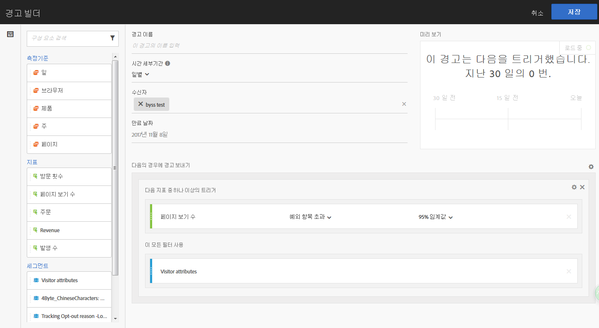
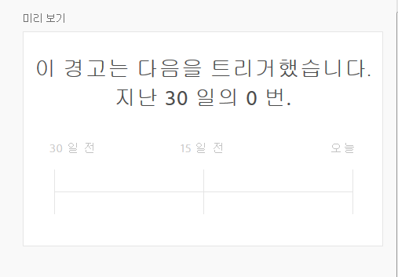

# 경고 빌더

>[!IMPORTANT]
>
>지능형 경고는 Adobe Analytics Prime 및 Adobe Analytics Ultimate 고객만 사용할 수 있습니다.

## 경고 빌더 액세스

다음 네 가지 방법 중 하나를 사용하여 경고 빌더에 액세스합니다.

* 분석 작업 공간에서 다음 바로 가기를 사용합니다.

   `ctrl (or cmd) + shift + a`
* > **[!UICONTROL Workspace]** > **[!UICONTROL Components]** > **[!UICONTROL New Alert]**&#x200B;로 이동합니다.
* By selecting one or more freeform table line items, right-clicking and selecting **[!UICONTROL Create Alert from Selection]**.
* 보고 및 분석 보고서 내에서 > **[!UICONTROL More]** 로 **[!UICONTROL Add Alert]**&#x200B;이동합니다.

## 경고 작성

경고 빌더 인터페이스는 Analytics에 세그먼트 또는 계산된 지표를 만든 사용자와 유사합니다.

<!--Meike, I edited this table for validation -->

**경고 이름**

경고의 이름을 지정합니다. 경고 이름에는 보고서 또는 지표 임계값이 포함될 수 있습니다.

**시간 세부기간**

지표를 확인할 시기(시간별, 일별, 주별 또는 월별)를 지정합니다.

>[!NOTE] 사용자 지정 달력을 사용하는 보고서 세트에 대해, Adobe에서는 경고 빌더에서 월별 세부기간을 지원하지 않습니다.

**수신자**

경고를 전송할 대상을 지정합니다. 경고를 Analytics 사용자, Analytics 그룹, 원시 이메일 주소 또는 전화 번호로 보낼 수 있습니다.

>[!IMPORTANT]
>
>전화번호 앞에는 &quot;+&quot;와 [국가 코드](https://countrycode.org/)가 있어야 합니다. 

경고가 트리거되면 사용자가 받게 되는 이메일은 다음과 유사합니다.

**만료 날짜**

경고의 만료 날짜를 설정합니다. 

**다음의 경우에 경고 보내기...**

*... 다음 지표 중 하나 이상의 트리거*

* 트리거를 추가하는 지표를 캔버스에 드래그하여 놓습니다. 

   경고에 뜬 모든 구성 요소(지표/차원/세그먼트) 중 일부가 현재 선택된 보고서 세트와 호환하지 않을 경우 **&quot;호환하지 않는 구성 요소&quot;** 메시지가 표시됩니다. 
* 경고를 설정하기 전에 지표가 초과해야 하는 임계값을 결정합니다. 이 값을 임계값으로 설정한 다음 다음 다음 조건 중 하나로 설정할 수 있습니다.

   * 예외 항목이 존재함
   * 예외 항목이 예상 이상임
   * 예외 항목이 예상 이하임
   * 크거나 같음
   * 아래 또는 같음
   * 변경
   * 90%, 95%, 99%, 99.75% 및 99.9%의 임계값을 설정할 수 있습니다.
   계산된 지표를 사용할 수도 있습니다.

*... 다음 필터 사용*

* 세그먼트 또는 차원을 드래그하여 놓아 필터를 추가합니다. 예를 들어 &quot;모바일 장치만&quot; 세그먼트를 추가하면 규칙이 모바일 장치에만 트리거됨을 의미합니다.
* AND 문을 사용하여 추가 필터가 추가됩니다.

**규칙 추가**

톱니바퀴 아이콘을 클릭하여 AND 또는 OR 규칙을 추가할 수 있습니다.

## 경고 미리 보기 {#section_10D75BA7B77E4C5FAF58A719C082E070}

인터랙티브한 경고 미리 보기는 약 경고가 지난 경험에 따라 발생하는 빈도를 표시합니다.

예를 들어 시간 세부기간을 일별로 설정하는 경우 미리 보기에서 지난 30일 또는 31일 동안 특정 지표 x에 대해 경고가 트리거되었음을 알 수 있습니다.

너무 많은 경고가 트리거된 경우 경고 관리자에서 임계값을 조정할 수 [있습니다](/help/components/c-alerts/alert-manager.md).

