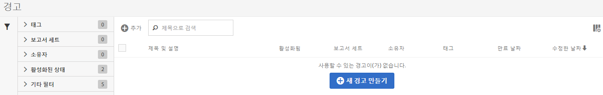

# 경고 관리자

The Alert Manager ( **[!UICONTROL Analytics]** > **[!UICONTROL Components]** > **[!UICONTROL Alerts]**) is structured very much like the [Segment Manager](https://marketing.adobe.com/resources/help/ko_KR/analytics/segment/seg_manage.html) and the [Calculated Metric Manager](https://marketing.adobe.com/resources/help/ko_KR/analytics/calcmetrics/cm_manager.html) and allows you to

* Access the Alert Builder by clicking **[!UICONTROL + Add]**.
* 경고에 태그 지정. 경고를 쉽게 사용할 수 있도록 구성할 수 있습니다.
* 경고 삭제
* 경고 이름 변경
* 경고 승인
* 경고 복사
* 경고 활성화/비활성화
* 경고 만료 날짜 **갱신**. 하나 이상의 경고를 선택한 경우 **갱신**&#x200B;을 클릭하여 갱신할 수 있습니다. 이렇게 하면 원래 만료 날짜와 상관없이 갱신을 클릭한 날로부터 1년으로 만료 날짜가 연장됩니다.
* 경고를 .CSV 파일로 내보내기
* 경고 제목을 두 번 클릭하여 경고 편집
* 경고 검색
* 다른 보고서 세트에 경고 추가
* 경고 소유자 지정/변경
* 다른 필터 추가
* 경고 **만료 날짜** 정의

