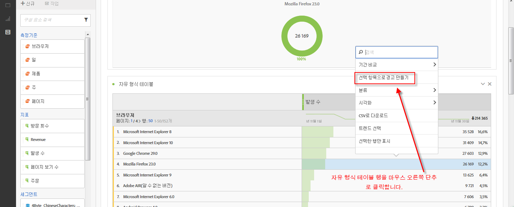
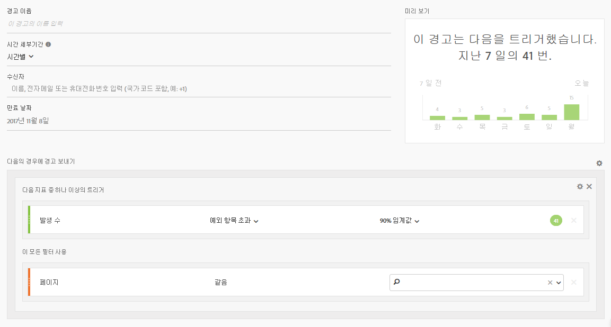
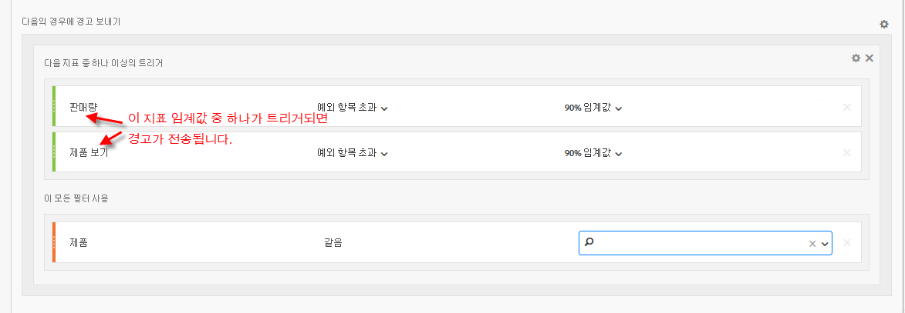

# 지능형 경고 - 활용 사례

## 두 개의 세그먼트로 필터링된 단순 경고 만들기 {#section_2E96FFFA93D44F7D8DBCEC97203204AA}

<!-- 

Update screenshots for better readability.

 -->

## 표 선택에서 경고 만들기 {#section_AE6D42E1255D498D908A2FA60370A419}

이제 자유 형식 테이블에서 표 행을 마우스 오른쪽 버튼으로 클릭하고 **[!UICONTROL 선택 항목으로 경고 만들기를 선택하여 컨텍스트 내 경고를 만들 수 있습니다]**.

이렇게 하면 즉시 경고 빌더가 사전에 채워져서 올바른 지표 및 필터를 사용한 경고가 만들어집니다.

## 여러 경고를 만드는 대신 경고를 통합 (스택) {#section_B27B0856BA104B9FB6D0BBB317633F18}

경고를 스택하면 경고들이 결합되고 별도의 경고 수를 얻지 못합니다.

