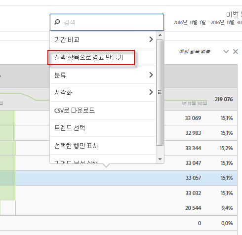
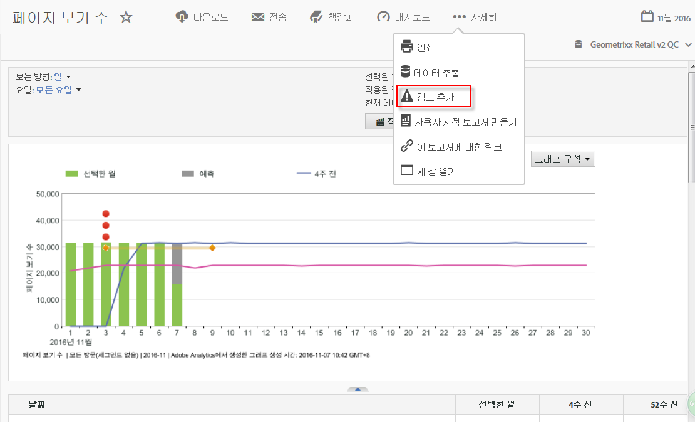

# 지능형 경고 개요

>[!Important]
>타임스탬프가 있는 데이터를 사용하여 경고를 만들면 경고가 잘못 발생할 수 있습니다. 따라서 지능형 경고에 대해 타임스탬프가 없는 데이터를 활용하는 것이 좋습니다.

새로운 인텔리전트 경고 시스템에서는 경고를 더욱 세밀하게 제어할 수 있으며 예외 항목 탐지 기능이 경고 시스템과 통합됩니다.

[YouTube에 대한 지능형 경고](https://www.youtube.com/watch?v=UVH9xr_2REA&list=PL2tCx83mn7GuNnQdYGOtlyCu0V5mEZ8sS&index=65) (5:34)

## 개요 {#section_6AC8CA81DEA94E99B0F192B60D0FDF03}

Analysis Workspace의 새로운 경고 빌더와 경고 관리자는 Reports &amp; Analytics에 있는 기존의 경고 기능을 대체합니다. 지능형 경고를 사용하면 다음 작업을 수행할 수 있습니다.

* 예외 항목을 기반으로 한 경고를 만듭니다(90%, 95%, 99%, 99.75%, 및 99.9% 임계값, % 변경, 초과/미만).
* 경고가 트리거되는 빈도를 미리 봅니다.
* 자동 생성된 Analysis Workspace 프로젝트에 대한 링크가 있는 이메일 또는 SMS로 경고를 보냅니다.
* 하나의 경고에서 여러 지표를 캡처하는 "누적된" 경고를 생성합니다.

새 경고 시스템의 구성 요소에는 경고 빌더, 경고 관리자, 경고 미리 보기 및 경고 작성에 대한 더 나은 컨텍스트 내 액세스 기능 포함됩니다. 이전 경고 시스템 사용자 인터페이스는 더 이상 사용할 수 없지만, 경고는 마이그레이션됩니다. 일부 이전 경고 기능은 [더 이상 사용할 수 없습니다](https://marketing.adobe.com/resources/help/en_US/sc/user/deprecated_alerts.html). 

경고 빌더를 여는 방법에는 네 가지가 있습니다. 

* Analysis Workspace에서 다음의 바로 가기 사용:

   `ctrl (or cmd) + shift + a`
* By going directly to the Alert Builder:  **[!UICONTROL Workspace]** &gt; **[!UICONTROL Components]** &gt; **[!UICONTROL New Alert]** .
* 하나 이상의 자유 형식 테이블 라인 항목을 선택하고, 마우스 오른쪽 단추로 클릭한 다음, **[!UICONTROL 선택 항목으로 경고 만들기 선택]**. 이렇게 하면 경고 빌더가 열리고, 테이블에서 적용된 적절한 지표와 필터로 빌더가 사전에 채워집니다. 그런 다음 필요할 경우 경고를 편집할 수 있습니다. 

   

* From within a Reports &amp; Analytics report, by going to  **[!UICONTROL More]** &gt; **[!UICONTROL Add Alert]** . 이렇게 하면 새 경고 빌더가 열리고, 보고서에서 적용된 적절한 지표와 필터로 빌더가 사전에 채워집니다. 그런 다음 필요할 경우 경고를 편집할 수 있습니다. 

   

## FAQ: How alerts are calculated and triggered {#section_1F3B1DAF21784306953B49AAD4C3DCAB}

% 임계값은 표준 편차입니다. 예를 들어, 95% = 2 표준 편차와 99% = 3 표준 편차가 있습니다. 선택한 시간 단위에 따라 [다양한 모델](../../../analyze/analysis-workspace/virtual-analyst/c-anomaly-detection/statistics-anomaly-detection.md#concept_0705DC91F0F44951AC2226EC846E824C)을 사용하여 각 데이터 포인트가 기준(norm)에서 얼마나 떨어져 있는지(표준 편차 수) 계산합니다. 낮은 임계값(예: 90%)을 설정하면 높은 임계값(99%)을 설정하는 경우보다 많은 예외 항목이 생깁니다. 99.75% 및 99.99% 임계값은 많은 예외 항목을 트리거되지 않도록 시간 단위용으로 특별히 도입되었습니다.

<table id="table_B3AA85E1DE3543DCA34966A52E3CE4AB"> 
 <thead> 
  <tr> 
   <th colname="col1" class="entry"> 질문 </th> 
   <th colname="col2" class="entry"> 답변 </th> 
  </tr> 
 </thead>
 <tbody> 
  <tr> 
   <td colname="col1"> 
<b>Q: 경고의 예외 항목 탐지에서 데이터 예외 항목을 판단하려면 얼마나 되돌아갑니까? </b> 
 </td> 
   <td colname="col2"> 
교육 기간은 선택한 세부기간에 따라 다릅니다. (자세한 내용은 <a href="../../../analyze/analysis-workspace/virtual-analyst/c-anomaly-detection/statistics-anomaly-detection.md#concept_0705DC91F0F44951AC2226EC846E824C" format="dita" scope="local">예외 항목 탐지에서 사용되는 통계 기법</a>을 참조하세요.) 다음은 요약입니다. 
 
    <ul id="ul_4F8C2A41F06C498DBF5E7AE5DE803773"> 
     <li id="li_E246091A3F1E484C8444AF4052FCA784">월 단위 = 15개월 + 지난 해와 동일한 범위 </li> 
     <li id="li_CC014FB38AE1492B9647E990C29BFB3C">주 단위 = 15주 + 지난 해와 동일한 범위 </li> 
     <li id="li_2517EE2097534324BE9C1B54CD181A62">일 단위 = 35일 + 지난 해와 동일한 범위 </li> 
     <li id="li_710BC8B009354542AA4962A59A646099">시간 단위 = 336시간 </li> 
    </ul> </td> 
  </tr> 
  <tr> 
   <td colname="col1"> 
<b>Q: 일시적인 동작 하락이나 동작 급등에 대해서만 경보를 발행하려는 경우, 예외 항목 기능을 사용할 수 있습니까? 또는 절대값을 사용해야 합니까?</b> 
 </td> 
   <td colname="col2"> 
절대값을 사용하면 급등은 물론 하락에 대해서도 경고가 계속 트리거됩니다. 하락 또는 급등에 대해서만 경고를 분리할 수 없습니다. 
 </td> 
  </tr> 
  <tr> 
   <td colname="col1"> 
<b>Q: 그날의 특정 시간 동안(예: 업무 시간과 비업무 시간)만 트리거하도록 경고를 구성할 수 있습니까? </b> 
 </td> 
   <td colname="col2"> 
현재는 할 수 없습니다. 
 </td> 
  </tr> 
  <tr> 
   <td colname="col1"> 
<b>Q: 점선을 구성하는 "예상값" 테이블이나 그러한 값에 대한 일종의 출력을 얻을 수 있습니까? </b> 
 </td> 
   <td colname="col2"> 
Workspace에서는 얻을 수 없지만 Report Builder에서는 얻을 수 있습니다(<a href="https://www.youtube.com/watch?v=-a-8W6GQZnU" format="https" scope="external">Report Builder의 예외 항목 탐지</a>에서 이 비디오 참조 ). 
 
Report Builder는 보다 덜 복잡한 예외 항목 탐지 방법을 사용한다는 점을 기억하십시오. 이 방법은 고정된 30일 교육 기간, 고정된 95% 간격을 사용하며 <a href="https://marketing.adobe.com/resources/help/en_US/reference/anomaly.html" format="html" scope="external">Reports &amp; Analytics 예외 항목 탐지</a>와 유사합니다 . 
 </td> 
  </tr> 
 </tbody> 
</table>

