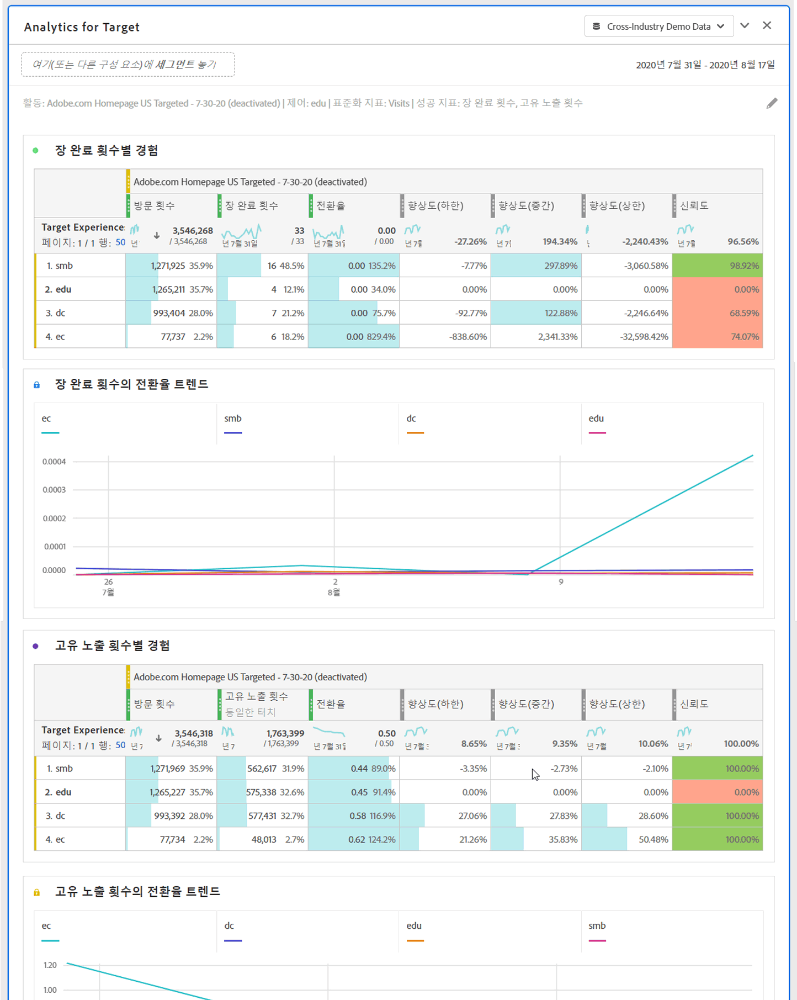

# Analytics for Target(A4T) 패널

>[!IMPORTANT]
>
>**[!UICONTROL Analytics for Target(A4T)]** 패널은 현재 제한된 테스트 중입니다. [추가 정보](https://docs.adobe.com/content/help/ko-KR/analytics/landing/an-releases.html)

Analytics for Target(A4T) 패널을 사용하면 Analysis Workspace에서 Adobe Target 활동 및 경험을 분석할 수 있습니다. 또한 최대 3개의 성공 지표에 대한 상승도 및 신뢰도를 볼 수 있습니다. A4T 패널에 액세스하려면 A4T 구성 요소가 활성화된 보고서 세트로 이동합니다. 그런 다음 맨 왼쪽에 있는 패널 아이콘을 클릭하고 Analytics for Target 패널을 분석 작업 공간 프로젝트로 드래그합니다.

## A4T 패널 빌더

다음 설정을 사용하여 A4T 패널을 구성할 수 있습니다.

| 설정 | 설명 |
|---|---|
| 타겟 활동 | 타겟 활동 목록에서 선택하거나 왼쪽 레일에서 활동을 드래그하여 놓습니다. **참고:**이 목록은 최소 1개의 히트가 있는 최근 6개월 활동 수로 채워집니다. 목록에 활동이 없으면 6개월 이상일 수 있습니다. 이것은 여전히 왼쪽 레일에서 추가할 수 있는데, 이것은 최대 18개월 동안의 룩백 기간이 있습니다. |
| 제어 경험 | 제어 경험을 선택하십시오. 드롭다운에서 필요한 경우 변경할 수 있습니다. |
| 지표 표준화 | 고유 방문자 수, 방문 횟수 또는 활동 노출 횟수 중에서 선택합니다. 대부분의 분석 사용 사례에는 고유 방문자가 권장됩니다. |
| 성공 지표 | 드롭다운에서 최대 3개의 표준(계산되지 않은) 성공 이벤트를 선택하거나 왼쪽 레일에서 지표를 드래그하여 놓습니다. 각 지표에는 렌더링된 패널에 전용 테이블과 시각화가 있습니다. |
| 달력 날짜 범위 | 이렇게 하면 Adobe Target의 활동 날짜 범위를 기반으로 자동으로 채워집니다. 필요한 경우 변경할 수 있습니다. |

## A4T 패널 출력

타겟 분석 패널은 Adobe Target 활동 및 경험의 성과를 더 잘 이해할 수 있도록 다양한 데이터 및 시각화를 반환합니다. 패널 맨 위에는 선택한 패널 설정을 알려주는 요약 줄이 제공됩니다. 언제든지 오른쪽 상단의 연필 편집을 클릭하여 패널을 편집할 수 있습니다.

선택한 각 성공 지표에 대해 하나의 자유 형식 테이블 및 하나의 전환 비율 트렌드가 표시됩니다.

각 자유 형식 테이블에는 다음 지표 열이 표시됩니다.

| 지표 | 설명 |
|---|---|
| 지표 표준화 | 고유 방문자, 방문 또는 활동 노출 횟수. |
| 성공 지표 | 빌더에서 선택한 지표 |
| 전환율 | 성공 지표/표준화 지표 |
| 상승도 | 통제 경험을 기준으로 각 경험의 전환율을 비교합니다. **참고:**향상도는 Target 경험에 대해 &quot;잠긴 지표&quot;입니다. 분류하거나 다른 차원과 함께 사용할 수 없습니다. |
| 향상도(하한) | 변형 경험을 통해 제어할 수 있는 최하의 향상도를 나타냅니다. |
| 향상도(중간) | 95% 신뢰 구간에서 변형 경험을 통해 제어할 수 있는 중간 향상도를 나타냅니다. 보고 및 분석의 &quot;리프트&quot;입니다. |
| 향상도(상한) | 변형 경험을 통해 제어할 수 있는 최상의 향상도를 나타냅니다. |
| 신뢰도 | T-test는 신뢰 수준을 계산합니다. 이는 테스트가 다시 실행되면 결과가 중복될 가능성을 나타냅니다. 고정 조건부 서식 범위(75%/85%/95%)가 지표에 적용되었습니다. 열 설정에서 필요한 경우 이 형식을 사용자 지정할 수 있습니다.  **참고:**신뢰도는 Adobe Target 경험에 대한 &quot;잠긴 지표&quot;입니다. 분류하거나 다른 차원과 함께 사용할 수 없습니다. |

분석 작업 공간의 모든 패널과 마찬가지로 Adobe Target 활동을 분석하는 데 도움이 되는 추가 테이블 및 [시각화를](https://docs.adobe.com/content/help/ko-KR/analytics/analyze/analysis-workspace/visualizations/freeform-analysis-visualizations.html) 추가하여 분석을 계속할 수 있습니다.

## A4T 패널 FAQ

| 질문 | 답변 |
|---|---|
| A4T에서 지원되는 활동 유형은 무엇입니까? | [지원되는 활동 유형에 대해 자세히](https://docs.adobe.com/content/help/en/target/using/integrate/a4t/a4t-faq/a4t-faq-activity-setup.html) 알아보십시오. |
| A4T 보고에서 계산된 지표가 지원됩니까? | 아니요. [계산된 지표가 지원되지 않는 이유에 대해 자세히](https://docs.adobe.com/content/help/en/target/using/integrate/a4t/a4t-faq/a4t-faq-lift-and-confidence.html) 알아보십시오. |
| Target과 Analytics에서 고유 방문자가 다른 이유는 무엇입니까? | [제품 간 고유 방문자 차이에 대해 자세히](https://docs.adobe.com/content/help/en/target/using/integrate/a4t/a4t-faq/a4t-faq-viewing-reports.html) 알아보십시오. |

Target 보고를 위한 Analytics에 대한 자세한 내용은 [A4T 보고를 참조하십시오.](https://docs.adobe.com/content/help/en/target/using/integrate/a4t/reporting.html)
