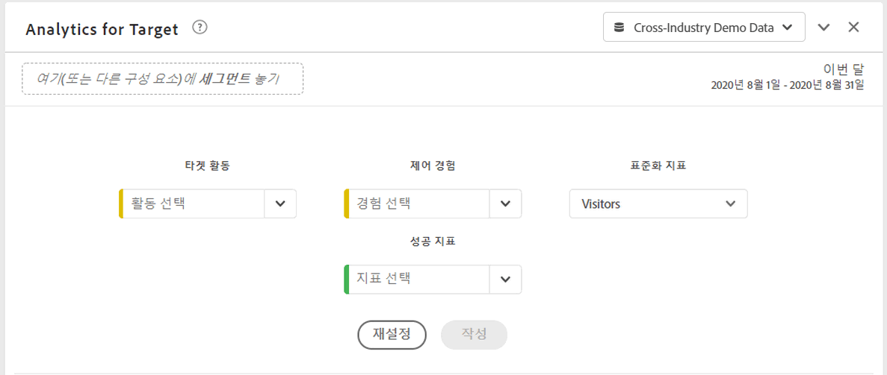

# A4T(Analytics for Target) 패널

Analytics for Target(A4T) 패널을 사용하면 Analysis Workspace에서 Adobe Target 활동 및 경험을 분석할 수 있습니다. 또한 최대 3개의 성공 지표에 대한 상승도 및 신뢰도를 볼 수 있습니다. A4T 패널에 액세스하려면 A4T 구성 요소가 활성화된 보고서 세트로 이동합니다. 그런 다음 맨 왼쪽에 있는 패널 아이콘을 클릭하고 Analytics for Target 패널의 Analysis Workspace 프로젝트로 드래그합니다.

## 패널 입력 {#Input}

다음 입력 설정을 사용하여 A4T 패널을 구성할 수 있습니다.

| 설정 | 설명 |
|---|---|
| 타겟 활동 | 대상 활동 목록에서 선택하거나 왼쪽 레일에서 활동을 드래그하여 놓습니다. 참고: 이 목록은 최소 1개의 히트가 있는 최근 6개월 활동 수로 채워집니다. 목록에 활동이 없으면 6개월 이상일 수 있습니다. 이는 여전히 왼쪽 레일에서 추가할 수 있는데, 이것은 최대 18개월 동안의 전환 기간이 있습니다. |
| 제어 경험 | 제어 경험을 선택합니다. 필요한 경우 드롭다운에서 변경할 수 있습니다. |
| 지표 표준화 | 고유 방문자 수, 방문 횟수 또는 활동 노출 횟수 중에서 선택합니다. 대부분의 분석 사용 사례에는 고유 방문자가 권장됩니다. 이 지표(계산 방법이라고도 함)는 상승도 계산의 분모가 됩니다. 이것은 신뢰도 계산이 적용되기 전에 데이터가 종합되는 방식에도 영향을 줍니다. |
| 성공 지표 | 드롭다운에서 최대 3개의 표준(계산되지 않은) 성공 이벤트를 선택하거나 왼쪽 레일에서 지표를 드래그하여 놓습니다. 각 지표에는 렌더링된 패널에 전용 테이블과 시각화가 있습니다. |
| 달력 날짜 범위 | Adobe Target의 활동 날짜 범위를 기반으로 자동으로 채워집니다. 필요한 경우 변경할 수 있습니다. |

## 패널 출력 {#Output}

Analytics for Target 패널은 Adobe Target 활동 및 경험의 성과를 더 잘 이해할 수 있도록 풍부한 데이터 및 시각화를 반환합니다. 패널 맨 위에는 선택한 패널 설정을 알려주는 요약 줄이 제공됩니다. 언제든지 오른쪽 상단의 연필 편집을 클릭하여 패널을 편집할 수 있습니다.

선택한 각 성공 지표에 대해 하나의 자유 형식 테이블 및 하나의 전환 비율 트렌드가 표시됩니다.

각 자유 형식 테이블에는 다음 지표 열이 표시됩니다.

| 지표 | 설명 |
|---|---|
| 지표 정규화 | 고유 방문자, 방문 또는 활동 노출 횟수. |
| 성공 지표 | 빌더에서 선택한 지표 |
| 전환율 | 성공 지표/정규화 지표 |
| 상승도 | 통제 경험을 기준으로 각 경험의 전환율을 비교합니다. 참고: 상승도는 Target 경험에 대해 &quot;잠긴 지표&quot;입니다. 분류하거나 다른 차원과 함께 사용할 수 없습니다. |
| 상승도(하한) | 95% 신뢰 구간에서 변형 경험을 통해 제어할 수 있는 최악의 상승도를 나타냅니다. 계산: (x/y ± 1.96 std_err(x,y)) / (x_control/y_control ∓ 1.96 std_err(x_control,y_control)). 여기서 std_err(x,y)는 sqrt(xx/y – (x/y)^2)이며, 여기서 xx는 제곱합을 나타냅니다. |
| 상승도(중간) | 95% 신뢰 구간에서 변형 경험을 통해 제어할 수 있는 중간 상승도를 나타냅니다. Reports &amp; Analytics의 &quot;상승도&quot;입니다. 계산: (x/y)/(x_control/y_control) – 1 |
| 상승도(상한) | 95% 신뢰 구간에서 변형 경험을 통해 제어할 수 있는 최고의 상승도를 나타냅니다. 계산: 상승도(하한) 참조. |
| 신뢰도 | 학생 T-테스트에서는 다시 테스트를 실행하면 결과가 복제될 가능성을 나타내는 신뢰 수준을 계산합니다. 고정 조건부 서식 범위(75%/85%/95%)가 지표에 적용되었습니다. 열 설정에서 필요한 경우 이 형식을 사용자 지정할 수 있습니다. 참고: 신뢰도는 Target 경험에 대해 &quot;잠긴 지표&quot;입니다. 분류하거나 다른 차원과 함께 사용할 수 없습니다. 계산: x/y가 _control/y_control과 같은지 p- 값을 찾기 위해 자유도가 y+y_control-2인 양측 T-테스트를 적용합니다. T-스코어를 계산합니다. 여기서 stderr은 sqrt( (xx/y-(x/y)^2)/y + (xx_control/y_control-(x_control/y_control)^2)/y_control)입니다. 서로 다름을 나타내는 신뢰도로 1-p가 반환됩니다. |

Analysis Workspace의 모든 패널과 마찬가지로 Adobe Target 활동을 분석하는 데 도움이 되는 추가 테이블 및 [시각화](https://docs.adobe.com/content/help/ko-KR/analytics/analyze/analysis-workspace/visualizations/freeform-analysis-visualizations.html)를 추가하여 분석을 계속할 수 있습니다. 패널 수준 또는 자유형 테이블 내에서 세그먼트를 적용할 수도 있습니다. 자유형 테이블 내에 추가하는 경우 상승도 및 신뢰도 계산을 유지하기 위해 전체 테이블에 오버레이해야 합니다. 현재 열 수준 세그먼트는 지원되지 않습니다.

## FAQ {#FAQ}

| 질문 | 답변 |
|---|---|
| A4T에서 지원되는 활동 유형은 무엇입니까? | 지원되는 활동 유형에 대해 [자세히](https://docs.adobe.com/content/help/ko-KR/target/using/integrate/a4t/a4t-faq/a4t-faq-activity-setup.html) 알아보십시오. |
| 상승도 및 신뢰도 계산에서 계산된 지표가 지원됩니까? | 아니요. 상승도 및 신뢰도에서 계산된 지표가 지원되지 않는 이유에 대해 [자세히](https://docs.adobe.com/content/help/ko-KR/target/using/integrate/a4t/a4t-faq/a4t-faq-lift-and-confidence.html) 알아보십시오. 하지만 계산된 지표는 이러한 지표 외부의 A4T 보고에서 사용할 수 있습니다. |
| Target과 Analytics 간에 고유 방문자가 다른 이유는 무엇입니까? | 제품 간 고유 방문자 차이에 대해 [자세히](https://docs.adobe.com/content/help/ko-KR/target/using/integrate/a4t/a4t-faq/a4t-faq-viewing-reports.html) 알아보십시오. |
| 내 분석에서 특정 Target 활동에 대해 히트 세그먼트를 적용하면 반환된 관련 없는 경험이 표시되는 이유가 무엇입니까? | A4T 차원은 목록 변수입니다. 이는 한 번에 많은 활동(및 경험)을 포함할 수 있음을 의미합니다. [추가 정보](https://docs.adobe.com/content/help/ko-KR/target/using/integrate/a4t/a4t-faq/a4t-faq-viewing-reports.html) |
| 신뢰도 지표는 예외적인 주문을 고려합니까? 또는 여러 오퍼에 대해 Bonferroni 수정을 적용합니까? | 아니요. Analytics이 신뢰도를 계산하는 방법에 대해 [자세히](https://docs.adobe.com/content/help/ko-KR/target/using/integrate/a4t/a4t-faq/a4t-faq-lift-and-confidence.html) 알아보십시오. |
| 상승도와 신뢰도 지표를 다른 차원이나 분류와 함께 사용할 수 있습니까? | 상승도와 신뢰도는 계산할 제어 및 변형을 필요로 하므로 타겟 경험 차원에 대해 &quot;잠긴 지표&quot;입니다. 따라서 분류하거나 다른 차원과 사용할 수 없습니다. |
| 상승도와 신뢰도는 언제 다시 계산됩니까? | 패널을 실행(또는 재실행)하거나, 패널 날짜 범위가 변경되거나, 세그먼트가 패널이나 테이블에 적용될 때마다 상승도와 신뢰도가 다시 계산됩니다. 자유형 테이블에 세그먼트 필터를 적용할 때 모든 열에 적용해야 합니다. 그렇지 않으면 상승도 및 신뢰도가 올바르게 업데이트되지 않습니다. 현재 열 수준 세그먼트는 지원되지 않습니다. |

Target 보고를 위한 Analytics에 대한 자세한 내용은 [A4T 보고](https://docs.adobe.com/content/help/ko-KR/target/using/integrate/a4t/reporting.html)를 참조하십시오.
