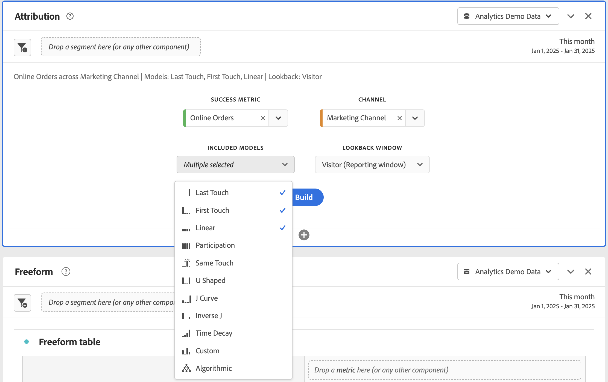

# 속성 패널 {#attribution-panel}

<!-- markdownlint-disable MD034 -->

>[!CONTEXTUALHELP]
>id="workspace_attribution_button"
>title="속성"
>abstract="차원 및 전환 지표를 사용하여 여러 속성 모델을 빠르게 비교하고 시각화합니다."
>additional-url="https://www.youtube.com/watch?v=Yu0hy2klzA0" text="Attribution IQ 패널"

>[!CONTEXTUALHELP]
>id="workspace_attribution_panel"
>title="속성 패널"
>abstract="차원 및 전환 지표를 사용하여 여러 속성 모델을 빠르게 비교하고 시각화합니다.  **매개변수&#x200B;** **채널** &#x200B;이 차원은 속성의 대상입니다. 이 차원은 마케팅 채널, 캠페인 또는 다른 차원일 수 있습니다. **모델** &#x200B;모델은 크레딧이 터치포인트에 어떻게 지정되는지 결정합니다. **전환 확인 기간** &#x200B;이 설정은 각 변환에 적용되는 데이터 속성의 기간을 결정합니다."
>additional-url="https://www.youtube.com/watch?v=Yu0hy2klzA0" text="Attribution IQ 패널"

<!-- markdownlint-enable MD034 -->

>[!BEGINSHADEBOX]

_이 문서에서는_  _**Adobe Analytics**&#x200B;의 속성 패널에 대해 설명합니다._ _이 문서의_  _**Customer Journey Analytics** 버전은 [속성 패널](https://experienceleague.adobe.com/ko/docs/analytics-platform/using/cja-workspace/panels/attribution)을 참조하십시오._

>[!ENDSHADEBOX]

**[!UICONTROL 속성]** 패널은 다양한 속성 모델을 비교하는 분석을 쉽게 구축할 수 있는 방법입니다. 패널은 속성 모델을 사용하고 비교할 수 있는 전용 작업 영역을 제공합니다.

Adobe Analytics는 다음을 통해 속성을 강화합니다.

* 유료 미디어 이외의 속성 정의: 차원, 지표, 채널 또는 이벤트는 마케팅 캠페인뿐 아니라 모델(예: 내부 검색)에 적용할 수 있습니다.
* 무제한 속성 모델 비교를 사용: 원하는 수만큼 모델을 동적으로 비교합니다.
* 구현 변경 방지: 보고서 처리 시간 및 컨텍스트 인식 세션으로 고객 여정 컨텍스트를 구축하고 런타임에 적용할 수 있습니다.
* 사용자의 속성 시나리오와 일치하는 세션을 생성합니다.
* 세그먼트별 속성 분류: 중요한 모든 세그먼트(예: 신규 및 반복 고객, 제품 X와 제품 Y, 로열티 수준 또는 CLV)에서 마케팅 채널의 실적을 쉽게 비교할 수 있습니다.
* 채널 교차 및 다중 터치 분석: 벤 다이어그램, 히스토그램 및 트렌드 속성 결과를 사용합니다.
* 주요 마케팅 시퀀스를 시각적으로 분석: 다중 노드 플로우 및 폴아웃 시각화를 통해 시각적으로 전환된 경로를 탐색합니다.
* 계산된 지표 작성: 여러 속성 할당 방법을 사용합니다.

## 사용

**[!UICONTROL 속성]** 패널 사용 방법:

1. **[!UICONTROL 속성]** 패널을 만듭니다. 패널을 만드는 방법에 대한 자세한 내용은 [패널 만들기](panels.md#create-a-panel)를 참조하십시오.

1. 패널의 [입력](#panel-input)을 지정합니다.

1. 패널의 [출력](#panel-output)을 확인합니다.

### 패널 입력

다음 입력 설정을 사용하여 속성 패널을 구성할 수 있습니다.

1. **[!UICONTROL 성공 지표]**&#x200B;와 속성을 지정하려는 **[!UICONTROL 채널]**&#x200B;의 차원을 추가합니다. 마케팅 채널 또는 내부 판촉 행사 등의 사용자 정의 차원을 예로 들 수 있습니다.

   

1. **[!UICONTROL 포함된 모델]**&#x200B;에서 하나 이상의 [속성 모델](#attribution-models)을 선택하고 비교에 사용할 **[!UICONTROL 전환 확인 기간]**&#x200B;에서 [전환 확인 기간](#lookback-window)을 선택합니다.

1. 패널에서 시각화를 빌드하려면 **[!UICONTROL 빌드]**&#x200B;를 선택합니다.

### 패널 출력

**[!UICONTROL 속성]** 패널은 선택한 차원 및 지표에 대한 속성을 비교하는 풍부한 데이터 및 시각화를 반환합니다.

### 속성 시각화

다음 시각화는 패널 출력의 일부입니다.

* **총 지표**: 보고 시간 창에서 발생한 총 전환 수로, 선택한 차원에 기인합니다.
* **속성 비교 막대**: 선택한 차원의 각 차원 항목에서 속성 전환을 시각적으로 비교합니다. 각 막대의 색상은 개별 속성 모델을 나타냅니다.
* **속성 비교 테이블**: 막대 그래프와 동일한 데이터를 테이블로 표시합니다. 이 테이블에서 다른 열 또는 행을 선택하면 막대 그래프와 패널의 다른 여러 가지 시각화가 필터링됩니다. 이 테이블은 Workspace의 기타 자유 형식 테이블과 유사하게 작동하므로 지표, 세그먼트 또는 분류와 같은 구성 요소를 추가할 수 있습니다.
* **중복 다이어그램**: 상위 3개 차원 항목과 이들이 전환에 공동으로 참여하는 빈도를 보여 주는 벤 시각화입니다. 예를 들어 버블의 크기는 방문자가 차원 항목 모두에 노출될 때 전환이 발생한 빈도를 나타냅니다. 인접 자유 형식 테이블에서 다른 행을 선택하면 선택 사항을 반영하도록 시각화가 업데이트됩니다.
* **성과 세부 정보**: 산포도 시각화를 사용하여 시각적으로 최대 3개의 속성 모델을 비교할 수 있습니다.
* **추세적 성과**: 최상위 차원 항목에 대한 속성 전환 추세를 표시합니다. 인접 자유 형식 테이블에서 다른 행을 선택하면 선택 사항을 반영하도록 시각화가 업데이트됩니다.
* **플로우**: 어떤 채널과 가장 일반적으로 상호 작용하는지 그리고 방문자의 여정에서 어떤 순서로 상호 작용하는지 확인할 수 있습니다.

## 속성 모델

{{attribution-models-details}}

## 컨테이너

{{attribution-container}}

## 전환 확인 기간

{{attribution-lookback-window}}

## 예

{{attribution-example}}

>[!MORELIKETHIS]
>
> [패널 만들기](/help/analyze/analysis-workspace/c-panels/panels.md#create-a-panel)
>

<!--
# Attribution panel

The [!UICONTROL Attribution] panel is an easy way to build an analysis comparing various attribution models. It is a feature in [Attribution](/help/analyze/analysis-workspace/attribution/overview.md) that gives you a dedicated workspace to use and compare attribution models.

>[!VIDEO](https://video.tv.adobe.com/v/23139/?quality=12)

## Create an attribution panel

1. Click the panel icon on the left.
1. Drag the [!UICONTROL Attribution] panel into your Analysis Workspace Project.

   

1. Add a metric that you want to attribute and add any dimension to attribute against. Examples include Marketing Channels or custom dimensions, such as internal promotions.

   

1. Select the [attribution models and lookback window](../attribution/models.md) you want to compare.

1. The Attribution panel returns a rich set of data and visualizations that compare attribution for the selected dimension and metric.

   

## Attribution visualizations

* **Total metric**: The total number of conversions that occurred over the reporting time window. These are the conversions that are attributed across the dimension that you selected.
* **Attribution Comparison Bar**: Visually compares the attributed conversions across each of the dimension items from your selected dimension. Each bar color represents a distinct attribution model.
* **Attribution Comparison Table**: Shows the same data as the bar chart, represented as a table. Selecting different columns or rows in this table filters the bar chart as well as several of the other visualizations in the panel. This table acts similar to any other Freeform Table in Workspace - allowing you to add components such as metrics, segments, or breakdowns.
* **Overlap Diagram**: A Venn Diagram showing the top three dimension items and how often they participate jointly in a conversion. For example, the size of the bubble overlap indicates how often conversions occurred when a visitor was exposed to both dimension items. Selecting other rows in the adjacent Freeform table updates the visualization to reflect your selection.
* **Performance Detail**: Lets you to compare up to three attribution models visually using a scatter plot.
* **Trended Performance**: By default, shows the conversion performance trend by attribution model for the first dimension listed in the adjacent Freeform table. You can select different dimension rows in the Freeform table to show the trend for the selected dimensions (such as Total Revenue for each attribution model for Social Campaigns and Paid Search). Alternately, you can select cells in the columns for any metric and attribution type combinations in the Freeform table to see the trended performance by dimension value for the specified attribution models (such as Total Revenue by Marketing Channel using Last Touch and First Touch attribution).
* **Flow**: Lets you see which channels are interacted with most commonly, and in what order across a visitor's journey.

-->