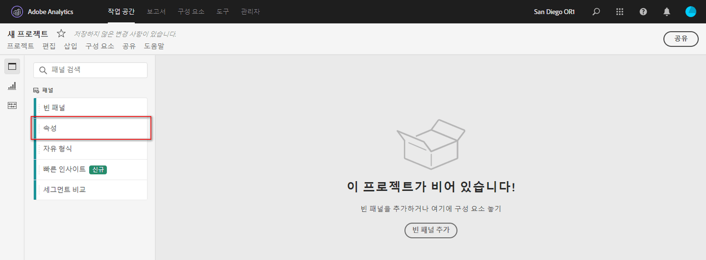
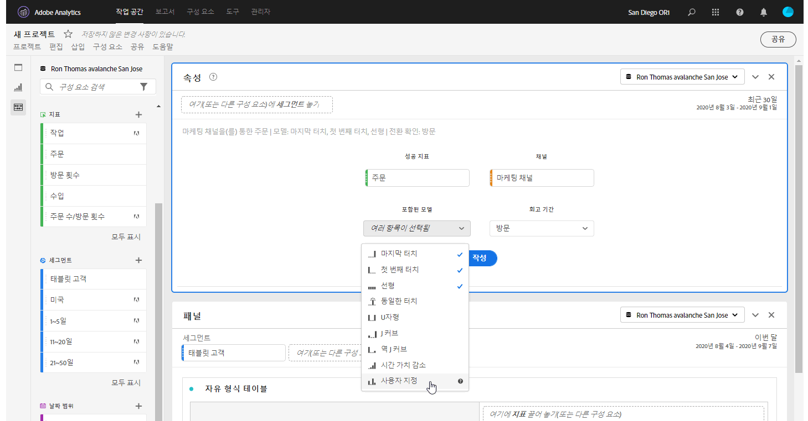
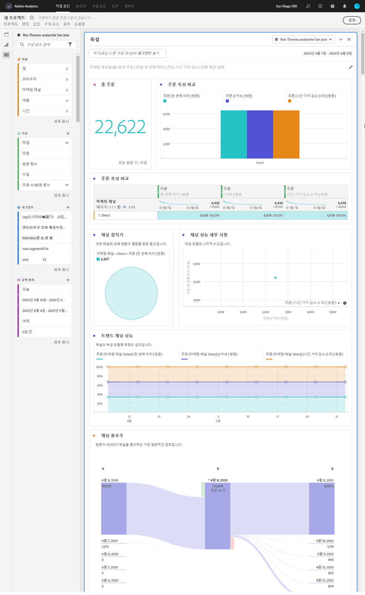

# 속성 패널

속성 패널은 다양한 속성 모델을 비교하는 분석을 쉽게 구축할 수 있는 방법입니다. 속성 모델을 사용하고 비교할 수 있는 전용 작업 공간을 제공하는 [속성 IQ](../attribution/overview.md)의 기능입니다.

## 속성 패널 만들기

1. 왼쪽의 패널 아이콘을 클릭합니다.
1. 속성 패널을 Analysis Workspace 프로젝트로 드래그합니다.

   

1. 속성을 지정할 지표를 추가하고 속성에 대한 차원을 추가합니다. 마케팅 채널 또는 내부 판촉 행사 등의 사용자 지정 차원을 예로 들 수 있습니다.

   

1. 비교할 [속성 모델 및 조회 창](../attribution/models.md)을 선택합니다.

1. 속성 패널은 선택한 차원 및 지표에 대한 속성을 비교하는 풍부한 데이터 및 시각화를 반환합니다.

   

## 속성 시각화

* **총 지표**: 보고 기간 내에 발생한 총 전환 수입니다. 선택한 차원에 할당된 전환입니다.
* **지표 속성 비교 막대 차트**: 선택한 차원의 각 차원 항목에 대한 속성 전환을 시각적으로 비교합니다. 각 막대 색상은 개별 속성 모델을 나타냅니다.
* **지표 속성 자유 형식 테이블**: 표로 표시된 막대 차트와 동일한 데이터를 표시합니다. 이 표에서 다른 열 또는 행을 선택하면 막대 차트와 패널의 다른 여러 가지 시각화가 필터링됩니다. 이 테이블은 작업 공간의 다른 자유 형식 테이블과 유사하게 작동하므로 지표, 세그먼트 또는 분류와 같은 구성 요소를 추가할 수 있습니다.
* **차원 겹침 차트**: 상위 3개 차원 항목과 이들이 전환에 공동 참여하는 빈도를 보여주는 벤 다이어그램입니다. 예를 들어 버블의 크기는 방문자가 차원 항목 모두에 노출될 때 전환이 발생한 빈도를 나타냅니다. 인접 자유 형식 테이블에서 다른 행을 선택하면 선택 사항을 반영하도록 시각화가 업데이트됩니다.
* **고객 여정당 마케팅 접점**: 조회 창에서 방문자가 보유한 터치포인트 수를 나타내는 막대 그래프입니다. 이 그래프는 다중 접점 속성이 데이터 집합에 얼마나 중요한지 확인하는 데 유용합니다. 거의 모든 방문자가 하나의 접점만 있는 경우 서로 다른 속성 모델에 유사한 데이터가 표시될 수 있습니다.
* **마케팅 채널 성과 세부 정보**: 산포도를 사용하여 시각적으로 최대 3개의 속성 모델을 비교할 수 있습니다.
* **마케팅 채널 플로우**: 어떤 채널이 가장 일반적으로 상호 작용하는지, 방문자의 움직임에서 어떤 순서로 상호 작용하는지 확인할 수 있습니다.
