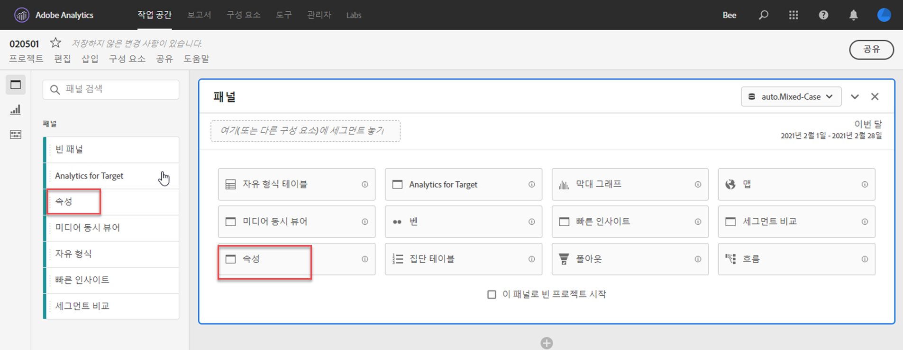

# 속성 패널

[!UICONTROL 속성] 패널은 다양한 속성 모델을 비교한 분석을 쉽게 만들 수 있습니다. 속성 모델을 사용하고 비교할 수 있는 전용 작업 공간을 제공하는 [속성 IQ](../attribution/overview.md)의 기능입니다.

## 속성 패널 만들기

1. 왼쪽의 패널 아이콘을 클릭합니다.
1. [!UICONTROL 속성] 패널을 Analysis Workspace 프로젝트로 드래그합니다.

   

1. 속성을 지정할 지표를 추가하고 속성에 대한 차원을 추가합니다. 마케팅 채널 또는 내부 판촉 행사 등의 사용자 지정 차원을 예로 들 수 있습니다.

   

1. 비교할 [속성 모델 및 조회 창](../attribution/models.md)을 선택합니다.

1. 속성 패널은 선택한 차원 및 지표에 대한 속성을 비교하는 풍부한 데이터 및 시각화를 반환합니다.

   

## 속성 시각화

* **총 지표**: 보고 기간 내에 발생한 총 전환 수입니다. 선택한 차원에 할당된 전환입니다.
* **속성 비교 막대**:선택한 차원의 각 차원 항목에 대한 기여도 전환을 시각적으로 비교합니다. 각 막대 색상은 개별 속성 모델을 나타냅니다.
* **속성 비교 표**:표로 표시된 막대 차트와 동일한 데이터를 표시합니다. 이 표에서 다른 열 또는 행을 선택하면 막대 차트와 패널의 다른 여러 가지 시각화가 필터링됩니다. 이 테이블은 작업 공간의 다른 자유 형식 테이블과 유사하게 작동하므로 지표, 세그먼트 또는 분류와 같은 구성 요소를 추가할 수 있습니다.
* **겹치기 다이어그램**:상위 3개 차원 항목과 이들이 전환에 공동 참여하는 빈도를 보여주는 벤 다이어그램. 예를 들어 버블의 크기는 방문자가 차원 항목 모두에 노출될 때 전환이 발생한 빈도를 나타냅니다. 인접 자유 형식 테이블에서 다른 행을 선택하면 선택 사항을 반영하도록 시각화가 업데이트됩니다.
* **성능 세부 정보**:산포도를 사용하여 시각적으로 최대 3개의 속성 모델을 비교할 수 있습니다.
* **트렌드 성능**:상위 차원 항목에 대한 기여도 전환 트렌드를 표시합니다. 인접 자유 형식 테이블에서 다른 행을 선택하면 선택 사항을 반영하도록 시각화가 업데이트됩니다.
* **흐름**:가장 일반적으로 상호 작용하는 채널과 방문자의 여정 간 순서를 확인할 수 있습니다.

