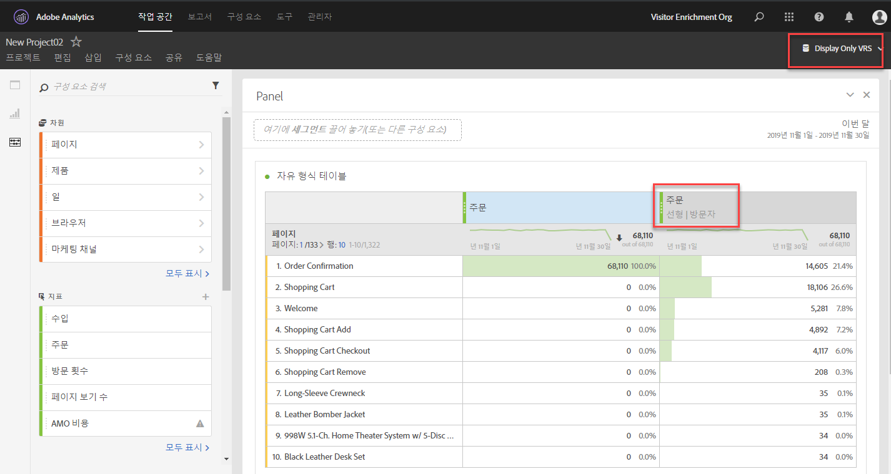

# 속성 패널 개요

>[!IMPORTANT] 속성 패널은 Adobe Analytics Ultimate, Prime, Select 및 Foundation SKU의 모든 고객이 사용할 수 있습니다.

속성 패널은 자유 [형식 테이블](../../attribution-iq.md) , 시각화 및 계산된 지표에 새로운 유형의 속성 모델을 추가할 수 있는 속성 IQ 기능입니다. 모든 속성 모델에는 다음과 같은 두 가지 구성 요소가 있습니다.

* **** 속성 모델:모델은 그룹의 히트에 대한 전환 분포를 설명합니다. 예: 첫 번째 터치 또는 마지막 터치.
* **** 속성 조회 창:조회 창은 각 모델에 대해 어느 히트 그룹이 고려되는지에 대해 설명합니다. 예를 들어, 방문 또는 방문자.

## 기여도 모델

| UI 아이콘 | 속성 모델 | 정의 | 사용 시기 |
| --- | --- | --- | --- |
|  | 마지막 터치 | 전환 전에 가장 최근에 발생하는 터치 지점에 100% 크레디트를 제공합니다. | 가장 기본적인 공통 속성 모델 이 플러그인은 짧은 고려 주기 동안 전환용으로 자주 사용됩니다. 마지막 터치는 팀에서 검색 마케팅을 관리하거나 내부 검색 키워드를 분석하는 데 주로 사용됩니다. |
|  | 첫 번째 터치 | 어트리뷰션 조회 창에서 먼저 본 터치포인트에 100% 크레디트를 제공합니다. | 브랜드 인지도 또는 고객 확보를 유도하기 위한 마케팅 채널을 분석하는 데 유용한 또 다른 일반적인 어트리뷰션 모델입니다. 디스플레이 또는 소셜 마케팅 팀에서 자주 사용하지만 온사이트 제품 추천 효과를 평가하는 데에도 유용합니다. |
|  | 동일한 터치 | 전환이 발생한 바로 히트에 100% 크레딧을 부여합니다. 전환과 동일한 히트에서 터치 포인트가 발생하지 않으면 "없음" 아래에 버킷됩니다. | 전환 시 즉시 제공된 컨텐츠 또는 사용자 경험을 평가할 때 유용한 모델입니다. 제품 또는 디자인 팀은 종종 이 모델을 사용하여 전환이 이루어지는 페이지의 효과를 평가합니다. |
|  | 선형 | 전환으로 이어지는 모든 접점에 동일한 크레딧을 제공합니다. | 고객 참여도가 더 높은 고려 주기 또는 사용자 경험을 통한 전환에 유용합니다. 모바일 앱 알림 효과를 측정하거나 구독 기반의 제품과 함께 사용됩니다. |
|  | U자형 | 첫 번째 인터랙션에 40%의 크레딧을 제공하고, 마지막 인터랙션에 40%의 크레딧을 부여하며, 나머지 20%를 그 사이의 모든 접점으로 나눌 수 있습니다. 단일 터치 포인트를 사용한 전환의 경우 100% 크레딧이 주어집니다. 두 개의 터치 포인트를 사용한 전환의 경우 50%의 크레딧이 두 가지 모두에 적용됩니다. | 전환을 소개하거나 종료한 인터랙션을 중요시하면서도 지원 인터랙션을 인식하려는 사용자를 위한 탁월한 모델입니다. U자 모양 속성은 일반적으로 보다 균형 잡힌 접근 방식을 취하지만 전환을 찾거나 종료한 채널에 더 많은 크레딧을 제공하려는 팀에서 사용합니다. |
|  | J자형 | 마지막 인터랙션에 60%의 크레딧을 제공하고 첫 번째 인터랙션에 20%의 크레딧을 부여하며 나머지 20%를 그 사이의 모든 접점으로 나눌 수 있습니다. 단일 터치 포인트를 사용한 전환의 경우 100% 크레딧이 주어집니다. 두 개의 터치 포인트를 사용한 전환의 경우 75%의 크레딧이 마지막 인터랙션에 적용되며, 첫 번째 인터랙션에 25%의 크레딧이 주어집니다. | 이 모델은 파인더와 닫기의 우선 순위를 매기는 데 중점을 두고 상호 작용을 닫으려는 사용자에게 적합합니다. J-Shaped 속성은 보다 균형적인 접근 방식을 취하여 전환을 종료한 채널에 더 많은 크레딧을 제공하려는 팀에서 자주 사용됩니다. |
|  | J의 역 | 첫 번째 터치 지점에 60%의 크레딧을 제공하고, 20%는 마지막 터치 지점에 크레딧을 사용하며, 나머지 20%는 그 사이의 모든 터치 지점에 나눕니다. 단일 터치 포인트를 사용한 전환의 경우 100% 크레딧이 주어집니다. 두 개의 터치 포인트를 사용한 전환의 경우 75%의 크레딧이 첫 번째 인터랙션에 적용되며 25%의 크레딧이 마지막 인터랙션에 주어집니다. | 이 모델은 파인더 및 닫기에 우선 순위를 두지만 상호 작용 찾기에 중점을 두고자 하는 사용자에게 이상적입니다. 역 J 기여도 분석은 보다 균형 잡힌 접근 방식을 취하여 전환을 시작한 채널에 더 많은 크레디트를 부여하려는 팀에서 사용합니다. |
|  | 사용자 지정 | 첫 번째 터치 지점, 마지막 터치 지점 및 그 사이에 있는 모든 터치 지점에 부여할 가중치를 지정할 수 있습니다. 입력한 사용자 지정 숫자가 100에 추가되지 않더라도 지정된 값은 100%로 표준화됩니다. 단일 터치 포인트를 사용한 전환의 경우 100% 크레딧이 주어집니다. 두 터치 포인트를 사용한 상호 작용의 경우 중간 매개 변수는 무시됩니다. 그런 다음 첫 번째 및 마지막 접촉 지점이 100%로 표준화되며 크레딧이 그에 따라 할당됩니다. | 이 모델은 기여도 모델을 완벽하게 제어하고 다른 기여도 모델이 충족시키지 못하는 특정 요구 사항을 가진 사용자에게 적합합니다. |
|  | 시간 감소 | 기본값이 7일인 사용자 지정 하프 라이프 매개 변수를 사용하여 연속 및 지수 감소 각 채널의 가중치는 터치 지점 시작과 최종 전환 사이에 경과된 시간에 따라 달라집니다. 크레딧을 확인하는 데 사용되는 공식은 `2``(-t/halflife)`여기서 `t` 터치포인트와 전환 사이의 시간입니다. 그런 다음 모든 터치 포인트가 100%로 표준화됩니다. | 미리 정해진 날짜를 가진 이벤트에 대해 비디오 광고 또는 마케팅을 정기적으로 실행하는 팀에 적합합니다. 마케팅 이벤트 후 전환이 오래 되면 크레딧이 적게 주어집니다. |
|  | 기여도 | 모든 고유 터치 지점에 100% 크레디트를 제공합니다. 다른 기여도 모델에 비해 총 전환 수가 부풀려집니다. 기여도는 여러 번 표시되는 채널을 중복 제거합니다. | 고객이 특정 인터랙션에 노출되는 경우가 많음을 이해하는 데 유용합니다. 미디어 조직은 이 모델을 자주 사용하여 콘텐츠 속도를 계산합니다. 소매 조직은 종종 이 모델을 사용하여 사이트 내에서 전환에 중요한 부분을 파악합니다. |

## 조회 창

룩백 창은 터치포인트를 포함하도록 전환에서 다시 확인해야 하는 시간입니다. 첫 번째 상호 작용에 더 많은 크레딧을 제공하는 속성 모델은 서로 다른 전환 창을 볼 때 더 큰 차이를 보게 됩니다.

* **** 방문 확인 창:전환이 발생한 방문 시작 부분으로 돌아갑니다. 방문 확인 창은 방문 범위를 벗어나지 않으므로 좁습니다. 방문 확인 창은 가상 보고서 세트에서 수정된 방문 정의를 준수합니다.
* **** 방문자 조회 창:현재 날짜 범위의 월 1일까지 모든 방문을 다시 봅니다. 방문자가 여러 방문에 걸쳐 있을 수 있으므로 방문자 조회 창은 넓습니다. 예를 들어 보고서 날짜 범위가 9월 15일 - 9월 30일이면 방문자 조회 날짜 범위는 9월 1일 - 9월 30일을 포함합니다.

## 예

다음 예를 생각해 보십시오.

1. 9월 15일 방문자가 유료 검색 광고를 통해 사이트에 도착하고 나갑니다.
2. 9월 18일, 방문자는 친구로부터 받은 소셜 미디어 링크를 통해 다시 사이트에 도착합니다. 장바구니에 여러 항목을 추가하지만 구입하지 않습니다.
3. 9월 24일 마케팅 팀은 장바구니에 있는 일부 항목에 대한 쿠폰이 포함된 이메일을 발송합니다. 쿠폰은 신청했지만 다른 쿠폰이 있는지 확인하기 위해 다른 사이트를 방문합니다. 디스플레이 광고를 통해 다른 광고를 찾은 다음 최종적으로 50달러에 구매합니다.

룩백 창과 어트리뷰션 모델에 따라 채널은 다른 크레딧을 받습니다. 다음은 몇 가지 주목할 만한 예입니다.

* 첫 **번째 터치** 및 **방문 룩백 창을**&#x200B;사용하는 속성은 세 번째 방문만 봅니다. 이메일과 디스플레이 광고 사이에 이메일이 처음으로 사용되었으며, 50달러 구매 시 이메일이 100% 크레딧을 받습니다.
* 첫 **번째 터치** 및 **방문자 조회 창을**&#x200B;사용하여 속성은 세 가지 모든 방문을 봅니다. 유료 검색이 처음이어서 50달러 구매에 대해 100% 크레딧을 받습니다.
* 리니어 **및** 방문 조회 창을 ****&#x200B;사용하면 크레딧이 이메일과 디스플레이 간에 구분됩니다. 이 두 채널 모두 각각 $25의 크레딧을 받습니다.
* 리니어 **및** 방문자 조회 창을 ****&#x200B;사용하면 크레딧이 유료 검색, 소셜, 이메일 및 표시로 구분됩니다. 각 채널은 이 구매에 대해 $12.50 크레딧을 받습니다.
* J **모양** 및 **방문자 조회 창을**&#x200B;사용하면 유료 검색, 소셜, 이메일 및 디스플레이로 크레딧이 구분됩니다.
   * 60%의 크레딧은 30달러에 진열된다.
   * 20%의 크레딧은 10달러에 해당하는 유료 검색을 받습니다.
   * 나머지 20%는 소셜과 이메일 간에 나누어져 각각 5달러가 지급됩니다.
* 시간 **감소** 및 **방문자 조회 창을**&#x200B;사용하면 크레딧은 유료 검색, 소셜, 이메일 및 디스플레이로 구분됩니다. 기본 7일 반수명 사용:
   * 디스플레이 터치 포인트와 전환 사이의 0일 간격. `2``(-0/7)` `= 1`
   * 이메일 터치 포인트와 전환 사이의 0일 간격. `2``(-0/7)` `= 1`
   * 소셜 터치 포인트와 전환 사이의 6일 간격. `2``(-6/7)` `= 0.552`
   * 유료 검색 접점과 전환 사이의 9일 간격. `2``(-9/7)` `= 0.41`
   * 이러한 값을 표준화하면 다음과 같은 결과가 발생합니다.
      * 표시:33.8%, $16.88
      * 이메일:33.8% $16.88
      * 소셜:18.6%, 9.32달러 상승
      * 유료 검색:13.8%, $6.92

> [!TIP] 주문 또는 사용자 지정 이벤트와 같은 기타 전환 이벤트는 크레딧이 둘 이상의 채널에 속한 경우에도 분할됩니다. 예를 들어 두 채널이 선형 속성 모델을 사용하여 사용자 지정 이벤트에 기여하는 경우 두 채널 모두 사용자 지정 이벤트의 0.5를 받습니다. 이러한 이벤트 부분은 모든 방문에 걸쳐 집계된 다음 보고에 가장 가까운 정수로 반올림됩니다.

## 마케팅 채널에서 기여도 분석 사용

마케팅 채널이 처음 소개되었을 때 첫 번째 및 마지막 터치 차원에서만 제공되었습니다. 이러한 추가 기여도 모델을 사용하면 명확한 첫 번째/마지막 터치 차원이 더 이상 필요하지 않습니다. Adobe는 범용 **마케팅 채널** 차원을 제공하므로 원하는 속성 모델과 함께 사용할 수 있습니다. 이러한 일반 마케팅 채널 차원은 마지막 터치 채널 크기와 동일하게 동작하지만 다른 속성 모델과 함께 마케팅 채널을 사용할 때 혼동을 방지하기 위해 다르게 레이블이 지정됩니다.

마케팅 채널 차원은 기존 방문 정의(처리 규칙으로 정의됨)에 따라 다르므로 가상 보고서 세트를 사용하여 방문 정의를 변경할 수 없습니다.

## 다중 값 변수와 함께 속성 사용

Analytics의 일부 차원은 한 번의 히트에 여러 값을 포함할 수 있습니다. 일반적인 예로는 목록 변수 및 products 변수가 있습니다.

기여도가 다중 값 히트에 적용되면 동일한 히트의 모든 값이 동일한 크레딧을 받습니다. 많은 값이 이 크레딧을 받을 수 있으므로 보고서 총계는 각 개별 라인 항목을 합산한 경우와 다를 수 있습니다. 보고서 합계는 중복 제거되고 각 개별 차원 값은 적절한 크레딧을 받습니다.

## 세분화와 함께 속성 사용

속성은 항상 세그먼테이션 전에 실행되며, 보고서 필터가 적용되기 전에 세그먼테이션이 실행됩니다. 이 개념은 세그먼트를 사용하는 가상 보고서 세트에도 적용됩니다.

예를 들어 "히트 표시" 세그먼트가 적용된 VRS를 만드는 경우 일부 속성 모델을 사용하여 표에 다른 채널을 볼 수 있습니다.

