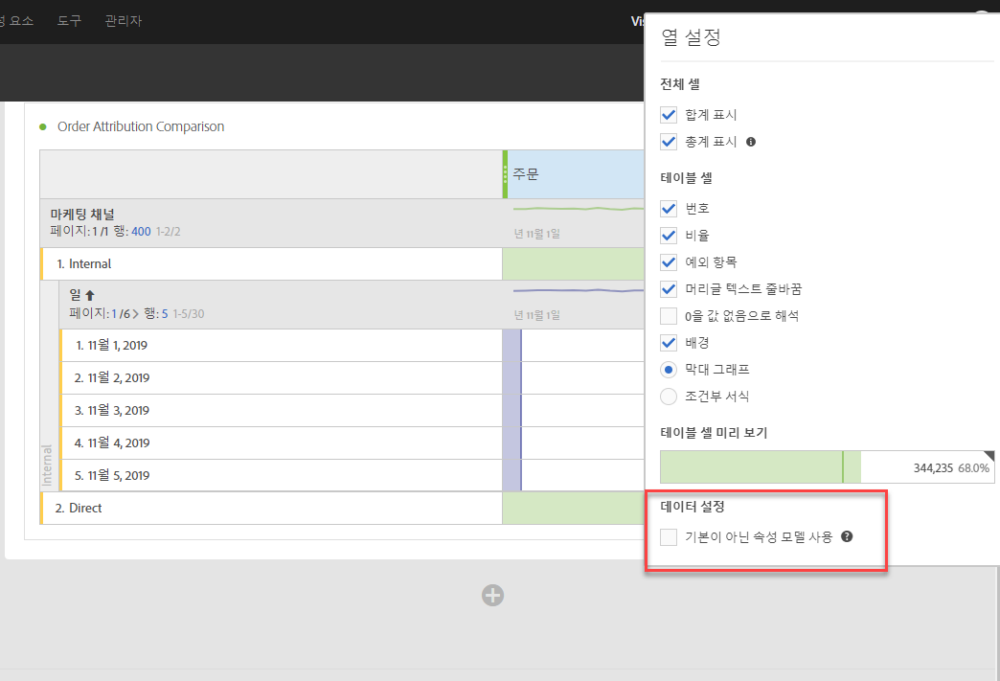
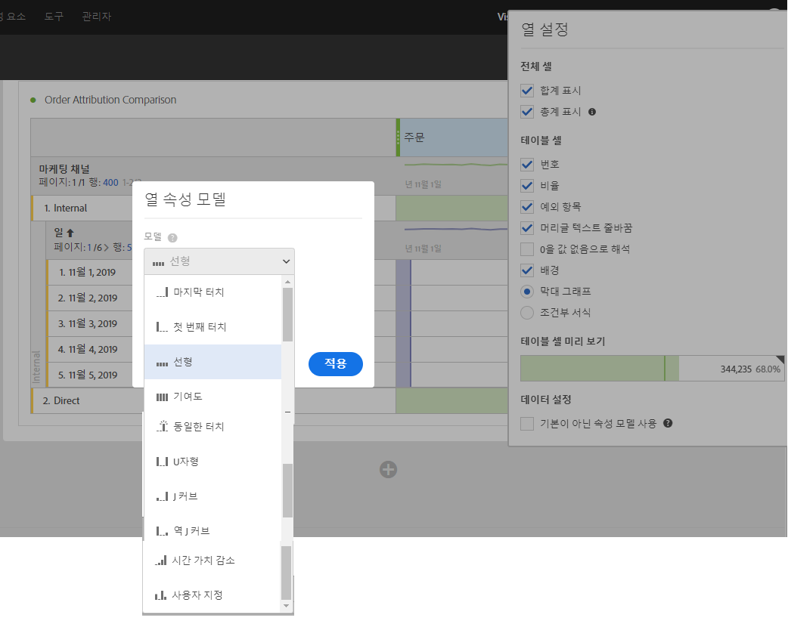
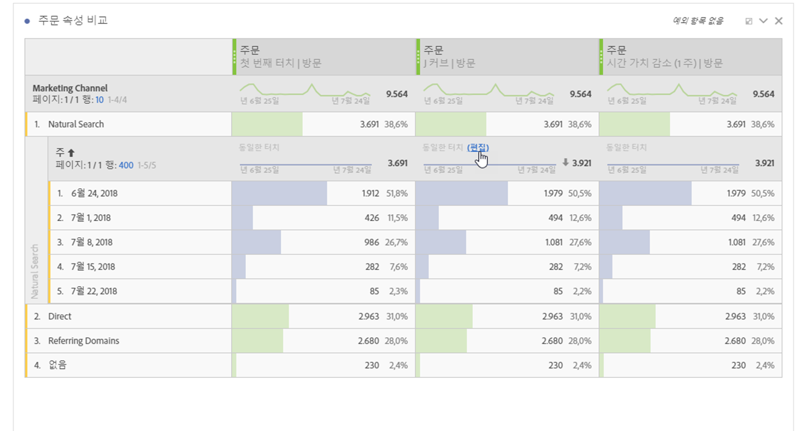
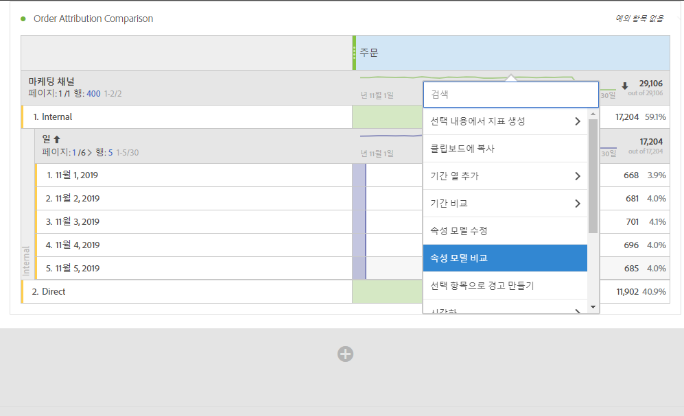
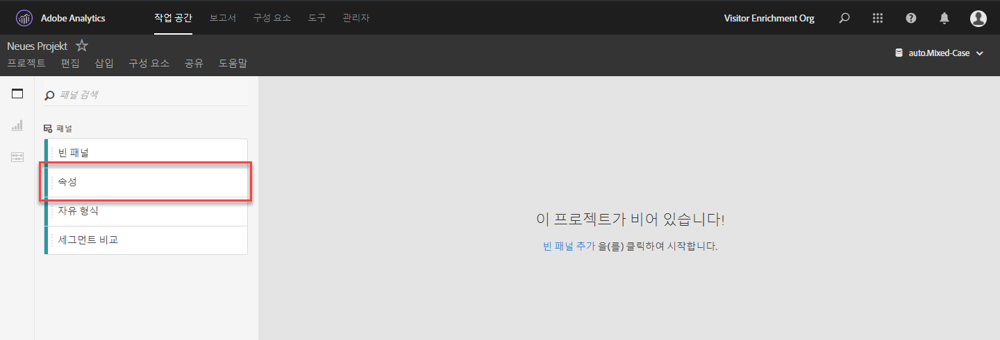
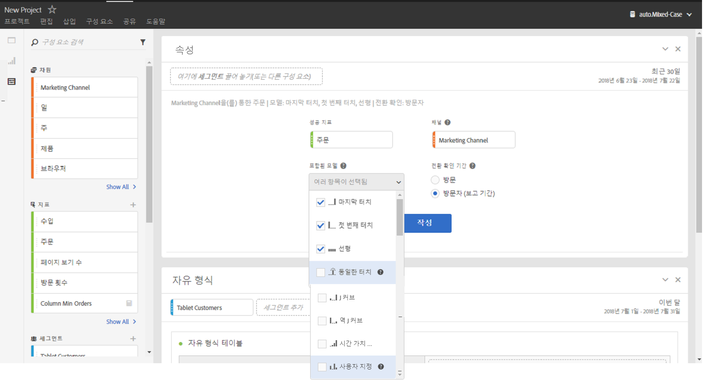
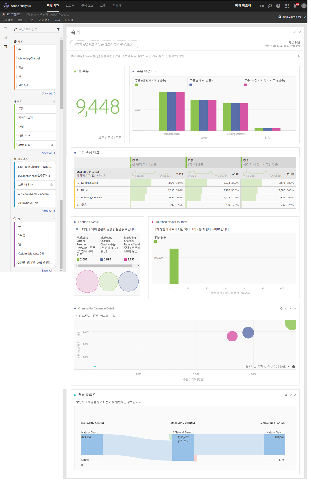

# Analysis Workspace에서 기여도 분석 사용

Analysis Workspace에서 기여도 분석 IQ를 사용하면 지원되는 기여도 분석 모델을 서로 비교하고, 고급 폴아웃 및 플로우 시각화를 사용하여 전환으로 이어지는 주요 마케팅 시퀀스를 시각화하고, 마케팅 채널 또는 캠페인의 추세를 간편하게 파악하여 시간 경과에 따른 실적을 쉽게 파악하며, 채널/캠페인 성과의 통계적 이상 현상을 찾아 성능 저하 또는 상승 시 경고할 수 있습니다.

## 자유 형식 테이블에서 기여도 분석 사용 {#section_F2F72AE840EB4EA781302A559726E6F4}

Analysis Workspace 자유 형식 테이블은 대부분의 지표에서 사용할 수 있는 기여도 분석 모델을 지원합니다. 기여도 분석 모델은 [열 설정]의 자유 형식 테이블 열 지표에서 설정할 수 있습니다.

1. 자유 형식 테이블 열 옆의 설정 (기어) 아이콘을 클릭합니다.

   

1. 아래에서 **[!UICONTROL Data Settings]**&#x200B;확인 **[!UICONTROL Use non-default attribution model]**&#x200B;하십시오. 다른 기여도 분석 모델에 대한 자세한 내용은 [기여도 분석 IQ 개요](attribution.md)를 참조하십시오.

   

## 분류에 기여도 분석 모델 적용 {#section_ED1E7532CF084B5AB0942BD80B4770C9}

자유 형식 테이블 내의 모든 분류에는 상위 열과 동일하거나 다를 수 있는 모든 기여도 분석 모델이 적용될 수 있습니다. 예를 들어, 마케팅 채널 차원에서 선형 주문을 분석하고 채널 내 특정 추적 코드에 U자형 주문을 적용할 수 있습니다. 분류에 적용되는 기여도 분석 모델을 편집하려면 다음과 같이 분류 모델 위로 마우스를 이동하고 &quot;편집&quot;을 클릭합니다.

## 한 기여도 분석 모델을 다른 기여도 분석 모델과 비교 {#section_1D74C09549CC4EC8A952A7392C76D375}

If you&#39;d like to quickly and easily compare one attribution model to another, right click a metric and select **[!UICONTROL Add comparative attribution model]**:

이렇게 하면 지표를 드래그하여 두 번 구성하지 않고 한 가지 기여도 분석 모델을 다른 모델과 신속하고 간편하게 비교할 수 있습니다.

## 기여도 분석 패널 및 시각화 {#section_6B02F28182F14ECC9FC5020F224726E6}

기여도 분석 패널은 다양한 기여도 분석 모델을 비교하는 분석을 쉽게 구축할 수 있는 방법입니다. 기여도 분석 패널에 액세스하려면 다음을 수행하십시오.

1. 맨 왼쪽의 [패널] 아이콘을 클릭합니다.
1. [기여도 분석] 패널을 Analysis Workspace 프로젝트로 드래그합니다.

   

1. 파악하려는 성공 지표를 추가하고 속성에 대한 채널 차원(예: 마케팅 채널 또는 내부 프로모션)을 추가합니다.

   

1. 비교하려는 [기여도 분석 모델](attribution.md) 및 전환 확인 기간을 선택합니다.

   기여도 분석 패널은 마케팅 채널(또는 기타 차원)이 함께 작동하는 방식을 보다 잘 이해할 수 있도록 다양한 데이터 및 시각화 세트를 반환합니다.

   

   다음은 각 시각화에 대한 설명입니다.

| 시각화 | 설명 |
|--- |--- |
| 전체 지표 | 보고 기간 내에 발생한 총 전환 수입니다. 선택한 차원에 할당된 전환입니다. |
| 지표 기여도 분석 비교 막대 차트 | 선택한 차원의 각 차원 항목에 대해 전환 기여를 시각적으로 비교할 수 있습니다. 각 막대 색상은 선택된 고유 기여도 분석 모델을 나타냅니다. |
| 지표 기여도 분석 자유 형식 테이블 | 동일한 데이터를 막대 차트로 표시합니다. 이 테이블에서 다른 열이나 행을 선택하면 패널의 다른 시각화뿐 아니라 막대 차트가 모두 필터링됩니다. 이 테이블은 Workspace에서 다른 모든 자유 형식 테이블처럼 작동하여 지표, 세그먼트, 분류 등을 추가할 수 있습니다. |
| 차원 겹침 차트 | 최상위 세 개의 차원 항목(예: 채널)과 이러한 항목이 전환에 기여하는 빈도를 보여 주는 벤 다이어그램입니다. 예를 들어 버블의 크기는 방문자가 차원 항목(예: 채널) 모두에 노출될 때 전환이 발생한 빈도를 나타냅니다. 자유 형식 테이블에서 다른 행을 선택하면 선택 사항을 반영하도록 시각화가 업데이트됩니다. |
| 전체 과정별 마케팅 터치포인트 | 보고 날짜 범위에서 방문자가 보유한 마케팅(또는 모든 차원) 터치포인트를 나타내는 막대 그래프입니다 이 그래프는 다중 접점 기여도 분석이 데이터 집합에 얼마나 중요한지 확인하는 데 유용합니다. 거의 대부분 방문자가 단일 터치포인트만 보유한 경우 다른 기여도 분석 모델이 결과의 다른 기여도 분석과는 크게 다르지 않습니다. |
| 마케팅 채널 실적 세부 사항 | 산포도를 사용하여 시각적으로 최대 3개의 기여도 분석 모델을 비교할 수 있습니다. |
| 마케팅 채널 플로우 | 어떤 채널이 가장 일반적으로 상호 작용하는지, 방문자의 움직임에서 어떤 순서로 상호 작용하는지 확인할 수 있습니다. |
