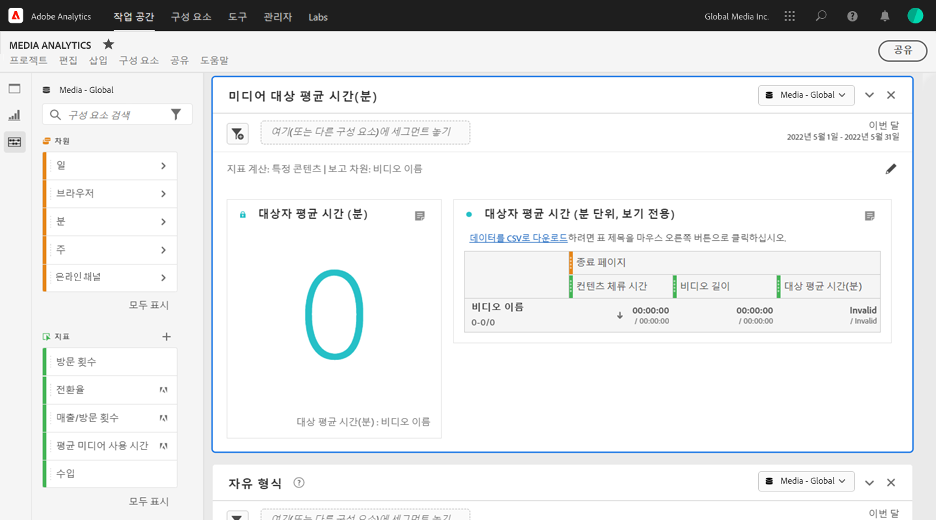
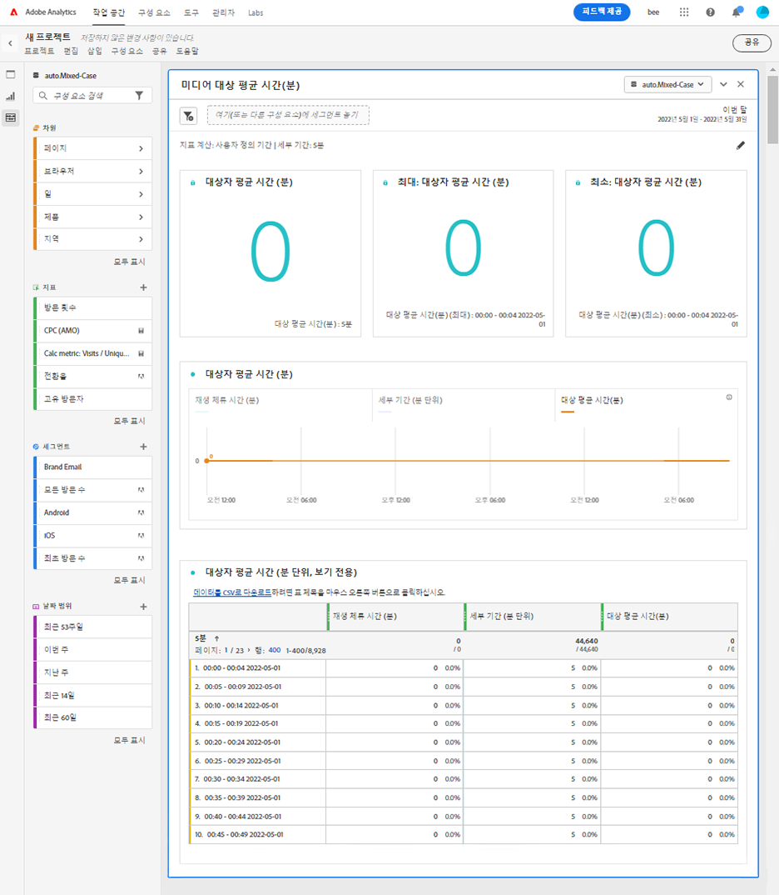

# 미디어 분당 평균 시청 시간 패널

Media Analytics 고객은 대상 평균 시간 패널을 사용하여 콘텐츠의 평균 소비에 대해 더 잘 이해할 수 있습니다. 대상 평균 시간을 통해 모든 길이 또는 모든 장르의 프로그램을 비교할 수 있습니다. 또한 고객은 이 디지털 분당 평균 시청 시간을 유선 TV 평균 시청 시간 지표와 비교하거나 추가할 수 있습니다. 이 패널을 통해 기간 분류가 이후에 업데이트된 경우에도 사용자 정의 기간의 대상 평균을 보다 유연하게 측정할 수 있습니다. 현재 대상 평균 시간 메트릭은 처리 시간에 지속 시간을 사용할 수 있는 경우에만 작동합니다.

Analysis Workspace에서 분당 평균 시청 시간은 미디어 스트림을 보는 데 소요된 시간을 콘텐츠 지속 시간 또는 기간의 총합 및 선택된 세부 기간으로 나눈 값입니다.

미디어 분당 평균 시청 시간 패널은 콘텐츠 지속 시간이 분류를 통해 제공되는 경우 선택된 특정 콘텐츠별로 분당 평균 시청 시간 분석을 제공합니다.
Average Minute Audience 패널은 또한 분류를 사용하여 기간을 사용할 수 있는지 여부에 관계없이 특정 콘텐츠로 필터링할 수 있는 선택된 기간에 대한 분석을 제공합니다. 미디어 분당 평균 시청 시간 패널에 액세스하려면 Media Analytics 구성 요소가 활성화된 보고서 세트로 이동합니다. 그런 다음 맨 왼쪽에 있는 패널 아이콘을 클릭하고 패널을 Analysis Workspace 프로젝트로 끌어옵니다.

<!-- For more information, see the Media Average Minute Audience introduction video:
<< replace with AMA video when available from Doug >> -->

<!-- >[!VIDEO](https://video.tv.adobe.com/v/330177/?quality=12) -->

## 패널 입력 {#Input}

다음 입력 설정을 사용하여 미디어 분당 평균 시청 시간 패널을 구성할 수 있습니다.

| 설정 | 설명 |
|---------|------------|
| 패널 날짜 범위 | 패널 날짜 범위 기본값은 오늘입니다. 단 하루 또는 여러 달이 보이도록 편집할 수 있습니다.    이 시각화는 1440개의 데이터 행으로 제한됩니다(예: 분 단위 세부 기간에서 24시간). 날짜 범위와 세부 기간 조합의 결과 행이 1440개를 초과하는 경우 전체 날짜 범위를 수용하도록 세부 기간이 자동으로 업데이트됩니다. |
| 세그먼트(또는 다른 구성 요소)를 여기로 드래그합니다. | 다른 패널과 마찬가지로 이 설정은 작성한 세그먼트에 따라 선택 사항을 필터링합니다. 이는 특정 플랫폼, 라이브 스트림 또는 기타 일반적인 미디어 세그먼트를 볼 수 있는 좋은 방법입니다. |
| 다음에 대한 지표 계산 | 이 설정을 사용하면 *특정 콘텐츠*&#x200B;를 선택하여 특정 콘텐츠에 대한 분당 평균 시청 시간을 보거나 *사용자 정의 기간*&#x200B;을 선택하여 특정 기간 동안의 분당 평균 시청 시간을 보는 것을 선택할 수 있습니다.   특정 콘텐츠는 분류를 사용하여 지속 시간이 업데이트된 경우에만 작동합니다. 지속 시간을 사용할 수 없거나 특정 지속 시간이 할당되지 않은 콘텐츠(예: 라이브 스트림 또는 이벤트 중) 또는 여러 콘텐츠가 포함된 시계열에 대한 분당 평균 시청 시간을 보려는 경우 사용자 정의 기간을 선택해야 합니다. 이 설정은 워크플로 및 보고서 출력을 변경합니다. |

### 특정 콘텐츠

| 설정 | 설명 |
|---------|------------|
| 보고 차원 | 특정 콘텐츠를 선택하는 경우, 선택한 기간에 대한 콘텐츠 및 연관된 분당 평균 시청 시간을 표시하기 위해 비디오 이름 또는 콘텐츠 ID 필드를 사용하도록 보고서 출력을 선택할 수 있습니다. |
| 콘텐츠 필터링 기준 (선택 사항) | 원하는 보기 또는 데이터 구조화 방식에 따라 특정 콘텐츠를 필터링할 수 있습니다. |
| 쇼, 시즌, 에피소드 | &quot;표시, 시즌, 에피소드&quot;를 선택하면 드롭다운에 사용 가능한 표시가 표시됩니다. 이 프로그램은 검색을 사용하여 필터링하거나 왼쪽 열에서 표시 이름을 드래그하여 놓을 수 있습니다. 여기에서 선택을 끝내면 쇼의 모든 시즌을 볼 수 있습니다. 또는 개별 시즌별로 필터링한 다음 개별 에피소드별로 필터링할 수 있습니다. 이 설정은 선택한 기간의 해당 쇼, 시즌 또는 에피소드에 대한 데이터를 표시합니다. |
| 사용자 정의 차원 | 쇼 이름이 사용자 정의 차원에 있는 경우 차원(선택 사항) 드롭다운에서 검색하거나 왼쪽 열 검색을 사용하여 찾을 수 있습니다. 차원 항목은 해당 선택에 따라 자동으로 채워지고 에피소드로 처리됩니다. |
| 없음 | 선택할 수 있습니다 *없음* 선택한 항목에 대한 대상 평균 시간(분) 데이터가 있는 모든 비디오 이름을 표시하기 위해 |

### 특정 콘텐츠 고급 설정

| 설정 | 설명 |
|---------|------------|
| 테이블 설정 | 기본 설정은 분당 평균 시청 시간의 분자와 분모를 테이블의 선행 열로 표시하는 테이블에 계산 값을 표시합니다. 이 옵션을 선택 해제하면 비디오 이름 또는 콘텐츠 ID 옆에 분당 평균 시청 시간만 남겨두고 해당 두 열이 제거됩니다. |
| 체류 시간 지표 | 콘텐츠 시간만 포함하는 기본 콘텐츠 체류 시간을 선택하거나 분당 평균 시청 시간에 대한 분자 계산으로 콘텐츠와 광고 시간을 함께 포함하는 미디어 체류 시간을 사용하도록 선택할 수 있습니다. |

### 사용자 정의 기간

| 설정 | 설명 |
|---------|------------|
| 세부 기간 | 기본 세부 기간은 5분이지만 달력 선택 사항에서 선택한 전체 기간 내에서 시계열의 분모로 사용되는 세부 기간을 선택할 수 있습니다. 예를 들어 5분 세부 기간을 사용하여 오후 12시에서 12시 30분을 선택하면 전체 30분 동안의 분당 평균 시청 시간과 각 5분 기간에 대한 분당 평균 시청 시간이 있는 6개의 행이 반환됩니다. 이 행은 시계열 차트에 대한 데이터 포인트로 사용됩니다. |
| 콘텐츠 필터링 기준 (선택 사항) | 원하는 보기 또는 데이터 구조화 방식에 따라 특정 콘텐츠를 필터링할 수 있습니다. |
| 쇼, 시즌, 에피소드 | *쇼, 시즌, 에피소드*&#x200B;를 선택하면 검색을 통해(또는 왼쪽 열에서 쇼 이름을 끌어다 놓아) 필터링할 수 있는 사용 가능한 쇼가 드롭다운에 표시됩니다. 여기에서 선택을 끝내면 쇼의 모든 시즌을 볼 수 있습니다. 또는 개별 시즌별로 필터링한 다음 개별 에피소드별로 필터링할 수 있습니다. 이 설정은 선택한 기간의 해당 쇼, 시즌 또는 에피소드에 대한 데이터를 표시합니다. |
| 사용자 정의 차원 | 쇼 이름이 사용자 정의 차원에 있는 경우 차원(선택 사항) 드롭다운에서 검색하거나 왼쪽 열 검색을 사용하여 찾을 수 있습니다. 차원 항목은 해당 선택에 따라 자동으로 채워지고 에피소드로 처리됩니다. |
| 없음 | 선택할 수 있습니다 *없음* 선택한 기간 동안의 모든 비디오 이름을 표시하도록 했습니다. |

### 사용자 정의 기간 고급 설정

| 설정 | 설명 |
|---------|------------|
| 테이블 설정 | 기본 설정은 분당 평균 시청 시간의 분자와 분모를 테이블의 선행 열로 표시하는 테이블에 계산 값을 표시합니다. 이 옵션을 선택 해제하면 기간 옆에 분당 평균 시청 시간만 남겨두고 해당 두 열이 제거됩니다. |

## 특정 콘텐츠 패널 출력

미디어 분당 평균 시청 시간 패널은 다음을 반환합니다.

* 전체 선택 항목에 대한 총 분당 평균 시청 시간
* 테이블에 표시되는 개별 비디오에 대한 필터 및 분당 평균 시청 시간
* 고급 설정을 선택한 경우 콘텐츠 체류 시간 및 비디오 길이(지속 시간)

언제든지 오른쪽 상단의 편집 연필을 클릭하여 패널을 편집하고 다시 작성할 수 있습니다.

### 특정 콘텐츠 데이터 소스

이 패널에서 사용할 수 있는 유일한 지표는 분당 평균 시청 시간입니다.

| 지표 | 설명 |
|--------|-------------|
| 분당 평균 시청 시간 | 미디어 스트림을 보는 데 소요된 시간을 분류를 통해 제공된 비디오 길이(지속 시간)로 나눈 값입니다. |

## 사용자 정의 기간 패널 출력 {#custom-time-period-output}

미디어 분당 평균 시청 시간 패널은 전체 선택 항목에 대한 총 분당 평균 시청 시간, 최대 및 최소 분당 평균 시청 시간, 전체 선택 항목에 대한 분당 평균 시청 시간을 보여 주는 선 시리즈 그래프를 반환합니다. 아래 테이블은 세부 기간에 대한 필터 및 분당 평균 시청 시간을 보여 주며 고급 설정이 선택된 경우 각 기간에 대한 콘텐츠 체류 시간 및 세부 기간도 보여 줍니다.

언제든지 오른쪽 상단의 편집 연필을 클릭하여 패널을 편집하고 다시 작성할 수 있습니다.

### 사용자 정의 기간 데이터 소스

이 패널에서 사용할 수 있는 유일한 지표는 분당 평균 시청 시간입니다.

| 지표 | 설명 |
|---|---|
| 분당 평균 시청 시간 | 미디어 스트림을 보는 데 소요된 시간을 전체 선택 기간 또는 선택한 세부 기간(분)으로 나눈 값입니다. |

<!-- For more information about Media Average Minute Audience, visit [MA doc page]( https://url). -->
