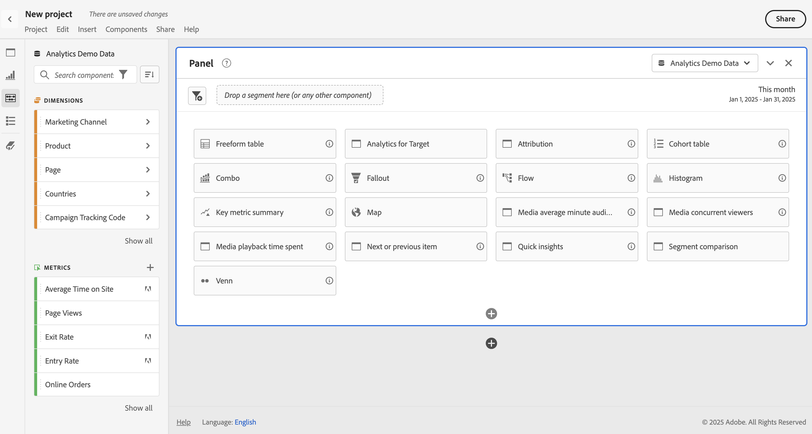

# 빈 패널 {#blank-panel}

<!-- markdownlint-disable MD034 -->

>[!CONTEXTUALHELP]
>id="workspace_blankpanel_button"
>title="빈 패널"
>abstract="완전히 개인 맞춤화된 분석을 빌드하기 위해 만들 수 있는 다양한 패널이나 시각화를 표시합니다."
>additional-url="https://www.youtube.com/watch?v=SYaioiwBTrk" text="Analysis Workspace의 패널"

<!-- markdownlint-enable MD034 -->

>[!BEGINSHADEBOX]

*이 문서는&#x200B;**Adobe Analytics**의 빈 패널에 대한 문서입니다. 이 문서의&#x200B;**Customer Journey Analytics**버전은 [빈 패널](https://experienceleague.adobe.com/en/docs/analytics/analyze/analysis-workspace/panels/blank-panel)을 참조하세요.*

>[!ENDSHADEBOX]

**[!UICONTROL 빈 패널]**&#x200B;은 완전히 개인 맞춤화된 분석을 빌드하기 위해 만들 수 있는 다양한 패널(로 표시됨)이나 시각화를 표시합니다.

## 사용

**[!UICONTROL 빈 패널]**&#x200B;을 사용하려면

1. **[!UICONTROL 빈 패널]**&#x200B;을 만듭니다. 패널을 만드는 방법에 대한 자세한 내용은 [패널 만들기](panels.md#create-a-panel)를 참조하십시오.

   

1. 제공되는 옵션에서 시각화 또는 패널을 선택합니다.

   * 패널을 선택하면 빈 패널이 선택한 패널로 전환됩니다.
   * 시각화를 선택하면 시각화가 빈 패널에 추가됩니다.

   예를 들어 시각화(예:  **[!UICONTROL 코호트 테이블]**)를 선택하여 패널에 추가하거나, 패널(예:  **[!UICONTROL 속성]**)을 선택하여 속성 패널 측 패널을 수정합니다.

다음과 같은 작업을 수행할 수 있습니다.

* 패널 **내** 을 선택하여 다른 시각화를 추가합니다. 시각화를 선택할 수 있는 팝업이 나타납니다.

  | 선택... | 다음을 만들려면... |
  |---|---|
  |  | [자유 형식 테이블](/help/analyze/analysis-workspace/visualizations/freeform-table/freeform-table.md) |
  |  | [라인](/help/analyze/analysis-workspace/visualizations/line.md) |
  |  | [막대](/help/analyze/analysis-workspace/visualizations/bar.md) |
  |  | [요약 번호](/help/analyze/analysis-workspace/visualizations/summary-number-change.md) |
  |  | [텍스트](/help/analyze/analysis-workspace/visualizations/text.md) |
  |  | [폴아웃](/help/analyze/analysis-workspace/visualizations/fallout/fallout-flow.md) |
  |  | [흐름](/help/analyze/analysis-workspace/visualizations/c-flow/flow.md) |
  |  | [스택 영역](/help/analyze/analysis-workspace/visualizations/area.md) |
  |  | [코호트 테이블](/help/analyze/analysis-workspace/visualizations/cohort-table/t-cohort.md) |
  |  | [글머리 기호](/help/analyze/analysis-workspace/visualizations/bullet-graph.md) |
  |  | [도넛](/help/analyze/analysis-workspace/visualizations/donut.md) |
  |  | [요약 변경](/help/analyze/analysis-workspace/visualizations/summary-number-change.md) |
  |  | [히스토그램](/help/analyze/analysis-workspace/visualizations/histogram.md) |
  |  | [분산](/help/analyze/analysis-workspace/visualizations/scatterplot.md) |
  |  | [벤](/help/analyze/analysis-workspace/visualizations/venn.md) |
  |  | [트리맵](/help/analyze/analysis-workspace/visualizations/treemap.md) |

* 패널 **외부에서** 을 선택하여 다른 빈 패널을 추가합니다.

>[!MORELIKETHIS]
>
>[패널 만들기](/help/analyze/analysis-workspace/c-panels/panels.md#create-a-panel)
>
